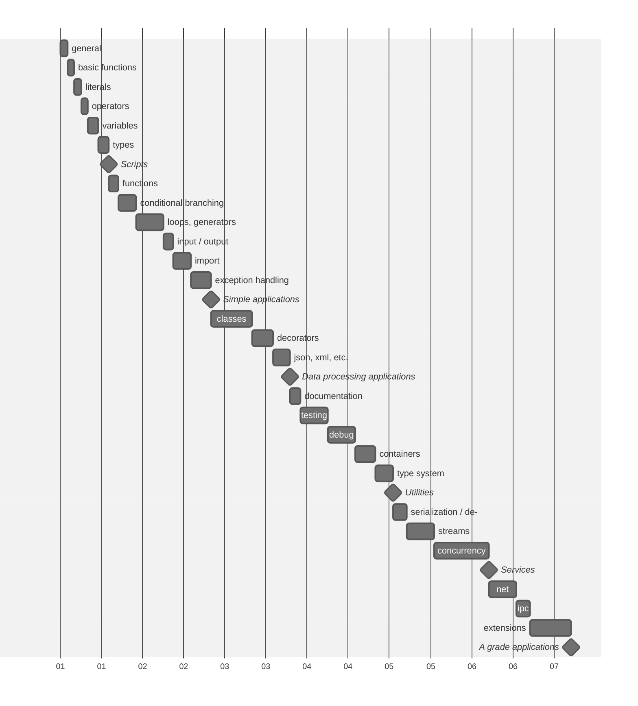

Python journey [→ru](README.ru.md)
===

In this repository, I will document my journey of learning the Python language
and related tools.

> [!NOTE]
>
> **Something to note**: I already have experience in writing applications
> in Python, but I've decided to update, enhance, and systematize my knowledge.

## Commitment

As the main sources, I will use various books, official documentation,
and courses. I will provide code examples and notes, accompanying them
with references to the materials.

## Learning plan

To start, I will develop a learning plan, not overly detailed but ensuring
a certain sequence of material mastery.

Each significant stage will conclude with practical work, indicated by
a diamond symbol on the following schedule.



## Books references

1. [Think Python, 2nd ed by Allen B. Downey](https://www.goodreads.com/book/show/14514306-think-python)
2. [Illustrated Guide to Python 3 by Matt Harrison](https://www.goodreads.com/book/show/36522990-illustrated-guide-to-python-3)

## About the Language

Python[^1] is a high-level, portable, dynamically typed[^2],
interpreted language with a garbage collection.

The language was developed by Guido van Rossum in 1991.

The language gained popularity by the time the second version was released.
The current version is the third, and it is considered the most up-to-date.

### Syntax and semantics

Python code is designed with readability in mind,
as it is visually formatted using indentation, and expressions are usually
not adorned with auxiliary symbols. The conventional semicolon,
which separates instructions, is often omitted, as the expression concludes
at the end of the line.

However, the `;` symbol may be used in specific cases when it is necessary
to write instructions on a single line.

The language lacks the conventional curly braces for delineating blocks
of instructions; this role is fulfilled by visual formatting with
a mandatory consistent indentation for instructions at the same level.

Spaces and tabs can be used as indentation characters,
but they should not be mixed within the same file.

### Language evolution

Despite its age, Python continues to evolve actively under the guidance
of the community and committees at the foundation[^3].

The language's development is carried out through the
Proposal Evaluation Process (PEP)[^4], from which the language description
is formed.

The language is characterized by a motto that defines the direction
of its development.

#### Zen of Python

There is a concise and eloquent way to describe the principles
guiding Python developers. These principles are known as the "Zen of Python"
and have their own PEP 20[^5].

> The Zen of Python, by Tim Peters
>
> Beautiful is better than ugly. <br />
> Explicit is better than implicit. <br />
> Simple is better than complex. <br />
> Complex is better than complicated. <br />
> Flat is better than nested. <br />
> Sparse is better than dense. <br />
> Readability counts. <br />
> Special cases aren't special enough to break the rules. <br />
> Although practicality beats purity. <br />
> Errors should never pass silently. <br />
> Unless explicitly silenced. <br />
> In the face of ambiguity, refuse the temptation to guess. <br />
> There should be one-- and preferably only one --obvious way to do it. <br />
> Although that way may not be obvious at first unless you're Dutch. <br />
> Now is better than never. <br />
> Although never is often better than *right* now. <br />
> If the implementation is hard to explain, it's a bad idea. <br />
> If the implementation is easy to explain, it may be a good idea. <br />
> Namespaces are one honking great idea -- let's do more of those! <br />

## Execution and Modes

To run a Python application or a standalone script, you need an interpreter
— an application capable of reading instructions in a human-readable language
and transforming them into instructions understood by a computing machine.

The advantage of interpreted languages over compiled ones is that
compilation tasks are performed directly when the program is launched,
without the need for additional building steps. This enhances code portability
and speeds up the development process. However, the execution
of interpreted code will never be as fast as that of a pre-compiled application
written in a lower-level language.

Python instructions can be executed either sequentially or as a program saved
in a file or a series of files.

To execute instructions sequentially, the REPL
(<ins>R</ins>ead <ins>E</ins>valuate <ins>P</ins>rint <ins>L</ins>oop)
mode is activated. In this mode, the interpreter awaits user input,
determining the end of an instruction when a new line is encountered.
The interpreter then attempts to execute the input and outputs the result
or an error, returning to await further input.

Running an application is a more common scenario, where the interpreter
immediately receives an entry point and attempts to execute
all subsequent instructions.

As an application may consist of one or more files, running an application
involves providing the path to the file or target directory as a Python
call argument. When specifying a directory, the interpreter looks for
the entry point in the `__main__.py` file.

Running Python is possible both on a local machine after installation[^6]
and in containerized environments[^7].

For the convenience of running simple scripts, you can use online services
such as [Python Anywhere](https://www.pythonanywhere.com/),
[Replit](https://replit.com/), or use [Google Colab](https://colab.google/)
as a REPL.

> [!NOTE]
>
> To exit the interpreter's REPL, call the globally available `exit()` method.

> [!NOTE]
>
> In Python, there is a "ahead of time compilation" stage where the interpreter
> converts the text version of Python code into bytecode, which is then executed.
> Such files are stored in the `__pycache__` directory, which should not be
> added to version control repositories by default.

## Basic functions

### print

One of the fundamental functions in any programming language
is the output function.

The `print` function automatically checks the type of the passed object.
If the object is not a string, the function converts its value to
a string format. By default, `print` outputs the result to the standard
output stream (`sys.stdout`), which usually means displaying it on the screen.
However, the output stream can be explicitly specified by passing it as
an argument when calling the function.

Allen Downey notes a slight difference in function calls between Python 2
and Python 3, specifically the absence of parentheses around arguments
in Python 2. However, in Python 3, the format with explicit indication
of the output stream through the file argument is used:

[Python2](https://docs.python.org/3/library/functions.html#print)
```python
>>> import sys
>>> print(>>sys.stdout, "Hello world\n")
```

[Python3](https://docs.python.org/3/library/functions.html#print)
```python
>>> import sys
>>> print("Hello world\n", file=sys.stdout)
```

These examples illustrate the syntax for different Python versions,
where in Python 2, `>>` is used to specify the output stream,
and in Python 3, the file argument is used for explicitly indicating
the output stream.

### input

In the context of data input in Python, there is the input function[^8].
Similar to the `print` function, `input` is globally accessible.

The `input` function allows you to switch the program's execution to
a waiting-for-input mode. When input is provided, and the user presses
the "Enter" key, input captures all the characters entered earlier.
The result is returned as a string.

```python
>>> input("Say my name: ")
Say my name: Mr. White
'Mr. White'
```

#### dir

The `dir` function returns a list of names available in the specified scope[^9].
If called without arguments, the current scope is selected.
If an object is passed to the function, dir returns a list of its methods
and attributes.

### help

The built-in help function[^10] is a powerful tool, especially in REPL mode.
Without arguments, calling the function initiates an interactive documentation
index search console. If the name of a function or class is specified,
the interpreter will attempt to find the corresponding element among those
registered in the current environment and provide help for it.

> [!NOTE]
> I won't go into detail on all the built-in functions. However,
> it's worth noting their importance and variety. For a detailed description
> of each function, you can refer to the official documentation[^11].

> [!TIP]
>
> The `help` method can also be used with the builtins argument
> to get detailed help. Alternatively, the `dir` method can be called with
> the `__builtins__` argument to display a list of registered names.

```python
>>> help('builtins')
Help on built-in module builtins:

NAME
    builtins - Built-in functions, types, exceptions, and other objects.
...
```

```python
>>> dir(__builtins__)
['ArithmeticError', 'AssertionError', 'AttributeError', 'BaseException', ...
```

> [!NOTE]
>
> It is important to avoid redefining reserved names of built-in objects
> and functions. This can lead to unpredictable results and hard-to-trace errors
> in the code. Interfering with reserved names can also cause naming conflicts,
> making the code harder for other developers to understand.
> If you need to use similar names, it's better to choose more specific ones
> or add prefixes to avoid conflicts.

## Literals, Boolean Values, and None

Literals[^12] are significant combinations of characters that can be represented
as strings[^13] or numbers[^14].

### Strings

String literals[^13] in Python are distinguished by the presence of quotes
on both sides. Quotes can be single (`'`), double (`"`),
or a series of single (`'''`) or double (`"""`) quotes.

```python
'It\'s a string literal'

"This is also a string literal"

'''
It's is a multi
line string
'''

"""
And this is a also multi
line string
"""
```

Differences in the type and quantity of quotes are determined by the meaning
of the characters contained in the literal. This allows avoiding the need for
escaping characters in some cases.

For example: `'''My name is 'Max\''''`.

As seen in the example, in a string enclosed in three single quotes,
it's not necessary to escape a single quote inside.
However, it is necessary to escape the same single quote at the end of
the string to separate it from the closing sequence.

To avoid such misunderstandings, it is recommended to consider which characters
will be inside the string and use the opposite type of quotes.

For example, this can prevent problems: `"""My name is 'Max'"""`.

Additionally, string literals can have control prefixes `f`, `r`, `u`, and `b`.
Where `f` specifies that the string contains variable formatting,
`r` indicates that the literal represents a "raw" string, i.e.,
a string where all characters are treated as written,
`u` indicates that the string uses Unicode encoding, and `b` indicates that
the string is represented as a sequence of bytes.

```python
>>> r'\Hello \People' # Raw string
'\\Hello \\People'

>>> u'This string in a Unicode format' # Backward capability from Python2
'This string in a Unicode format'

>>> f'x={1+1} y={{1,2,3,4,5}}' # Formatted string
'x=2 y={1,2,3,4,5}'

>>> b'\xcf\x84o\xcf\x81\xce\xbdo\xcf\x82'.decode('utf-8')
'τoρνoς'
```

### Numbers

Numeric literals[^14] are a set of characters consisting of the sign indicating
whether the number belongs to the subset of positive or negative real numbers
(`+`, `-`), the number format indicator (`0b` for binary, `0o` for octal,
`0x` for hexadecimal), digits `0,1` for binary, `0..7` for octal,
`0..9` for decimal, and in the case of hexadecimal numbers, the letters `A..F`.
The dot (`.`) is used as a separator between the integer and fractional parts
of the number.

Floating-point numbers can be written in exponential form using the postfix `e`
and specifying the exponent.

```python
# integers
0
41
0b101001
0o51
0x29
2_023
-41
```

> [!CAUTION]
>
> An integer decimal number cannot start with the digit 0.

```python
# floats
0.
0.30684931506
.30684931506
0.2023e4
306_849.0e-6
```

In addition to integers[^15] and floating-point numbers[^16], there is also
a notation for the literal of an imaginary number[^17].

```python
# imaginary
3.14j
1e100j
```

With the introduction of PEP 515[^18], it became possible to visually separate
digits with the underscore `_` character.

### Boolean values<a name="boolean"></a>

Boolean values, describing logical states[^19], are predefined and have
a fixed notation: `True` and `False`.

### None

`None` is a reserved word that expresses the absence of a value[^20]
and has a fixed notation.

## Operators<a name="opertors"></a>

Various operators are used to perform operations on numbers, strings,
and boolean values.

### Arithmetic Operations[^21]

| | Operator |       String        |    Number    |    Boolean    |
|-|:---------|:--------------------|-------------:|--------------:|
|1|  L + R   |  'a' + 'b' = 'ab'   |  1 + 2 = 3   |   T + T = 2   |
| |  L - R   |            -        |  1 - 2 = -1  |   F - T = -1  |
|1|  L * R   |    'a' * 3 = 'aaa'  | -1 * 2 = -2  |   T * T = 1   |
| |  L / R   |            -        |  1 / 2 = 0.5 |   F / T = 0.0 |
| |  L ** R  |            -        |  5 ** 2 = 25 |  T ** T = 1   |
| |  L // R  |            -        |  5 // 2 = 2  |  T // T = 1   |
|1|  L % R   | '%s' % 100 = '100'  |   5 % 2 = 1  |   T % T = 0   |

### Bitwise Operations[^22]

| | Operator |       String        |    Number    |    Boolean    |
|-|:---------|:--------------------|-------------:|--------------:|
| |  L ^ R   |            -        |   5 ^ 2 = 7  |   F ^ T = T   |
| |  L & R   |            -        |   5 & 2 = 0  |   F & T = F   |
| |  L \| R  |            -        |   5 | 2 = 7  |   F | T = T   |
| |  L << R  |            -        |  5 << 2 = 20 |  T << T = 2   |
| |  L >> R  |            -        |  5 >> 2 = 1  |  T >> T = 0   |
| |    ~R    |            -        |      ~2 = -3 |      ~T = -2  |

### Comparison Operations[^23]

| | Operator |       String        |    Number    |    Boolean    |
|-|:---------|:--------------------|-------------:|--------------:|
| |  L == R  | 'a' == 'b' = F      |  5 == 2 = F  |  F == T = F   |
| |  L != R  | 'a' != 'b' = T      |  5 != 2 = T  |  F != T = T   |
| |  L > R   |  'a' > 'b' = F      |   5 > 2 = T  |   F > T = F   |
| |  L >= R  | 'a' >= 'b' = F      |  5 >= 2 = T  |  F >= T = F   |
| |  L < R   |  'a' < 'b' = T      |   5 < 2 = F  |   F < T = T   |
| |  L <= R  | 'a' <= 'b' = T      |  5 <= 2 = F  |  F <= T = T   |

### Logical Operations[^24]

| | Operator |       String        |    Number    |    Boolean    |
|-|:---------|:--------------------|-------------:|--------------:|
| |  L and R |'a' and 'b' = 'b'    | 5 and 2 = 2  | F and T = F   |
| |  L or R  | 'a' or 'b' = 'a'    |  5 or 2 = 5  |  F or T = T   |
| |   not R  |    not 'b' = F      |   not 2 = F  |   not T = F   |
|*| L is R   | 'a' is 'b' = F      |  5 is 2 = F  |  F is T = F   |
|*|L is not R| 'a' is not 'b' = T  |5 is not 2 = T|F is not T = T |

`*` - The is and is not operators are used to check the identity
of object identifiers; they do not compare values.

All the mentioned operations are applicable to both numbers and boolean values.

The language follows the principle of implicit type conversion,
allowing such behavior. In some cases, a number is converted to a boolean type,
and in other cases, a boolean type is converted to a number.
You can identify such cases based on the result of the operation.

`1` - String literals have three specially overridden arithmetic operators: `+`,
which concatenates strings, `*`, which repeats a string a specified number
of times, and `%`, which formats a string using formatting specifications[^25].
Other arithmetic operations for strings are not defined.

> [!TIP]
> When comparing boolean values, it is advisable to prioritize logical operators
> over bitwise operators.

> [!TIP]
>
> The language allows for multiple comparisons, such as `1 < 3 > 2`.
> This type of comparison is known as a range check.

## Variables

Variables are used to reference original or intermediate values.
As Matt Harrison notes, variables can be thought of as labels pointing
to values that can be reused over and over.

```python
name = 'Maksim Kalenich'
year = 1982
```

### Variables Names

The language has restrictions on variable names. A variable can consist of
Latin alphabet letters, digits, and underscores. However, a variable cannot
start with a digit.

Additionally, the language has a list of reserved words[^26] that
the interpreter will not allow as variable names.

> [!TIP]
>
> By calling `help('keywords')`, a short reference will be presented.
> Alternatively, you can import the keyword module and access its
> kwlist variable, which contains the list of reserved words.
>
> ```python
> >>> import keyword
> >>> keyword.kwlist
> ```

In addition to reserved words, Matt Harrison does not recommend using names
of built-in language elements, the list of which is available from
the [`__builtins__`](#help) variable.

It is considered good practice, both in general and specifically in Python,
to give variables descriptive names that indicate the values they point to.

Furthermore, it's worth noting that the language documentation suggests
a specific variable naming convention[^27]: `snake_case`, where names are given
in lowercase letters, and if the name consists of multiple parts,
the parts are joined by underscores.

### Declaration and Initialization of Variables

Initially, the syntax of Python only allowed for variable declaration
with initialization. However, starting from version 3.6, it became possible
to declare a variable by specifying its type without providing
an initializing value.

```python
favorite_book = "The Hitchhiker's Guide to the Galaxy"
current_book: str
```

The assignment operator `=` is used to initialize a variable,
creating a representation of the assigned value as an object.

Each object is assigned an identifier, a description of the value's type,
and a reference count.

The reference count is necessary for the Python runtime environment because
it is responsible for the lifespan of values and timely memory cleanup,
not the developer.

> [!TIP]
>
> To obtain the identifier of an object, there is a built-in method called `id`.
>
> ```python
> >>> id(favorite_book)
> 4423523640 # yours would be different
> ```
>
> To get the type of the value represented by an object, you can use the
> built-in method `type`.
>
> ```python
> >>> type(favorite_book)
> <class 'str'>
> ```
>
> To get the reference count value for a specific object, you can use the
> `getrefcount` method from the `sys` package.
>
> ```python
> >>> import sys
> >>> sys.getrefcount(favorite_book)
> 2
> ```
>
> If you create another variable and assign the same object to it,
> the reference count will increase.
>
> ```python
> >>> favorite_guide = favorite_book
> >>> sys.getrefcount(favorite_book)
> 3
> ```
>
> When calling `getrefcount`, the reference count returned is one more than
> the expected count because a temporary reference is added as an argument
> during the function call.

### Variable Redefinition

Since Python is a dynamically-typed language, a variable can be redefined with
a value of a type different from the one it previously pointed to.

```python
>>> num = '1'
>>> id(num)
4423584600
>>> type(num)
<class 'str'>

>>> num = int(num)
>>> id(num)
4423523640
>>> type(num)
<class 'int'>
```

In this case, one value can be associated with multiple variables.

If you check the `id` of an already registered value, it will be the same as
the identifier returned from the variable.

```python
>>> num2 = num
>>> id(num)
4423523640

>>> id(num)
4423523640

>>> id(1)
4423523640
```

> [!NOTE]
>
> In fact, the identifier is a representation of the address of the value
> in memory. It may and will change from one run of the application to another.

> [!WARNING]
>
> Despite the language allowing variable redefinition by assigning values of
> different types, it is a bad idea. This complicates the determination of
> why the variable changed its type and under what circumstances it happened.

### Deferred Access to Operation Result in REPL

The result of an expression that was not assigned to a variable in time
will be lost. However, Python provides intermediate storage for
the computed value. It is available in a variable named `_`.

```python
>>> 100 + 1
101
>>> _
101
```

I learned about this feature from Matt Harrison's book.

### Assignment with evaluation

The assignment operator can be combined with some operators from the list,
allowing the reassignment of the value for the variable on the left.

#### Arithmetic Operations[^21]

| Operator   |       Number       |
|:-----------|-------------------:|
||                         x = 10 |
|   L += R   |  x += 2  # x = 12  |
|   L -= R   |  x -= 3  # x = 9   |
|   L *= R   |  x *= 3  # x = 27  |
|   L /= R   |  x /= 10 # x = 2.7 |
|  L **= R   | x **= 2  # x = 7.29|
|  L //= R   | x //= 2  # x = 3.0 |
|   L %= R   |  x %= 2  # x = 1.0 |

#### Bitwise Operations[^22]

| Operator   |       Number       |
|:-----------|-------------------:|
||                          x = 5 |
|   L ^= R   |   x ^= 2 # x = 7   |
|   L &= R   |   x &= 2 # x = 2   |
|  L \|= R   |  x \|= 4 # x = 6   |
|  L <<= R   |  x <<= 2 # x = 24  |
|  L >>= R   |  x >>= 3 # x = 3   |

## Types

In Python, the types of values indicate the class to which
a particular object belongs.

The behavior of an object of a specific class, including the available
operations and methods, depends on its type.

### Numerical Types

Python supports several built-in numeric types:

```python
>>> type(41)
<class 'int'>

>>> type(0.36)
<class 'float'>

>>> type(3.14j)
<class 'complex'>
```

#### Immutability of Numeric Types

Numeric types in Python are immutable, which means that once assigned,
the value of the object cannot be changed.

This also means that any mathematical operation generates a new object
as the result, including operations with assignment.

```python
>>> x = 100
>>> id(x)
4414086488

>>> x += 11
>>> id(x)
4414087523
```

#### Floating-Point Numbers Problem

For all implementations of floating-point arithmetic following the IEEE 754[^28]
standard, there exists a precision problem.

Floating-point numbers in Python are implemented using the IEEE 754 standard.
Some issues typical of this standard may also manifest in Python[^29].

```python
>>> 0.1 + 0.1 + 0.1 == 0.3
False
```

Python offers various methods to address issues related to the representation
of floating-point numbers:

1. Using functions from the `math` module:
```python
>>> import math
>>> math.isclose(0.1 + 0.1 + 0.1, 0.3)
True
```

2. Applying the rounding function with specified precision during comparison:
```python
>>> round(0.1 + 0.1 + 0.1, ndigits=1) == round(0.3, ndigits=1)
True
```

3. Utilizing specialized data types that preserve precision,
  such as Decimal[^30] and Fraction[^31]:

```python
>>> import decimal
>>> decimal.Decimal('0.1') * 3 == decimal.Decimal('0.3')
True

>>> import fractions
>>> fractions.Fraction(1, 10) * 3 == fractions.Fraction(3, 10)
True
```

The choice of an appropriate method depends on the specific situation
and precision requirements.

#### Type Conversion

There is implicit type conversion between numeric types, occurring with
the widening of the numeric space: `int` → `float` → `complex`.

```python
>>> 1 + 0.1 + 1.1j
(1.1+1.1j)
```

Explicit type conversion is also possible and sometimes even desirable:

```python
>>> int()
0

>>> float(1)
1.0

>>> complex(1.0)
(1.0+0j)
```

> [!CAUTION]
>
> It is advisable not to use type conversion in the opposite direction!

#### Auxiliary Numeric Methods

In addition to [arithmetic operations](#opertors), the language offers a set
of built-in methods[^11] and auxiliary functions[^32] from the `math` module.

Here are some of them: `abs`, `divmod`, `pow`, `math.pow`, `round`,
`math.trunc`, `math.floor`, `math.ceil`, `math.sqrt`, `math.cbrt`, `math.exp`,
`math.log`, `math.log2`, `math.log10`.

```python
>>> abs(-0.345)
0.345

>>> divmod(5, 2) # same as (5 // 2, 5 % 2)
(2, 1)

>>> pow(5, 2) # same as 5 ** 2
25

>>> import math
>>> math.pow(5, 2)
25.0

>>> round(5.35, 1)
5.3

>>> math.trunc(5.35)
5

>>> math.floor(5.35)
5
>>> math.floor(-5.35)
6

>>> math.ceil(5.35)
6
>>> math.ceil(-5.35)
5

>>> math.sqrt(25) # same as 25 ** 1/2
5.0

>>> math.cbrt(27) # same as 27 ** 1/9
3.0

>>> math.exp(2) # close to math.e ** 2
7.38905609893065

>>> math.log(2)
0.6931471805599453

>>> math.log2(4) # same as math.log(4, 2)
2.0

>>> math.log10(100) # same as math.log(100, 10)
2.0
```

### Boolean

Boolean values can be `True` or `False`. As mentioned in the literals section,
[boolean values](#boolean) have a fixed representation.

Values of any type can be explicitly converted to boolean using
the built-in `bool` method or implicitly when the interpreter gives priority
to the boolean type over others.

```python
>>> bool(1)
True

>>> bool(0)
False

>>> bool(-1)
True

>>> bool('')
False

>>> bool(None)
False

>>> not 0
True

>>> not ''
True

>>> not None
True

>>> not 1
False
```

> [!TIP]
>
> Explicit conversion to boolean is not encouraged.

#### Short-circuit Evaluation

When performing logical operations with boolean values, short-circuit
evaluation[^33] occurs, meaning that the second operand is not evaluated
if the first one satisfies the condition of the operator.

```python
>>> True or False
True

>>> False and True
False
```

**How to check this?**
Use a method as the second operand that would be executed only
if the evaluation reaches it.

```python
>>> True or print('Checked')
True

>>> False and print('Checked')
False

>>> True and print('Checked')
'Checked'
```

### Sequences

Sequences or series are objects that store multiple values one after another.

| | Operator  | Expected Result                                               |
|-|:----------|:--------------------------------------------------------------|
| | x in s    | True if element or series is in the sequence                  |
| | x not in s| True if element/series is not in the sequence                 |
|1| s + t     | Concatenation                                                 |
|1| s * n     | Repetition of the series n times                              |
|1| s[i]      | Return the element of the sequence at index i                 |
|*| s[i:j]    | Return a slice from the series, starting from index i up to j |
|*| s[i:j:k]  | Return a slice from the series, from i up to j with step k    |

`*` — in the case of slices, all parameters are optional, so writing s[:]
  will create a new slice with the same contents as the original.

`1` — Concatenation, repetition, element retrieval, and slicing by indexes
  are not defined for sets since sets have no inherent order.

```python
>>> word = 'peace'
>>> id(word)
4398765168

>>> not_war = word[:]
>>> id(not_war)
4398765168
```

> [!NOTE]
>
> The sequence `i:j:k` start index, end index, and step — used quite frequently.
> In this case, the range should be read as `[i:j)`, meaning the left boundary
> is included, and the right one is excluded.

> [!TIP]
>
> Working with slices also involves negative indices and steps.
> For example, you can reverse a sequence using `s[::-1]`.

> [!NOTE]
>
> If you don't like the format of slice notation `[::]`, you can use
> the built-in method `slice([start, ]stop[, step=None])` and pass it
> as a parameter like `string[slice(10)]`.

| | Method        | Expected Result                                           |
|-|:--------------|:----------------------------------------------------------|
| | len(s)        | Length of the series                                      |
|*| min(s)        | Element with the minimum value in the series              |
|*| max(s)        | Element with the maximum value in the series              |
|*| sorted(s)     | Sorted sequence                                           |
|1| reversed(s)   | Reversed sequence as an iterator                          |
| | iter(s)       | Iterator over the elements                                |
| |enumerate(s, i)| Iterator over pairs key: element                          |
| |filter(f, s)   | Iterator over the filtered sequence                       |
| |map(f, s[, *s])| Iterator over the modified sequence                       |
|*|zip(*s)        | Iterator over the transposed series                       |
|1|s.index(x,i,j) | Start index of the el./series in the seq. with a window   |
|1|s.count(x)     | Number of occurrences of the el./series in the sequence   |

`*` — For `min` and `max`, a simplified version of the method descriptor
  is given.

`1` — The methods `reversed`, `.index`, and `.count` are not defined for sets,
  as sets do not have a defined order of elements.

#### Strings

As you might have guessed from the example above, strings are a special case of
a sequence.

Strings are sequences of characters[^34], each of which represents a byte.

```python
>>> some_string = 'some not that long of a string'
>>> type(some_string)
<class 'str'>
```

To view the string as a sequence of bytes, you can use the built-in `bytes`[^35]
or `bytearray`[^36] methods, calling the `.hex` method with a specified
separator character as an argument.

```python
>>> bytes(some_string, 'latin-1').hex(',')
'73,6f,6d,65,20,6e,6f,74,20,74,68,61,74,20,6c,6f,6e,67,20,6f,...'
```

Strings are an immutable type, meaning that once assigned, the value of
the stored object cannot be changed.

Strings can be explicitly converted to numeric types, provided that
the string contains only permitted digits and numeric-form letters to which
it is converted:

```python
>>> int('41') # same as int('41', 10)
41

>>> int('29', 16)
41

>>> int('51', 8)
41

>>> int('101001', 2)
41

>>> float('41.5')
41.5

>>> complex('10.1j')
10.1j
```

> [!TIP]
>
> Type conversion is a common task, and it's better to master it in advance.
> For example, when getting a value from the input method, the user-entered
> value is returned as a string, regardless of what was entered.
> If a numeric response is expected, it makes sense to convert the value
> to perform arithmetic operations or compare it with a benchmark.

Values of other types can be converted to strings using the `str` method[^37],
the `format` formatting function[^38], or formatted[^25] strings[^39].

```python
>>> str(41) # str(0b101001) str(0o51) str(0x29)
'41'

>>> str(41.5)
'41.5'

>>> str(True)
'True'

>>> format(41, '>#05d')
'00041'

>>> format(41, '>#' '10b')
'  0b101001'

>>> format(77, 'c')
'M'

>>> '%x' % 41
'29'

>>> f'{41:#0x}'
'0x29'
```

[!TIP]

Type conversion to a string, number, or any other type is limited by the class
from which the object of that type is inherited and the presence of a method
in that class that will be called when the interpreter attempts to convert
the type.

More details on this will be covered in the section on classes
and their subclasses.

All sequence operators work with strings.

You can determine the length, find the index of a letter or word within
a string, count the number of repetitions, reverse the string, and so on.

The string class extends the functionality for working with sequences with the
following methods[^40]:

| String Class Method           | Arguments       | Result                    |
|:------------------------------|:----------------|:--------------------------|
|||                                               s = 'schwarze Katze straße' |
| Modification                                                              |||
| s.capitalize()                |                 | 'Schwarze katze straße'   |
| s.title()                     |                 | 'Schwarze Katze Straße'   |
| s.upper()                     |                 | 'SCHWARZE KATZE STRASSE'  |
| s.lower()                     |                 | 'schwarze katze straße'   |
| s.casefold()                  |                 | 'schwarze katze strasse'  |
| s.removeprefix(prf)           |'schwarze '      | 'Katze straße'            |
| s.removesuffix(sfx)           |' straße'        | 'Schwarze katze'          |
| s.strip([chs])                |'s'              | 'chwarze Katze straße'    |
| s.lstrip([chs])               |'s'              | 'chwarze Katze straße'    |
| s.rstrip([chs])               |'e'              | 'schwarze Katze straß'    |
| s.replace(old, new[, count]]) |'ß', 'ss'        | 'schwarze Katze strasse'  |
| Decoding                                                                  |||
| s.encode(enc, err)            |'ascii', 'ignore'| b'schwarze Katze strae'   |
| Search                                                                    |||
| s.find(ss[, s[, e]])          |'å'              | -1                        |
| s.rfind(ss[, s[, e]])         |'ra'             | 17                        |
| s.index(ss[, s[, e]])         |'å'              | ValueError                |
| s.rindex(ss[, s[, e]])        |'ra'             | 17                        |
| s.count(ss[, s[, e]])         |'a'              | 3                         |
| Validation                                                                |||
| s.startwith(sf[, s[, e]])     |'sch'            | True                      |
| s.endwith(sf[, s[, e]])       |'sch'            | False                     |
| s.isalnum()                   |                 | False                     |
| s.isalpha()                   |                 | False                     |
| s.isascii()                   |                 | False                     |
| s.isnumeric()                 |                 | False                     |
| s.isdecimal()                 |                 | False                     |
| s.isdigit()                   |                 | False                     |
| s.isidentifier()              |                 | False                     |
| s.islower()                   |                 | False                     |
| s.isupper()                   |                 | False                     |
| Decomposition                                                             |||
| s.partition(sep)              |' '        |('schwarze', ' ', 'Katze straße')|
| s.rpartition(sep)             |' '        |('schwarze Katze', ' ', 'straße')|
| s.split(sep, max)             |'a', 2     |['schw', 'rze K', 'tze straße']  |
| s.rsplit(sep, max)            |'a', 2     |['schwarze K', 'tze str', 'ße']  |
| Alignment                     ||                                  s = 'cat' |
| s.center(w[, f])              |10, '*'          | '\*\*\*cat\*\*\*\*'       |
| s.ljust(w[, f])               |10, '*'          | 'cat\*\*\*\*\*\*\*'       |
| s.rjust(w[, f])               |10, '*'          | '\*\*\*\*\*\*\*cat'       |
| Formatting                    ||                       s = '{} eats {food}' |
| s.format(*a, **kw)            |'cat', food='tuna'| 'cat eats tuna'          |
| Concatenation                 ||                                    s = ';' |
| s.join(iter)                  | ['one', 'two']  | 'one;two'                 |

#### Tuples

A tuple[^41] is an immutable sequence of elements.

```python
>>> t1 = (1, 'one', b'uno')
>>> t1
(1, 'one', b'uno')

>>> t2 = 1, 'one', b'uno'
>>> t2
(1, 'one', b'uno')


>>> t3 = tuple([1, 'one', b'uno'])
>>> t3
(1, 'one', b'uno')
```

The final variant with the named method call[^42] is a way to convert
any iterable type to a tuple.

Tuples are used for passing data between different parts of code and can serve
as an expectation interface, as their length does not change. This allows
an agreement on what each position in the tuple represents.

Tuples inherit the operators and methods of enumerations. They can be
concatenated to form a new tuple, repeated n times, have their length obtained,
check for the existence of an element, get a slice, and also check whether
a variable points to the same tuple or not.

Maximum and minimum elements by value can only be obtained if they can be
converted to the same type.

```python
>>> max((1, 2, 3, 20, -2, 60, .5, 100.1))
100.1
```

As this type belongs to immutable ones, you cannot change the length
of the tuple or assign a new value to its element.

```python
>>> t1[0] = 10
TypeError: 'tuple' object does not support item assignment
```

However, if an element of the tuple has a mutable type, it can be mutated.

```python
>>> t2 = ([1, 2, 3, 4],)
>>> t2[0][0] = 10
>>> t2
([10, 2, 3, 4],)
```

#### Lists

A list[^43] is the most common type for representing sequences. Similar
to a tuple, it can also store elements of different types. However, unlike
a tuple, a list belongs to mutable types. This means that its elements
can be deleted, added, replaced, and sorted in place.

```python
>>> l1 = [1, 'one', b'uno']
>>> l1
[1, 'one', b'uno']

>>> l2 = list([1, 'one', b'uno'])
>>> l2
[1, 'one', b'uno']
```

The last option with the invocation of a named method[^44] is a way to convert
any enumerable type to a list.

> [!TIP]
>
> It is better to avoid using named methods when initializing from "clean" sets,
> as it may look redundant.

As mentioned before, mutable types of sequences can be easily modified.
There are several operators and methods for this:

| | Operator      | Expected Result                                           |
|-|:--------------|:----------------------------------------------------------|
| | s[i] = x      | Sets the element at the specified index                   |
| | s[i:j] = t    | Replaces part of the sequence with values from an iterable|
| | del s[i:j]    | Deletes part of the sequence; s[i:j] = []                 |
|1| s[i:j:k] = t  | Replaces specified elements with values from an iterable  |
| | del s[i:j:k]  | Deletes specified elements                                |

| | Method        | Expected Result                                           |
|-|:--------------|:----------------------------------------------------------|
|2| s.append(x)   | Appends an element to the end s[len(s):len(s)] = [x]      |
|3| s.extend(t)   | Appends a series to the end s[len(s):len(s)] = t          |
|4| s.insert(i, x)| Inserts an element at the specified position s[i:i] = [x] |
| | s.pop([i])    | Pops an element from the array, w/o an idx, — from the end|
| | s.copy()      | Creates a copy of the list s[:]                           |
|5| s.reverse()   | Reverses the sequence                                     |
|6| s.remove(x)   | Removes the nearest element from the beginning, by value  |
| | s.clear()     | Clears the list del s[:]                                  |

> [!NOTE]
>
> 1. The number of elements to replace in the iterable object must match
>    the number of replacements;
> 2. Adding elements to the end of the list is a relatively inexpensive
>    operation `O(1)`;
> 3. Extending the list can be done through concatenation assignment `s += t`,
>    but it is a more expensive operation.
>    I consider `s[len(s):len(s)] = [x]|t` to be the most successful
>    and versatile option, which is worth preferring;
> 4. The most expensive operation `O(n)` with lists that should be avoided;
> 5. The sequence reversal method modifies the sequence itself and does not
>    return a result;
> 6. Removing an element by value is an expensive operation `O(n)`,
>    as the desired element must first be found among all elements
>    of the sequence.


```python
>>> l1[0] = 10
>>> l1
[10, 'one', b'uno']
```

For descendants of the List class, there is one more method:

| | Method        | Expected Result                                           |
|-|:--------------|:----------------------------------------------------------|
|1| s.sort()      | Sorts the elements within the sequence                    |

`1` — Just like the `.reverse` method, the `.sort` method modifies
  the sequence and returns nothing. Both of these methods save memory as they
  do not create a copy, which is beneficial for large sequences. If the sequence
  is of an acceptable size, it is better to use the built-in methods reversed
  and sorted.

#### Sets

The main thing to know about sets[^45] is that they store unique elements
in an unordered fashion!

```python
>>> s1 = {1, 'one', b'uno', 1}
>>> s1
{b'uno', 1, 'one'}

>>> s2 = set([1, 'one', b'uno', b'uno'])
>>> s2
{1, b'uno', 'one'}
```

The second important feature of sets is that they allow solving problems
of set theory[^46]:

| Operator      | Expected Result                                             |
|:--------------|:------------------------------------------------------------|
| s1 \| s2      | Union of sets                                               |
| s1 & s2       | Intersection of sets                                        |
| s1 - s2       | Difference of sets s1 and s2                                |
| s1 ^ s2       | Symmetric difference of sets s1 and s2                      |
| s1 < s2       | True if s1 is a proper subset of s2                         |
| s1 <= s2      | True if s1 is a subset of or equal to s2                    |
| s1 == s2      | True if sets are equal                                      |
| s1 >= s2      | True if s1 contains s2 or is equal to it                    |
| s1 > s2       | True if s1 contains s2                                      |

> [!NOTE]
>
> Any immutable hashable value can be an element of a set, for example:
> a number, string, object, tuple, but not a list or another set.

Sequence operators are applicable to sets as they are a special case of
sequences. However, operators related to index operations are not defined.

Like with sequence methods, set methods are applicable, except those
that involve indices. For example, sorting is not possible since set elements
are stored without a specific order, and counting repeated elements is not
feasible as set elements are always unique!

Sets have auxiliary methods:

| Method                   | Expected Result                                  |
|:-------------------------|:-------------------------------------------------|
|s.isdisjoint(z)           | True if s and z have no intersection `not(s & z)`|
|s.issubset(z)             | True if s is a subset of z `s <= z`              |
|s.issuperset(z)           | True if s contains set z `s >= z`                |
|s.union(*z)               | Union of s and *z `s \| z \| ...`                |
|s.intersection(*z)        | Intersection of s and *z `s & z & ...`           |
|s.difference(*z)          | Difference of s and *z `s - z - ...`             |
|s.symmetric_difference(z) | Symmetric difference of s and z `s ^ z`          |
|s.copy()                  | Copy of the set                                  |
|s.add(e)                  | Adds an element to the set `s \|= {e}`           |
|s.pop()                   | Removes and returns an arbitrary element         |
|s.remove(e)               | Removes an elem. from the set, or raises an err  |
|s.discard(e)              | Removes an elem. from the set `s -= {e}`         |
|s.update(*z)              | Updates s by add elem. from *z `s \|= z \| ...`  |
|s.intersection_update(*z) | Leaves common elem. of s and *z `s &= z & ...`   |
|s.difference_update(*z)   | Updates s by remove elem. from *z `s -= z \| ...`|
|s.symmetric_difference_update(z) | Updates s with the symmetric difference z |
|s.clear()                 | Clears the set                                   |

#### Dictionaries

They are sometimes called hash maps or associative arrays. Implementations
in different languages and platforms may vary, but they share a similar
representation principle: for each key, there is an associated value.
Keys are a list of immutable hashable values.

Dictionaries[^47] provide fast access by key `O(1)`. Otherwise, searching for
a value occurs through iteration `O(n)`.

> [!NOTE]
>
> Until version 3.6, the order of keys was arbitrary, similar to the values
> in sets.

```python
>>> d1 = {1: 'one', 'one': 1, b'one': 1, 1: 'uno'}
>>> d1
{1: 'uno', 'one': 1, b'one': 1}

>>> d2 = dict([(1, 'one'), ('one', 1), (b'one', 1), (1, 'uno')])
>>> d2
{1: 'uno', 'one': 1, b'one': 1}
```

Not all sequence operators and methods are available for dictionaries,
but those that are implemented work with keys.

| Operator        | Expected Result                                           |
|:----------------|:----------------------------------------------------------|
| x in d          | True if the key is in the dictionary                      |
| x not in d      | True if the key is not in the dictionary                  |
| d[i]            | Element of the dictionary by key or KeyError              |
| d[i] = x        | Sets the element of the dictionary by key                 |
| del d[i]        | Deletes the key-value pair from the dictionary            |
| d1 \| d2        | Combination of dictionaries                               |
| d1 \|= d2       | Update the combination of dictionaries                    |

| Method          | Expected Result                                           |
|:----------------|:----------------------------------------------------------|
| len(d)          | Length of the dictionary / number of key-value pairs      |
| reversed(d)     | Reversed series of keys, as there is an order             |
| enumerate(d, i) | Iterator over pairs of ordinal number and key             |
| filter(f, d)    | Iterator over the filtered sequence of keys               |
| map(f, d[, *d]) | Iterator over the modified sequence of keys               |
| zip(*d)         | Iterator over series of tuples with the key as value      |

Dictionaries, like other sequences, have auxiliary methods:

| Method               | Expected Result                                      |
|:---------------------|:-----------------------------------------------------|
| d.clear()            | Clears the dictionary                                |
| d.copy()             | Creates a copy of the dictionary                     |
| d.get(k [, v])       | Returns the value for the key                        |
| d.items()            | Returns key-value pairs                              |
| d.keys()             | Returns keys                                         |
| d.values()           | Returns values                                       |
| d.pop(k [, v])       | Removes the value from the d by key and returns it   |
| d.popitem()          | Removes and returns a value from the beginning       |
| d.update(*dd)        | Updates the dictionary from dictionaries-donors      |
| d.setdefault(k[, v]) | Sets the value if the key is not found               |

> [!TIP]
>
> In addition to the listed methods on dictionary instances, there is a class
> method that allows creating a dictionary with different keys
> and initializing them with a single value:
>
> ```python
> >>> dict.fromkeys(('one', 'two', 'three'), 0)
> >>> {'one': 0, 'two': 0, 'three': 0}
> ```

#### Ranges

This is an auxiliary integer sequence.

```python
>>> r1 = range(1, 10, 2)
>>> list(r1)
[1, 3, 5, 7, 9]
```

A range[^48] represents a sequence of integers and becomes an actual sequence
only when requested for unpacking.

In combination with other structures and the sequence method `zip`, it can
be used to solve a variety of tasks.

## Scripts

At the current stage of language knowledge, it's sufficient for writing
a simple but functional program. This program will execute a sequence
of instructions step by step: prompt the user to input data, process
the received values, and perform logical and arithmetic operations.

For example, let's write a utility that expects input of a string from
the `uname` command with the `-a` flag. Then, it will display basic
information about the current operating environment in the form of a table.

At this stage, we have not yet studied working with threads and
file descriptors, and we do not know how to run console commands from
Python code and capture their responses. However, we already have all
the necessary knowledge!

> [!TIP]
>
> When writing a program, it is worth assessing the requirements.
> This allows us to understand whether we have the necessary tools,
> define the boundaries of the solution, and outline the approach
> to the solution.

**Let's assess the input parameters.**

In all modern systems, there is a built-in utility available in console mode
called `uname`. It provides information about the current operating system:
the kernel name, network name, kernel version, architecture for which
the operating system is built, and other details.

To get the result, it is necessary to execute it in the terminal shell.
There are many shells, here are just a few: `sh`, `bash`, `zsh`, `fish`.
For Windows operating systems, you can use PowerShell, `pwsh`, or `cmd`.
In any of them, you can enter `uname -a` and, by pressing Enter,
get the desired description string.

The final strings will differ from version to version of the operating system:

> Here is a example of `uname -a` output on a different systems:
>
> `Darwin maxbook.local 23.2.0 Darwin Kernel Version 23.2.0: Wed Nov 15 21:54:10 PST 2023; root:xnu-10002.61.3~2/RELEASE_X86_64 x86_64`
>
> `Linux mumenstallu 5.14.0-284.30.1.el9_2.aarch64 #1 SMP PREEMPT_DYNAMIC Fri Sep 15 19:19:23 UTC 2023 aarch64 aarch64 aarch64 GNU/Linux`
>
> `Windows_NT MaxWinITX 10.0 22621 x86_64 MS/Windows (Windows 11)`

But the principle of forming the string remains unchanged[^49]:

> "\<sysname\> \<nodename\> \<release\> \<version\> \<machine\>\n"

**Now we need to understand the requirements for the output of the task.**

Let's assume that the result of the solution should be the output
of information in the form of a table:

```
|------------|--------------|---------|---------|
| Sysname    | Nodename     | Release | Machine |
|------------|--------------|---------|---------|
| Windows_NT | homepc.local |    10.0 | x86_64  |
|------------|--------------|---------|---------|
```

The width of the columns should adapt to the longest word in the column.
The values of the columns Sysname, Nodename, Machine will be left-aligned,
and for Release - right-aligned.

**Developing a Solution.**

To create a solution, it is necessary to formulate a chain of questions
and answer them. The answer is a part of the solution.

It's not possible to answer all questions at once, but in the process
of clarification and obtaining answers to some of them,
new clarifying questions arise.

1. How can the result of executing `uname -a` be captured?
2. How to extract parts of the string and assign them to variables?
3. How to clean the string from unnecessary characters?
4. How to calculate the length of the value and the column name?
5. How to determine which of them is longer?
6. How to display the value with alignment to the specified side
  and fixed width?
7. How to display multiline text on the screen?

<details>
  <summary>Check the answers:</summary>

1. To capture the result of executing `uname -a` in Python,
  you can use the `|` (pipe) symbol to pass the output of one command
  to the input of another.
  The complete run looks like this: `uname -a | python3 ./uname_table_view.py`.
  To get a string from the input, you can use the [`input`](#input) function.
2. Based on the output format of `uname -a`, it can be concluded that
  a space is the delimiter between elements. In this case, the string method
  `.split` with a space as the delimiter can be used to extract parts of
  the string and assign them to variables.
  However, real results from the `uname -a` command show that this principle
  is not always followed. The solution includes taking a certain number
  of elements from the left and right, leaving the \<version\> segment
  untouched. Additionally, the `.rstrip` method can be used to remove extra
  characters after specifying the architecture in the \<machine\> segment.
3. To calculate the length of a string, you can use the sequence method `len`.
  To determine the longest value in a column, you can use sequence methods
  `max` and `map`. Using variables storing sysname, nodename, release,
  and machine, you can create a dictionary with known keys and values.
  Then, `map` can be used to create a list of tuples containing the lengths
  of strings, and dictionary methods `.keys` and `.values` will return lists
  of keys and values while preserving order for analyzing their lengths.
4. For aligning strings, Python provides string instance methods: `.center`,
  `.ljust`, and `.rjust`. The `.format` method can be used for formatting
  within a template string and also supports specifying alignment and width.
  Alternatively, the `%` operator allows defining alignment and supports
  the specified width. Formatting via the `%` operator can be combined with
  formatted strings (`f''`), allowing you to reference variables from the
  string and use formatting syntax similar to `.format`.
5. Multiline text can be displayed either by multiple calls to the `print`
  method or by passing a text block with line breaks as an argument.
</details>

<details>
  <summary>Check the solution:</summary>

```python
sysname, nodename, release, rest = input()\
  .split(' ', 3)
# Using `input`, fetch the string from the input.
# Input is considered complete after receiving the end-of-line character.
# Using `.split`, take the first 3 values separated by a space,
# and the rest.
# The backslash `\` is used to continue the expression on the next line.
# In Python, multiple assignment is possible, where the elements on the left
# side can be fewer than on the right.

_, machine = rest\
  .rstrip(' ()/1GLMNSUWdgiilmnnosuwx')\
  .rsplit(' ', 1)
# Clear the right part of the string from "garbage" on the right using the
# `.rstrip` method.
# A unique set of characters following the architecture from the examples
# is used as a dictionary.
# The underscore (_) is used to ignore the value in multiple assignment.

uname_params = {
  'sysname': sysname,
  'nodename': nodename,
  'release': release,
  'machine': machine
}

columns_widths = tuple(
  map(
    max,
    zip(
      map(len, uname_params.keys()),
      map(len, uname_params.values())
    )
  )
)
# To calculate the column widths, choose the maximum length
# among header and value strings.
# Using `.keys` and `.values` on the uname_params dictionary, get 2 lists.
# For each list, use the `map` method with the method name `len`
# without calling.
# Thus, for each element, `len` will be called, and the result will be
# a list of string lengths.
# The `zip` method combines these two lists into a list of tuples
# with two elements.

separator_row = """|-{0:-<{1}}-|-{0:-<{2}}-|-{0:->{3}}-|-{0:-<{4}}-|""".format(
  '-',
  *columns_widths
)
# The template string has substitution areas, looking like `{0:-<{1}}`.
# Here `{}` is the substitution area, `0` is the index of the argument from
# the `.format` call, `-` is the symbol used for space filling, `<` indicates
# left alignment, `{1}` is the argument substitution place from `.format`.

head_row = """| {0: <{4}} | {1: <{5}} | {2: >{6}} | {3: <{7}} |""".format(
  *(tuple(
      map(str.capitalize, uname_params.keys())
      # Since according to the task, column headers should be words
      # with a capital letter,
      # use `map` to apply the `str.capitalize` function
      # to all dictionary keys.
  ) + columns_widths)
  # Form a tuple from strings and lengths, then concatenate it with
  # a tuple of lengths, unpack the result as arguments for the `.format` call.
)

value_row = f"| %(sysname) -{columns_widths[0]}s \
| %(nodename) -{columns_widths[1]}s \
| %(release) +{columns_widths[2]}s \
| %(machine) -{columns_widths[3]}s |" % uname_params
# Using the overloaded `%` operator, format the output of values
# from the dictionary, referencing by names `%(name)s`,
# where `s` indicates the data type — string.
# Since it is not a regular string but with the `f` prefix, it allows
# substituting variable values from the scope: `f'{variable}'`.
# The complete substitution format can be read as follows:
# `%()` — substitution area,
# ` ` — space filling symbol, coming after the round bracket,
# `-` — left alignment flag, `{var}` — variable substitution,
# `s` — type of the substituted value.

print(
  '\n'.join([
    separator_row,
    head_row,
    separator_row,
    value_row,
    separator_row,
  ])
  # Having separate strings, they need to be joined. Concatenation of strings
  # using the overloaded `+` operator is an expensive operation.
  # It is better to use the method of the string class inheritor `.join`.
  # The string on which this method is called becomes the joining string,
  # i.e., it will be repeated between elements that need to be joined.
  # The method argument is an enumeration.
)
# The `print` method is used to output the result.
```
</details>

---

[^1]: <https://www.python.org/> "Python official site"
[^2]: <https://en.wikipedia.org/wiki/Python_(programming_language)> "Python on Wikipedia"
[^3]: <https://legacy.python.org/psf/committees/> "Python Software Foundation"
[^4]: <https://peps.python.org/pep-0000/> "Python Enhancement Proposals"
[^5]: <https://peps.python.org/pep-0020/> "The Zen of Python"
[^6]: <https://www.python.org/downloads/> "Python download page"
[^7]: <https://hub.docker.com/_/python> "Docker image for Python"
[^8]: <https://docs.python.org/3/library/functions.html?highlight=input#input> "Input function, Python documentation"
[^9]: <https://docs.python.org/3/library/functions.html?highlight=dir#dir> "Dir function, Python documentation"
[^10]: <https://docs.python.org/3/library/functions.html?highlight=help#help> "Help function, Python documentation"
[^11]: <https://docs.python.org/3/library/functions.html> "Built-in functions, Python documentation"
[^12]: <https://docs.python.org/3/reference/lexical_analysis.html#literals> "Literals, Python documentation"
[^13]: <https://docs.python.org/3/reference/lexical_analysis.html#string-and-bytes-literals> "String literals, Python documentation"
[^14]: <https://docs.python.org/3/reference/lexical_analysis.html#numeric-literals> "Numeric literals, Python documentation"
[^15]: <https://docs.python.org/3/reference/lexical_analysis.html#integer-literals> "Integer literals, Python documentation"
[^16]: <https://docs.python.org/3/reference/lexical_analysis.html#floating-point-literals> "Floating point number literals, Python documentation"
[^17]: <https://docs.python.org/3/reference/lexical_analysis.html#imaginary-literals> "Imaginary number literals, Python documentation"
[^18]: <https://peps.python.org/pep-0515/> "PEP 515 – Underscores in Numeric Literals, Python documentation"
[^19]: <https://docs.python.org/3/library/stdtypes.html#boolean-type-bool> "Boolean Type, Python documentation"
[^20]: <https://docs.python.org/3/reference/datamodel.html#none> "None, Python documentation"
[^21]: <https://docs.python.org/3/library/stdtypes.html#numeric-types-int-float-complex> "Arithmetic operators, Python documentation"
[^22]: <https://docs.python.org/3/library/stdtypes.html#bitwise-operations-on-integer-types> "Bitwise operators, Python documentation"
[^23]: <https://docs.python.org/3/library/stdtypes.html#comparisons> "Comparisons operators, Python documentation"
[^24]: <https://docs.python.org/3/library/stdtypes.html#boolean-operations-and-or-not> "Logical operators, Python documentation"
[^25]: <https://docs.python.org/3/library/stdtypes.html#printf-style-string-formatting> "String formatting, Python documentation"
[^26]: <https://docs.python.org/3/reference/lexical_analysis.html#keywords> "Reserved keywords, Python documentation"
[^27]: <https://peps.python.org/pep-0008/#naming-conventions> "PEP 008 — Naming Conventions, Python documentation"
[^28]: <https://en.wikipedia.org/wiki/IEEE_754> "IEEE 754 on Wikipedia"
[^29]: <https://docs.python.org/3/tutorial/floatingpoint.html#floating-point-arithmetic-issues-and-limitations> "Floating Point Arithmetic: Issues and Limitations, Python documentation"
[^30]: <https://docs.python.org/3/library/decimal.html#module-decimal> "Decimal fixed point and floating point arithmetic, Python documentation"
[^31]: <https://docs.python.org/3/library/fractions.html#module-fractions> "Rational numbers, Python documentation"
[^32]: <https://docs.python.org/3/library/math.html#module-math> "Mathematical functions, Python documentation"
[^33]: <https://en.wikipedia.org/wiki/Lazy_evaluation> "Lazy evaluation on Wikipedia"
[^34]: <https://en.wikipedia.org/wiki/String_(computer_science)> "String on Wikipedia"
[^35]: <https://docs.python.org/3/library/functions.html#func-bytes> "Bytes function, Python documentation"
[^36]: <https://docs.python.org/3/library/functions.html#func-bytearray> "Bytearray function, Python documentation"
[^37]: <https://docs.python.org/3/library/stdtypes.html#str> "Builtin str function, Python documentation"
[^38]: <https://docs.python.org/3/library/functions.html#format> "Format method of str type, Python documentation"
[^39]: <https://docs.python.org/3/reference/lexical_analysis.html#f-strings> "F-string literals, Python documentation"
[^40]: <https://docs.python.org/3/library/string.html> "Methods of str type, Python documentation"
[^41]: <https://docs.python.org/3/library/stdtypes.html#tuples> "Tuple type, Python documentation"
[^42]: <https://docs.python.org/3/library/stdtypes.html#tuple> "Builtin function tuple, Python documentation"
[^43]: <https://docs.python.org/3/library/stdtypes.html#lists> "List type, Python documentation"
[^44]: <https://docs.python.org/3/library/functions.html#func-list> "Builtin function list, Python documentation"
[^45]: <https://docs.python.org/3/library/stdtypes.html#set-types-set-frozenset> "Set type, Python documentation"
[^46]: <https://en.wikipedia.org/wiki/Set_theory> "Set theory on Wikipedia"
[^47]: <https://docs.python.org/3/library/stdtypes.html#mapping-types-dict> "Dict type, Python documentation"
[^48]: <https://docs.python.org/3/library/stdtypes.html#ranges> "Ranges, Python documentation"
[^49]: <https://pubs.opengroup.org/onlinepubs/9699919799/utilities/uname.html> "Specification on uname command"
