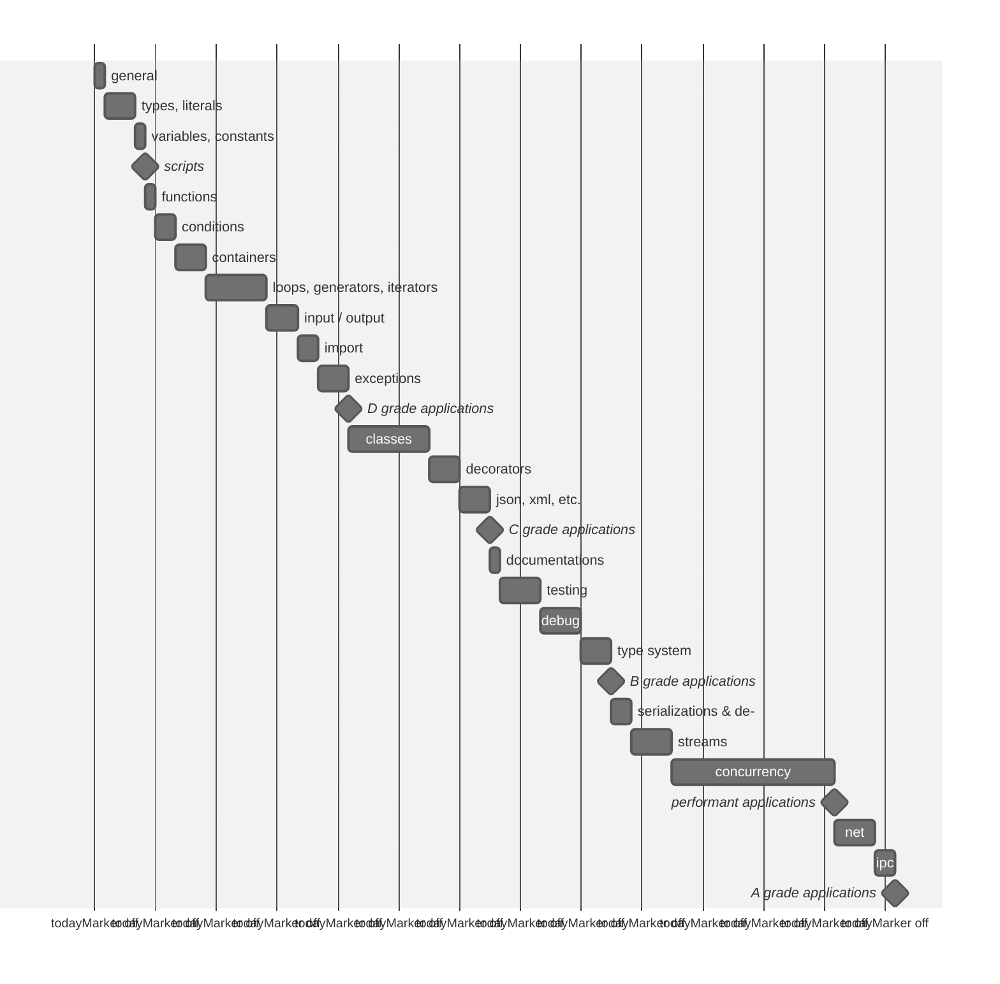

Python learning playground [→ru](README.ru.md)
===

This repository will document my learning journey with the Python language and its supporting tools.

> [!NOTE] **Disclaimer**
>
> I have some prior experience with Python, but I have decided to refresh my knowledge on this topic.

## Commitment

I will be following various books and will provide code samples and notes based on what I have learned and understood. All references to books will be accompanied by links leading to a reference list.

## Learning plan

First of all, I will compose a learning plan—not too specific, but one that allows me to follow a certain path.



## Books references

1. [Think Python, 2nd ed by Allen B. Downey][1]
2. [Illustrated Guide to Python 3 by Matt Harrison][2]

## About Language

[Python][^3] is a [high-level, general-purpose, dynamically typed language with garbage-collection][^4]. It is a multi-paradigm programming language initially designed by Guido van Rossum in 1991.

It became most popular with version 2. The current version is 3, and the second version is no longer maintained.

### Syntax and semantics

Python code should be easily readable, as working code is visually formatted through indentation and the absence of curly braces around blocks.

### Python Enhancement Proposals

Python is a developing language, despite its age, and new features arrive quite frequently

There is an [index][^5] of proposals that already accepted and ones that just proposed.

### Zen of Python

A brief and concise way to describe Python's guiding principles is known as the Zen of Python, and yes, it has its own [PEP 20][^6]:

> The Zen of Python, by Tim Peters
>
> Beautiful is better than ugly. <br />
> Explicit is better than implicit. <br />
> Simple is better than complex. <br />
> Complex is better than complicated. <br />
> Flat is better than nested. <br />
> Sparse is better than dense. <br />
> Readability counts. <br />
> Special cases aren't special enough to break the rules. <br />
> Although practicality beats purity. <br />
> Errors should never pass silently. <br />
> Unless explicitly silenced. <br />
> In the face of ambiguity, refuse the temptation to guess. <br />
> There should be one-- and preferably only one --obvious way to do it. <br />
> Although that way may not be obvious at first unless you're Dutch. <br />
> Now is better than never. <br />
> Although never is often better than *right* now. <br />
> If the implementation is hard to explain, it's a bad idea. <br />
> If the implementation is easy to explain, it may be a good idea. <br />
> Namespaces are one honking great idea -- let's do more of those! <br />

## Setup

Python 3 (hereinafter Python) — the target version of the language that interests me in the learning process.

Python can be installed as a standalone package, and there are many ways to do this, varying from one operating system
to another.

Allen Downey, the author of the book ["Python Basics"][1], suggests using the online service [Python Anywhere](https://www.pythonanywhere.com/), although there are many other platforms available, such as [Google Colab](https://colab.google/).

## Run

### REPL — <ins>R</ins>ead <ins>E</ins>valuate <ins>P</ins>rint <ins>L</ins>oop

Some languages, mostly interpreted ones, do have a so-called REPL, or interactive console, that reads given input, tries to evaluate what it's got as an input, prints out the result or error description, and starts awaiting a new input.

It allows testing algorithmic hypotheses step by step.

To run the Python REPL, just execute `$ python` or `$ python3` this will run the subroutine and print out the input invitation started with `>>>`.

> To exit from it, simply call the globally available method `exit()`.

### Execute

Python script can be executed as standalone file; in this case, the file should have `.py` extension or its pre-compiled version `.pyc`. It can also be executed as a whole directory, but in this scenario, the directory must have entrypoint file with the specific name `__main__.py` (the `.pyc` variant also will work).

```sh
$ python3 application.py
```

```sh
$ ls app/
__main__.py

$ python3 app
```

> [!NOTE]
>
> Yes, there is an ahead-of-time compilation step when the interpreter translates a Python file into bytecode that will be executed. Such files are stored in `__pycache__`, which should not be added to VCS repositories by default.

## Dive into

### Essentials

#### print

The print function is one of the main functions and is located in the global namespace. At first glance, it "simply" outputs the given value "to the screen." However, in reality, everything is a bit more complex.

The print method first checks the type of the passed object, and if it is not a string, it invokes conversion. Moreover, the thesis that print outputs "to the screen" is also incorrect. By default, print outputs to the specified output stream, which points to sys.stdout, but the output stream can also be specified by passing it as an argument during the call.

Allen Downey, the author of the book ["Python Basics"][1], notes only one difference between the calling formats in Python2 and Python3 - the absence of parentheses around the call arguments in the second version. In reality, however, parentheses can be present, but the composition of the call arguments is significantly different:

[Python2](https://docs.python.org/3/library/functions.html#print)
```python
import sys
print(>>sys.stdout, "Hello world\n")
```

[Python3](https://docs.python.org/3/library/functions.html#print)
```python
import sys
print("Hello world\n", file=sys.stdout)
```


[^1]: <https://www.goodreads.com/book/show/14514306-think-python> "Think Python, 2nd ed by Allen B. Downey"
[^2]: <https://www.goodreads.com/book/show/36522990-illustrated-guide-to-python-3> "Illustrated Guide to Python 3: A Complete Walkthrough of Beginning Python with Unique Illustrations Showing how Python Really Works by Matt Harrison"
[^3]: <https://www.python.org/> "Python official site"
[^4]: <https://en.wikipedia.org/wiki/Python_(programming_language)> "Wikipedia page about Python"
[^5]: <https://peps.python.org/pep-0000/> "Index of Python Enhancement Proposals"
[^6]: <https://peps.python.org/pep-0020/> "The Zen of Python"
