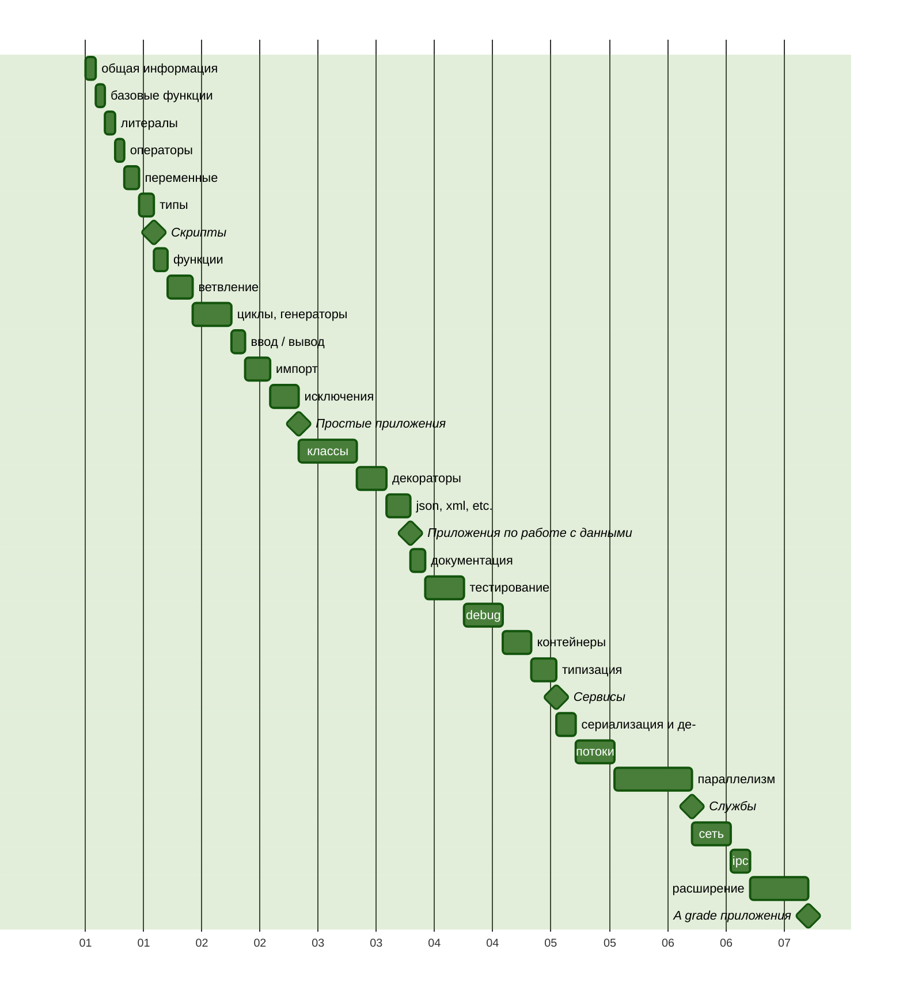

Путь изучения Python [→en](README.md)
===

В этом репозиторий я буду документировать путь изучения языка Python и
сопутствующих инструментов.

> [!NOTE]
>
> **Уточнение**
> У меня уже есть опыт написания приложений на Python, но я решил
> актуализировать, восполнить и систематизировать свои знания.

## Обязательство

В качестве опорных материалов я буду использовать различные книги,
официальную документацию и курсы.
Буду предоставлять примеры кода и заметки.
Текст буду сопровождать ссылками на материалы.

## План изучения

Для начала я составлю план изучения, не слишком подробный,
но позволяющий соблюдать определённую последовательность в освоении.

Каждый значимый этап будет завершать практическая работа,
на следующем графике эти работы можно опознать по символу ромба.



## Литературный список

1. «Основы Python. Научитесь думать как программист», 2-е издание. Аллен Б. Дауни[^1]
2. «Как устроен Python. Гид для разработчиков, программистов и интересующихся». Мэтт Харрисон[^2]

## О Языке

Python[^3] — высокоуровневый, универсальный, интерпретируемый язык со сборщиком
мусора и динамической типизацией[^4]. Язык разработан Гвидо ван Россумом
в 1991 году.

Язык приобрёл популярность ко второй версии. Текущая версия, — третья,
считается актуальной.

### Синтаксис и семантика

Код на Python призван быть легко читаемым, так как он визуально форматируется
с использованием отступов, а выражения не принято сопровождать
вспомогательными символами. Привычный символ, точка с запятой, разделяющий
инструкции, часто пропускается, так как выражение заканчивается в конце строки.

Однако `;` может быть использована в отдельных случаях, когда нужно записать
инструкции в одну строку.

В языке нет привычных фигурных скобок, как обозначение блока набора инструкций,
эту роль выполняет визуальное форматирование и обязательно одинаковый отступ
для инструкций одного уровня.

В качестве символа отступа может выбран или пробел или табулятор,
но они не должны смешиваться в рамках одного файла.

### Развитие языка

Python, несмотря на свой возраст, это развивающийся язык, который развивается
сообществом и комитетами при фонде[^5].

Развитие языка происходит через систему оценки предложений PEP[^6], из которых
формируется описание языка.

У языка есть лозунг, который задаёт рамки его развития.

### Zen of Python

Существует краткий и лаконичный способ описать принципы которыми
руководствуются разработчики Python, они известны как Zen of Python,
и у них есть свой PEP 20[^7].

> Красивое лучше, чем уродливое. <br />
> Явное лучше, чем неявное. <br />
> Простое лучше, чем сложное. <br />
> Сложное лучше, чем запутанное. <br />
> Плоское лучше, чем вложенное. <br />
> Разреженное лучше, чем плотное. <br />
> Читаемость имеет значение. <br />
> Особые случаи не настолько особые, чтобы нарушать правила. <br />
> При этом практичность важнее безупречности. <br />
> Ошибки никогда не должны замалчиваться. <br />
> Если они не замалчиваются явно. <br />
> Встретив двусмысленность, отбрось искушение угадать. <br />
> Должен существовать один и, желательно, только один очевидный способ сделать это. <br />
> Хотя он поначалу может быть и не очевиден, если вы не голландец. <br />
> Сейчас лучше, чем никогда. <br />
> Хотя никогда зачастую лучше, чем прямо сейчас. <br />
> Если реализацию сложно объяснить — идея плоха. <br />
> Если реализацию легко объяснить — идея, возможно, хороша. <br />
> Пространства имён — отличная штука! Будем делать их больше! <br />

## Запуск и режимы

Чтобы запустить Python приложение или отдельный скрипт нужен интерпретатор,
— приложение которое умеет читать инструкции на понятном человеку языке,
и переводить его в набор инструкций понятных вычислительной машине.

Преимущество интерпретируемых языков перед компилируемыми,
что задачи компиляции выполняются непосредственно при запуске программы,
и не требуют дополнительного подготовительного этапа — сборки (или компиляции
и линковки), так как сборка производится всегда под конкретную архитектуру
процессора и операционную систему.

Это увеличивает переносимость кода и скорость разработки.
Подобное улучшение не бесплатно, и исполнение интерпретируемого кода никогда
не будет на столько быстрым чтобы сравниться с заранее скомпилированным
приложением написанном на языке системного уровня.

Но зачастую, такой компромисс приемлем.

Выполнять Python инструкции можно как последовательно, так и в виде программы
сохранённой в файл или серию файлов.

Для того, чтобы выполнять инструкции последовательно нужно активировать REPL
(<ins>R</ins>ead <ins>E</ins>valuate <ins>P</ins>rint <ins>L</ins>oop) режим.
Это такой вариант работы интерпретатора, когда тот после запуска ожидает ввода
пользователя, перевод на новую строку — определяет конец инструкции, и в этот
момент интерпретатор пытается выполнить написанное, после чего выдает
или результат выполнения, или ошибку, и возвращается с нова в ожидания ввода.

Запуск приложения — более распространенный вариант, когда интерпретатор при
вызове сразу получает точку входа в приложение, и пытается исполнить
все следующие за точкой входа инструкции.

Так-как приложение может быть представлено одним или несколькими фалами,
то и запуск приложения выглядит как передача пути до фала
или целевой директории в качестве аргумента приложению интерпретатора Python.
В случае директории интерпретатор будет искать току входа — файл `__main__.py`.

Запускать Python можно с локальной машины, для этого нужно его установить[^8].

Если вам не хочется засорять локальную машину, — можно воспользоваться решением
на основе контейнеризации[^9].

Аллен Дауни, автор книги «Основы Python»[^1], предлагает для запуска простых
сценариев воспользоваться онлайн-сервисом
[Python Anywhere](https://www.pythonanywhere.com/).
Существуют и другие, например [Replit](https://replit.com/),
или в качестве REPL можно воспользоваться [Google Colab](https://colab.google/).

> [!NOTE]
>
> Для выхода из REPL интерпретатора, вызовите глобально доступный метод `exit()`.

> [!NOTE]
>
> В Python, есть этап компиляции заранее, когда интерпретатор преобразует
> текстовую версию кода Python в байт-код, который и будет выполнен.
> Такие файлы хранятся в каталоге `__pycache__`, который по-умолчанию
> не должен добавляться в репозитории VCS.

## Базовые функции

### print

Одна из базовых функций любого языка, — функция вывода.

Метод `print` проверяет тип переданного объекта, и если он не является
строкой, то приводит значение к строке.
Функция печатает в поток вывода, который по-умолчанию задан как стандартный
поток вывода (`sys.stdout`), то есть на экран.
Поток вывода можно указать, передав его в качестве аргумента вызова.

Аллен Дауни[^1], отмечает одно отличие между форматами вызова в Python2
и Python3, — отсутствие скобок вокруг аргументов вызова для Python2.
Дело не в скобках, а в дескрипторе метода, точнее в принимаемых аргументах:

[Python2](https://docs.python.org/3/library/functions.html#print)
```python
>>> import sys
>>> print(>>sys.stdout, "Hello world\n")
```

[Python3](https://docs.python.org/3/library/functions.html#print)
```python
>>> import sys
>>> print("Hello world\n", file=sys.stdout)
```

### input

В противовес выводу в Python есть функция захвата ввода, `input`[^10],
она так же как и `print` является глобально-доступной.
Функция позволяет перевести выполнение в режим ожидания ввода,
и дождавшись вызова переноса строки захватить всё что было указано ранее
в качестве значения. Результат будет возвращен в виде строки.

```python
>>> input("Say my name: ")
Say my name: Mr. White
'Mr. White'
```

### dir

Возвращает список имен, доступных в заданной области видимости[^11].
Без указания аргумента вызова будет выбрана текущая область видимости.
Если передать объект, то будут возвращены его методы и атрибуты.

#### help

Встроенная функция `help`[^12] особенно полезна в режиме REPL.
Без аргумента вызов функции инициализирует интерактивную консоль поиска
по индексу документации. При указании имени функции или класса интерпретатор
попытается найти соответствующий элемент среди зарегистрированных в текущем
окружении, и выведет по нему справку.

> [!TIP]
>
> Я не стану подробно останавливаться на всех встроенных функциях. Уточню лишь,
> что они важны и поставляются разными модулями в глобальное пространство.
> На официальном сайте[^13] можно найти подробное описание.
> Вызвав метод `help` со строкой `'builtins'` можно получить подробную справку,
> или передав `__builtins__` в качестве аргумента метода `dir`,
> можно вывести список зарегистрированных имён.

```python
>>> help('builtins')
Help on built-in module builtins:

NAME
    builtins - Built-in functions, types, exceptions, and other objects.
...
```

```python
>>> dir(__builtins__)
['ArithmeticError', 'AssertionError', 'AttributeError', 'BaseException', ...
```

> [!NOTE]
>
> Не стоит переопределять зарезервированные имена встроенных объектов и функций!

## Литералы, Булевы значения и None

Литералами являются значимые комбинации символов, которые могут быть
строками[^14] или числами[^15].

### Строки

Строковые литералы[^14] визуально выделяются наличием кавычек с обеих сторон.
Кавычки могут быть одинарными (`'`), двойными (`"`) и серией одинарных (`'''`)
или двойных (`"""`) кавычек.

```python
'It\'s a string literal'

"This is also a string literal"

'''
It's is a multiline string
with single quote inside.
'''

"""
And this is a also so called
"multiline" string
"""
```

Различия вида и количества кавычек определяется по-смыслу содержащихся
в литерале символов. И позволяет в некоторых случаях избежать экранирования
символов.

Например: `'''My name is 'Max\''''`.

Как видно из примера, в строке обёрнутой в три одинарные кавычки позволяется
не экранировать одинарную кавычку внутри, но при этом обязывает экранировать
такую-же одинарную кавычку в конце строки, чтобы отделить от закрывающей
последовательности.

Чтобы избежать подобного недоразумения, лучше учитывать какие символы будут
внутри и использовать противоположный тип кавычек, например так можно выйти
из положения: `"""My name is 'Max'"""`.

Кроме того, строковые литералы могут иметь префиксы управления `f r u b`.
Где `f` определяет, что строка содержит форматирование переменных,
`r` — что литерал представляет «сырую» строку, то есть строку в которой
все символы воспринимаются так как написаны, `u` — указывает на то, что строка
использует unicode кодировку, и `b` — указывает на то, что строка представлена
набором байтов.

```python
>>> r'\Hello \People' # Raw string
'\\Hello \\People'

>>> u'Это строка в формате Unicode' # Backward capability from Python2
'Это строка в формате Unicode'

>>> f'x={1+1} y={{1,2,3,4,5}}' # Formatted string
'x=2 y={1,2,3,4,5}'

>>> b'\xcf\x84o\xcf\x81\xce\xbdo\xcf\x82'.decode('utf-8')
'τoρνoς'
```

### Числа

Или числовые литералы[^15] это набор символов состоящих из знака принадлежности
числа к подмножеству положительных или отрицательных вещественных чисел
(`+`, `-`), указателя формата числа (`0b` — двоичный, `0o` — восьмеричный,
`0x` — шестнадцатеричный), цифр 0,1 для двоичных, 0..7 — восьмеричной,
0..9 — десятичной, а в случае шестнадцатеричной формы ещё и букв A..F.
`.`  используется как символ разделителя целой и дробных частей числа.

Числа с плавающей точкой, могут быть записаны в экспоненциальной форме,
для этого используется постфикс `e` c указанием размерности.

```python
# integers
0
41
0b101001
0o51
0x29
2_023
-41
```

> [!CAUTION]
>
> Целое десятичное число не может начинаться с цифры 0.


```python
# floats
0.
0.30684931506
.30684931506
0.2023e4
306_849.0e-6
```

В дополнение к целым числам[^16] и числам с плавающей точкой[^17], существует
запись литерала мнимого числа[^18].

```python
# imaginary
3.14j
1e100j
```
С введением PEP 515[^19] появилась возможность визуального разделения разрядов
символом нижнего подчеркивания `_`.

### Булевы значения

Значения описывающие логическое состояние[^20], предопределены и имеют
фиксированную форму записи: `True` и `False`.

### None

Зарезервированное слово выражающее отсутствие значения[^21] имеет фиксированную
форму записи.

## Операторы

Для произведение операций над числами, строками и булевыми значениями
используются различные операторы.

| | Оператор |       Строки        |    Числа     |     Булев     |
|-|:---------|:--------------------|-------------:|--------------:|
| | _Арифметические операции[^22]_                             ||||
| |  L + R   |  'a' + 'b' = 'ab'   |  1 + 2 = 3   |   T + T = 2   |
| |  L - R   |            -        |  1 - 2 = -1  |   F - T = -1  |
| |  L * R   |    'a' * 3 = 'aaa'  | -1 * 2 = -2  |   T * T = 1   |
| |  L / R   |            -        |  1 / 2 = 0.5 |   F / T = 0.0 |
| |  L ** R  |            -        |  5 ** 2 = 25 |  T ** T = 1   |
| |  L // R  |            -        |  5 // 2 = 2  |  T // T = 1   |
| |  L % R   | '%s' % 100 = '100'  |   5 % 2 = 1  |   T % T = 0   |
| | _Побитовые операции[^23]_                                  ||||
| |  L ^ R   |            -        |   5 ^ 2 = 7  |   F ^ T = T   |
| |  L & R   |            -        |   5 & 2 = 0  |   F & T = F   |
| |  L \| R  |            -        |   5 | 2 = 7  |   F | T = T   |
| |  L << R  |            -        |  5 << 2 = 20 |  T << T = 2   |
| |  L >> R  |            -        |  5 >> 2 = 1  |  T >> T = 0   |
| |    ~R    |            -        |      ~2 = -3 |      ~T = -2  |
| | _Операции сравнения[^24]_                                  ||||
| |  L == R  | 'a' == 'b' = F      |  5 == 2 = F  |  F == T = F   |
| |  L != R  | 'a' != 'b' = T      |  5 != 2 = T  |  F != T = T   |
| |  L > R   |  'a' > 'b' = F      |   5 > 2 = T  |   F > T = F   |
| |  L >= R  | 'a' >= 'b' = F      |  5 >= 2 = T  |  F >= T = F   |
| |  L < R   |  'a' < 'b' = T      |   5 < 2 = F  |   F < T = T   |
| |  L <= R  | 'a' <= 'b' = T      |  5 <= 2 = F  |  F <= T = T   |
| | _Логические операции[^25]_                                 ||||
| |  L and R |'a' and 'b' = 'b'    | 5 and 2 = 2  | F and T = F   |
| |  L or R  | 'a' or 'b' = 'a'    |  5 or 2 = 5  |  F or T = T   |
| |   not R  |    not 'b' = F      |   not 2 = F  |   not T = F   |
|*| L is R   | 'a' is 'b' = F      |  5 is 2 = F  |  F is T = F   |
|*|L is not R| 'a' is not 'b' = T  |5 is not 2 = T|F is not T = T |

`*` — Операторы `is` и `is not` нужны для проверки идентичности идентификаторов
объектов, они не сравнивают значения.

Все приведённые операции доступны для чисел и булевых значений.

В языке существует принцип не явного преобразования типов который позволяет
подобное поведение, и в некоторых случаях число приводится к булеву типу,
а в некоторых булев тип к числу.

Такие случаи можно идентифицировать по результату операции.

Строковые литералы имеют 3 специально переопределённых арифметических оператора:
`+`, — конкатенирует строки, `*`, — повторяет строку заданное число раз,
а `%` форматирует строку в которой использован форматирующий признак[^26].

Другие арифметические операции для строк не определены.

> [!TIP]
>
> При сравнении булевых значений приоритет стоит отдавать логическим операторам,
> перед побитовыми.

> [!TIP]
>
> В языке существует возможность многократного сравнения:
> `1 < 3 > 2`. Такой вид сравнения называется диапазонной проверкой.

## Переменные

Для ссылки на исходные или промежуточные значения используются переменные.
Как отмечает Мэтт Харрисон[^2], переменные можно воспринимать как метки
указывающие на значения, которые можно переиспользовать снова и снова.

```python
name = 'Maksim Kalenich'
year = 1982
```

В языке есть ограничения для имен переменных, так переменная может состоять
из букв латинского алфавита, цифр и символа нижнего подчёркивания.

При этом переменная не может начинаться с цифры.

Кроме того, в языке есть список зарезервированных слов[^27], которые
интерпретатор не даст использовать в качестве имён переменных.

> [!TIP]
>
> Вызвав `help('keywords')` будет представлена короткая справка.
>
> Или можно импортировать модуль `keyword` и обратиться к его переменной `kwlist`
> модуля которая содержит список зарезервированных слов.
>
> ```python
> >>> import keyword
> >>> keyword.kwlist
> ```

Кроме зарезервированных слов, Мэтт Харрисон не рекомендует использовать имена
встроенных элементов языка, список которых доступен из переменной
[`__builtins__`](#help).

Хорошим тоном вообще, и в Python в частности, считается давать переменным
описательные имена, из которых можно заключить, на какое значение они указывают.

Кроме того, стоит отметить, что документация языка предлагает конкретный формат
переменных[^28]: `snake_case`, — когда имена даются строчными буквами,
а если имя состоит из нескольких частей, то части соединяются символом
нижнего подчёркивания.

Изначально синтаксис Python-а предполагал только декларацию переменных
c инициализацией. Однако с версии 3.6 можно объявить переменную с указанием типа
и не передавать инициализирующее значение.

```python
favorite_book = "The Hitchhiker's Guide to the Galaxy"
current_book: str
```

Для инициализации переменной используется оператор присвоения `=`,
при этом создается представление переданного значения в виде объекта.

Каждый объект получает идентификатор, описание типа значения и счётчик ссылок.

Счётчик ссылок необходим среде исполнения Python, поскольку именно она,
а не разработчик отвечает за время жизни значений и своевременную очистку памяти
от мусора.

> [!TIP]
>
> Для получения идентификатора объекта существует встроенный метод `id`.
>
> ```python
> >>> id(favorite_book)
> 4423523640 # your's would be different
> ```
>
> Для получения типа значения представляемого объектом существует встроенный
> метод `type`.
>
> ```python
> >>> type(favorite_book)
> <class 'str'>
> ```
> Для получения значения счётчика ссылок на конкретный объект,
> можно воспользоваться методом `getrefcount` из пакета `sys`.
>
> ```python
> >>> import sys
> >>> sys.getrefcount(favorite_book)
> 2
> ```
> При этом если завести ещё одну переменную и присвоить ей тот же объект,
> то число ссылок увеличится.
> ```python
> >>> favorite_guide = favorite_book
> >>> sys.getrefcount(favorite_book)
> 3
> ```
>
> При вызове `getrefcount` число ссылок возвращается на 1 больше,
> так как во время вызова `getrefcount` добавляется временная ссылка как на
> аргумент вызова.

Поскольку Python — язык с динамической типизацией, то переменную можно
переопределить со значением типа отличным от того на который она вела.

```python
>>> num = '1'
>>> id(num)
4423584600
>>> type(num)
<class 'str'>

>>> num = int(num)
>>> id(num)
4423523640
>>> type(num)
<class 'int'>
```

При этом на одно значение может вести больше одной переменной.

A если проверить `id` уже зарегистрированного значения, то он будет
таким же как идентификатор возвращаемый от переменной.

```python
>>> num2 = num
>>> id(num)
4423523640
>>> id(num)
4423523640
>>> id(1)
4423523640
```
> [!NOTE]
>
> Фактически идентификатор это представление адреса значения в памяти.
> Оно может и будет меняться от запуска к запуску приложения.

> [!WARNING]
>
> Не смотря на то, что язык позволяет переопределять переменную,
> присваивая значения других типов, — это крайне плохая идея,
> так, как в последствии сложно определить почему переменная могла поменять тип,
> и при каких обстоятельствах это могло произойти.

> [!TIP]
>
> Результат выражения который не был вовремя присвоен переменной, будет утерян.
> Но в Python предусмотрено промежуточное хранение вычисленного значения,
> оно доступно в переменной с именем `_`.
>
> ```python
> >>> 100 + 1
> 101
> >>> _
> 101
> ```
> Об этом я узнал из книги Мэтта Харрисона[^2].

Оператор присвоения может быть совмещён с некоторыми
[операторами из списка](#%D0%BE%D0%BF%D0%B5%D1%80%D0%B0%D1%82%D0%BE%D1%80%D1%8B),
что позволяет переопределять значение для переменной слева.

| Оператор   |       Числа        |
|:-----------|-------------------:|
| _Арифметические операции[^22]_ ||
||                         x = 10 |
|   L += R   |  x += 2  # x = 12  |
|   L -= R   |  x -= 3  # x = 9   |
|   L *= R   |  x *= 3  # x = 27  |
|   L /= R   |  x /= 10 # x = 2.7 |
|  L **= R   | x **= 2  # x = 7.29|
|  L //= R   | x //= 2  # x = 3.0 |
|   L %= R   |  x %= 2  # x = 1.0 |
| _Побитовые операции[^23]_      ||
||                          x = 5 |
|   L ^= R   |   x ^= 2 # x = 7   |
|   L &= R   |   x &= 2 # x = 2   |
|  L \|= R   |  x \|= 4 # x = 6   |
|  L <<= R   |  x <<= 2 # x = 24  |
|  L >>= R   |  x >>= 3 # x = 3   |

## Типы

Типы значений в Python обозначают наследником какого класса является
данный объект.

От типа зависит и поведение наследника класса, в том числе о том,
какие операции с ним доступны и какие методы на нём можно вызвать.

### Числовые

Язык поддерживает несколько встроенных типов чисел:

```python
>>> type(41)
<class 'int'>

>>> type(0.36)
<class 'float'>

>>> type(3.14j)
<class 'complex'>
```

Число это не изменяемый тип, — после присвоения нельзя изменить значение
хранящего его объекта.

Это означает, что любая математическая породит новый объект в виде результата,
и в том числе операция изменения с присвоением.

```python
>>> x = 100
>>> id(x)
4414086488

>>> x += 11
>>> id(x)
4414087523
```

Арифметика чисел с плавающей точкой почти у всех современных вычислительных
машин базируется на стандарте IEEE 754[^29], и Python не является
исключением[^30], в силу чего он наследуют проблемы стандарта.

```python
>>> 0.1 + 0.1 + 0.1 == 0.3
False
```

Язык предлагает различные подходы по устранению подобных проблем:

1. Использовать функции из пакета math:
```python
>>> import math
>>> math.isclose(0.1 + 0.1 + 0.1, 0.3)
True
```

2. Использовать функцию округления, с указанием точности, при сравнении:
```python
>>> round(0.1 + 0.1 + 0.1, ndigits=1) == round(0.3, ndigits=1)
True
```

3. Использовать вспомогательные типы с сохранением точности:
`Decimal`[^31] и `Fraction`[^32]:

```python
>>> import decimal
>>> decimal.Decimal('0.1') * 3 == decimal.Decimal('0.3')
True

>>> import fractions
>>> fractions.Fraction(1, 10) * 3 == fractions.Fraction(3, 10)
True
```

Между числовыми типами существует неявное преобразование которое происходит с укрупнением числового пространства: `int` → `float` → `complex`.

```python
>>> 1 + 0.1 + 1.1j
(1.1+1.1j)
```

Явное преобразование типов тоже возможно и даже желательно:

```python
>>> int()
0

>>> float(1)
1.0

>>> complex(1.0)
(1.0+0j)
```

> [!CAUTION]
>
> В обратную сторону приведение типа лучше не использовать!

Помимо [арифметических операций](#%D0%BE%D0%BF%D0%B5%D1%80%D0%B0%D1%82%D0%BE%D1%80%D1%8B)
язык предлагает набор встроенных методов[^13] и вспомогательных методов[^33]
из модуля `math`.

Вот часть из них: abs[^34], divmod[^35], pow[^36], math.pow[^37], round[^38],
math.trunc[^39], math.floor[^40], math.ceil[^41], math.sqrt[^42],
math.cbrt[^43], math.exp[^44], math.log[^45], math.log2[^46], math.log10[^47].

```python
>>> abs(-0.345)
0.345

>>> divmod(5, 2) # same as (5 // 2, 5 % 2)
(2, 1)

>>> pow(5, 2) # same as 5 ** 2
25

>>> import math
>>> math.pow(5, 2)
25.0

>>> round(5.35, 1)
5.3

>>> math.trunc(5.35)
5

>>> math.floor(5.35)
5
>>> math.floor(-5.35)
6

>>> math.ceil(5.35)
6
>>> math.ceil(-5.35)
5

>>> math.sqrt(25) # same as 25 ** 1/2
5.0

>>> math.cbrt(27) # same as 27 ** 1/9
3.0

>>> math.exp(2) # close to math.e ** 2
7.38905609893065

>>> math.log(2)
0.6931471805599453

>>> math.log2(4) # same as math.log(4, 2)
2.0

>>> math.log10(100) # same as math.log(100, 10)
2.0
```

### Булев

Булевыми значениями могут быть `True` или `False`. Как упоминалось в секции
о литералах,
[булевы значения](#%D0%B1%D1%83%D0%BB%D0%B5%D0%B2%D1%8B-%D0%B7%D0%BD%D0%B0%D1%87%D0%B5%D0%BD%D0%B8%D1%8F)
имеют фиксированное написание.

К булевым значениям можно привести значения любых типов, явно,
используя встроенный метод `bool`, или не явно,
когда интерпретатор сам отдаст приоритет типу булев перед другим.

```python
>>> bool(1)
True

>>> bool(0)
False

>>> bool(-1)
True

>>> bool('')
False

>>> bool(None)
False

>>> not 0
True

>>> not ''
True

>>> not None
True

>>> not 1
False
```

> [!TIP]
>
> Явное приведение к булеву типу не приветствуется.

#### Ленивое вычисление

При исполнении логических операций с булевыми значениями, происходит ленивое
вычисление[^48], — при котором второй операнд не проверяется,
если первый удовлетворяет условию оператора.

```python
>>> True or False
True

>>> False and True
False
```

Как это проверить?
Использовать в качестве него метод, который бы был исполнен если бы до него
дошло выполнение.

```python
>>> True or print('Checked')
True

>>> False and print('Checked')
False

>>> True and print('Checked')
'Checked'
```

### Последовательности

Последовательности или серии — это объекты которые хранят несколько значений
следующих друг за другом.

| | Оператор      | Ожидаемый результат                                       |
|-|:--------------|:----------------------------------------------------------|
| |  x in s       | Элемент или серия есть в последовательности               |
| |  x not in s   | Элемент или серия отсутствуют в последовательности        |
|1|  s + t        | Конкатенация                                              |
|1|  s * n        | Повторение серии n раз                                    |
|1|  s[i]         | Элемент последовательности по индексу                     |
|*|  s[i:j]       | Срез из серии от индекса и до индекса                     |
|*|  s[i:j:k]     | Срез из серии от индекса и до индекса с шагом             |

`*` — в случае со срезами, все параметры опциональны,
      так запись `s[:]` — создаст новый срез с тем же содержимым,
      что и у оригинала.

`1` - Операторы конкатенации, произведения, взятия элемента и слайса по
      индексам не определены для множеств.

> [!NOTE]
>
> Если вам не нравится формат записи взятия слайса: `[::]`, можно использовать
> встроенный метод `slice([start, ]stop[, step=None])` и передать его
> параметром `string[slice(10)]`.

> [!NOTE]
>
> Сама последовательность `i:j:k` — начальный индекс, конечный индекс, шаг,
> используется довольно часто. При это диапазон нужно читать так: `[i:j)`,
> т.е. когда левая граница включена, а правая нет.


| | **Метод**     | **Ожидаемый результат**                                   |
|-|:--------------|:----------------------------------------------------------|
| | len(s)        | Длинна серии                                              |
|*| min(s)        | Элемент с минимальным значением в серии                   |
|*| max(s)        | Элемент с максимальным значением в серии                  |
|*| sorted(s)     | Сортированная последовательность                          |
|1| reversed(s)   | Отраженная последовательность в виде итератора            |
| | iter(s)       | Итератор по элементам                                     |
| |enumerate(s, i)| Итератор по парам ключ: элемент                           |
| |filter(f, s)   | Итератор по отфильтрованной последовательности            |
| |map(f, s[, *s])| Итератор по модифицированной последовательности           |
|*|zip(*s)        | Итератор по транспонированным сериям                      |
|1|s.index(x,i,j) | Начальный индекс элем./серии из последовательности с окном|
|1|s.count(x)     | Количество вхождений элемента/серии в последовательность  |

`*` — для `min` и `max` дан упрощенный вариант дескриптора методов.

`1` - Методы `reversed`, `.index` и `.count` не определёны для множеств.

```python
>>> word = 'peace'
>>> id(word)
4398765168

>>> not_war = word[:]
>>> id(not_war)
4398765168
```

> [!TIP]
>
> Работа со слайсами ка же предусматривает отрицательные индексы и шаг.
> Так, например, развернуть последовательность можно при помощи `s[::-1]`.

#### Строки

Как можно было догадаться из примера выше, строки частный случай
последовательности.

Строки это последовательность символов[^49], каждый из которых является
представлением байт.

```python
>>> some_string = 'some not that long of a string'
>>> type(some_string)
<class 'str'>
```

Чтобы увидеть строку в виде серии байт, можно воспользоваться встроенным
методом `bytes`[^50] или `bytearray`[^51] и вызвать метод этих классов `.hex`,
с указанием символа разделителя в качестве аргумента.

```python
>>> bytes(some_string, 'latin-1').hex(',')
'73,6f,6d,65,20,6e,6f,74,20,74,68,61,74,20,6c,6f,6e,67,20,6f,...'
```

Строки это не изменяемый тип, — после присвоения нельзя изменить значение
хранящего её объекта.

Строки можно явно привести к числовым типам, при условии, что строка содержит
только разрешенные цифры и буквы числовой формы к которой она приводится:

```python
>>> int('41') # same as int('41', 10)
41

>>> int('29', 16)
41

>>> int('51', 8)
41

>>> int('101001', 2)
41

>>> float('41.5')
41.5

>>> complex('10.1j')
10.1j
```

> [!TIP]
>
> Преобразование типов часто требуемая задача, и лучше её освоить заранее.
>
> Например при получении значения из метода [`input`](#input),
> введённое пользователем значение возвращается как строка, вне зависимости
> от того, что было введено. И если предполагался числовой ответ, то логичным
> будет привести значение, чтобы выполнить арифметическое действие или провести
> сравнение c эталоном.

К строкам можно привести значения иных типов используя метод `str`[^52],
функцию форматирования `format`[^53], форматированные строки[^26] и [^54].

```python
>>> str(41) # str(0b101001) str(0o51) str(0x29)
'41'

>>> str(41.5)
'41.5'

>>> str(True)
'True'

>>> format(41, '>#05d')
'00041'

>>> format(41, '>#' '10b')
'  0b101001'

>>> format(77, 'c')
'M'

>>> '%x' % 41
'29'

>>> f'{41:#0x}'
'0x29'
```

> [!TIP]
>
> Приведение к строки, к числу, или к любому иному типу ограничено классом
> от которого наследован объект данного типа, и наличием у этого класса метода,
> который будет вызван при попытке интерпретатора привести тип.
>
> Подробнее об этом будет в разделе о классах их наследниках.

Все операторы последовательностей работают со строками.

Так можно определить длину, найти индекс буквы или слова внутри строки,
подсчитать количество повторений, развернуть строку и так далее.

Класс строк расширяет функционал от работы с последовательностями следующими
методами[^55]:

| Метод класса строк            | Аргументы       | Результат                 |
|:------------------------------|:----------------|:--------------------------|
|||                                               s = 'schwarze Katze straße' |
| Модификация                                                               |||
| s.capitalize()                |                 | 'Schwarze katze straße'   |
| s.title()                     |                 | 'Schwarze Katze Straße'   |
| s.upper()                     |                 | 'SCHWARZE KATZE STRASSE'  |
| s.lower()                     |                 | 'schwarze katze straße'   |
| s.casefold()                  |                 | 'schwarze katze strasse'  |
| s.removeprefix(prf)           |'schwarze '      | 'Katze straße'            |
| s.removesuffix(sfx)           |' straße'        | 'Schwarze katze'          |
| s.strip([chs])                |'s'              | 'chwarze Katze straße'    |
| s.lstrip([chs])               |'s'              | 'chwarze Katze straße'    |
| s.rstrip([chs])               |'e'              | 'schwarze Katze straß'    |
| s.replace(old, new[, count]]) |'ß', 'ss'        | 'schwarze Katze strasse'  |
| Декодирование                                                             |||
| s.encode(enc, err)            |'ascii', 'ignore'| b'schwarze Katze strae'   |
| Поиск                                                                     |||
| s.find(ss[, s[, e]])          |'å'              | -1                        |
| s.rfind(ss[, s[, e]])         |'ra'             | 17                        |
| s.index(ss[, s[, e]])         |'å'              | ValueError                |
| s.rindex(ss[, s[, e]])        |'ra'             | 17                        |
| s.count(ss[, s[, e]])         |'a'              | 3                         |
| Валидация                                                                 |||
| s.startwith(sf[, s[, e]])     |'sch'            | True                      |
| s.endwith(sf[, s[, e]])       |'sch'            | False                     |
| s.isalnum()                   |                 | False                     |
| s.isalpha()                   |                 | False                     |
| s.isascii()                   |                 | False                     |
| s.isnumeric()                 |                 | False                     |
| s.isdecimal()                 |                 | False                     |
| s.isdigit()                   |                 | False                     |
| s.isidentifier()              |                 | False                     |
| s.islower()                   |                 | False                     |
| s.isupper()                   |                 | False                     |
| Декомпозиция                                                              |||
| s.partition(sep)              |' '        |('schwarze', ' ', 'Katze straße')|
| s.rpartition(sep)             |' '        |('schwarze Katze', ' ', 'straße')|
| s.split(sep, max)             |'a', 2     |['schw', 'rze K', 'tze straße']  |
| s.rsplit(sep, max)            |'a', 2     |['schwarze K', 'tze str', 'ße']  |
| Равнение                      ||                                  s = 'cat' |
| s.center(w[, f])              |10, '*'          | '\*\*\*cat\*\*\*\*'       |
| s.ljust(w[, f])               |10, '*'          | 'cat\*\*\*\*\*\*\*'       |
| s.rjust(w[, f])               |10, '*'          | '\*\*\*\*\*\*\*cat'       |
| Форматирование                ||                       s = '{} eats {food}' |
| s.format(*a, **kw)            |'cat', food='tuna'| 'cat eats tuna'          |
| Склейка строк                 ||                                    s = ';' |
| s.join(iter)                  | ['one', 'two']  | 'one;two'                 |

#### Кортежи

Кортеж[^56] это неизменяемая последовательность элементов.

```python
>>> t1 = (1, 'one', b'uno')
>>> t1
(1, 'one', b'uno')

>>> t2 = 1, 'one', b'uno'
>>> t2
(1, 'one', b'uno')


>>> t3 = tuple([1, 'one', b'uno'])
>>> t3
(1, 'one', b'uno')
```

Последний вариант с вызовом именного метода[^57] — это способ привести любой
перечисляемый тип к кортежу.

Кортежи используются для передачи данных, между различными частями кода,
и могут играть роль интерфейса-ожидания, поскольку длинна не меняется,
и можно договориться какая позиция в кортеже за что будет отвечать.

На кортежи распространяются операторы и методы перечислений,
их можно склеивать получая новый кортеж, повторять n раз, получать длину, проверять на наличие элемента, получать срез и проверять указывает ли переменная на тот же самый кортеж или нет.

Максимальный и минимальные элементы по значению можно получить только в случае
если они могут быть приведены к одному типу.

```python
>>> max((1, 2, 3, 20, -2, 60, .5, 100.1))
100.1
```

Так как этот тип относится к неизменяемым, то нельзя изменить длину кортежа,
как и переприсвоить новое значение его элементу.

```python
>>> t1[0] = 10
TypeError: 'tuple' object does not support item assignment
```

Однако, если элемент кортежа имеет изменяемый тип, то его можно мутировать.

```python
>>> t2 = ([1, 2, 3, 4],)
>>> t2[0][0] = 10
>>> t2
([10, 2, 3, 4],)
```

#### Списки

Список[^58] это наиболее распространённый тип представляющий перечисления, он похож на кортеж, также может хранить элементы различных типов, на него также
распространяются операторы и методы перечислений, но при этом он относится к
изменяем. А значит его элементы можно удалять или добавлять в него новые,
можно заменять и сортировать на месте.

```python
>>> l1 = [1, 'one', b'uno']
>>> l1
[1, 'one', b'uno']

>>> l2 = list([1, 'one', b'uno'])
>>> l2
[1, 'one', b'uno']
```

Последний вариант с вызовом именного метода[^59] — это способ привести любой
перечисляемый тип к списку.

> [!NOTE]
>
> Честно говоря, я стараюсь не использовать именные методы при инициализации
> из чистых наборов, так как выглядит это избыточно.

Как упоминалось выше, изменяемые типы последовательностей, охотно изменяются,
для этого существует следующий набор операторов и методов:

| | Оператор      | Ожидаемый результат                                       |
|-|:--------------|:----------------------------------------------------------|
| | s[i] = x      | Устанавливает элемент по индексу                          |
| | s[i:j] = t    | Заменяет часть серии значениями из итерируемого объекта   |
| | del s[i:j]    | Удаляет часть серии, s[i:j] = []                          |
|1| s[i:j:k] = t  | Заменяет указанные элементы значениями из итерир. объекта |
| | del s[i:j:k]  | Удаляет указанные элементы                                |
| | **Метод**     | **Ожидаемый результат**                                   |
|2| s.append(x)   | Добавляет элемент в конец списка s[len(s):len(s)] = [x]   |
|3| s.extend(t)   | Добавляет серию в конец списка s[len(s):len(s)] = t       |
|4| s.insert(i, x)| Добавляет элемент в указанное место s[i:i] = [x]          |
| | s.pop([i])    | Забирает элемент из массива, без индекса, — с конца       |
| | s.copy()      | Создает копию списка s[:]                                 |
|5| s.reverse()   | Разворачивает последовательность                          |
|6| s.remove(x)   | Удаляет ближайший элемент от начала, по значению          |
| | s.clear()     | Очищает список del s[:]                                   |

> [!NOTE]
>
> 1. Количество элементов для замены в итерируемом объекте должно
>    соответствовать числу заменяемых;
> 2. Добавление элементов вконец списка сравнительно не дорогая операция O(1);
> 3. Расширение списка может быть произведено через присвоение с конкатенацией
>    s += t, но это более затратная операция. Считаю s[len(s):len(s)] = [x]|t
>    наиболее удачным и универсальным вариантом, которому стоит отдавать
>    предпочтение;
> 4. Самая затратная операция O(n) со списками, которою стоит избегать;
> 5. Метод разворачивания последовательности модифицирует саму
>    последовательность, и не возвращает результата;
> 6. Удаление элемента по значению затратная операция O(n), поскольку нужно
>    сначала найти искомый элемент среди всех элементов последовательности.

```python
>>> l1[0] = 10
>>> l1
[10, 'one', b'uno']
```

Для наследников класса Список существует ещё один метод:

| | Метод         | Ожидаемый результат                                       |
|-|:--------------|:----------------------------------------------------------|
|1| s.sort()      | Сортирует элементы внутри последовательности,             |
| |               | при условии, что их можно сравнить                        |

> [!NOTE]
>
> 1. Так же как метод `reverse` метод `sort` модифицирует последовательность и
>    ничего не возвращает. Оба этих метода экономят память, поскольку не
>    создают копию, и это целесообразно для больших последовательностей.
>    Если последовательность приемлемого размера, лучше использовать
>    встроенные методы `reversed` и `sorted`.

#### Множества

Основное, что нужно знать о множествах[^60], это то, что они хранят уникальные элементы вне определённого порядка!

```python
>>> s1 = {1, 'one', b'uno', 1}
>>> s1
{b'uno', 1, 'one'}

>>> s2 = set([1, 'one', b'uno', b'uno'])
>>> s2
{1, b'uno', 'one'}
```

Вторая важная особенность множеств, они позволяют находить решения для задач
из теории множеств[^61]:

| Оператор      | Ожидаемый результат                                         |
|:--------------|:------------------------------------------------------------|
| s1 | s2       | Объединение множеств                                        |
| s1 & s2       | Пересечение множеств                                        |
| s1 - s2       | Исключение s2 из s1                                         |
| s1 ^ s2       | Исключающее объединение s1 и s2                             |
| s1 < s2       | True если s1 входит s2                                      |
| s1 <= s2      | True если s1 входит или есть s2                             |
| s1 == s2      | True если s1 есть s2                                        |
| s1 >= s2      | True если s1 включает или есть s2                           |
| s1 > s2       | True если s1 включает s2                                    |

> [!NOTE]
>
> Элементом множества может быть любое неизменяемое хешируемое значение,
> например: число, строка, объект, кортеж, но не список или другое множество.

Операторы последовательностей применимы для множеств, так как это частный
случай первых, но операторы для работы с элементами по индексам, не определены.

Как и в случае с методами последовательностей, применимы за исключением тех,
что предполагают участие индексов. Например невозможна сортировка, потому-что:
элементы множеств хранятся вне порядка, или подсчёт повторяющихся элементов,
так, как элементы множеств всегда уникальны!

У множеств есть вспомогательные методы:

| Метод                    | Ожидаемый результат                              |
|:-------------------------|:-------------------------------------------------|
| s.isdisjoint(z)          | True если есть пересечение s и z `not(s & z)`    |
| s.issubset(z)            | True если z включает множество s `s <= z`        |
| s.issuperset(z)          | True если s включает множество z `s >= z`        |
| s.union(*z)              | Объединение s и *z `s \| z \| ...`               |
| s.intersection(*z)       | Пересечение s и *z `s & z & ...`                 |
| s.difference(*z)         | Исключение s и *z `s - z - ...`                  |
| s.symmetric_difference(z)| Исключающее объединение s и z `s ^ z`            |
| s.copy()                 | Копия множества                                  |
| s.add(e)                 | Добавляет элемента к s `s \|= {e}`               |
| s.pop()                  | Удаляет и возвращает удаленный элемент           |
| s.remove(e)              | Удаляет элемент или возвращает KeyError          |
| s.discard(e)             | Удаляет элемент из s `s -= {e}`                  |
| s.update(*z)             | Обновляет s из *z `s \|= z \| ...`               |
| s.intersection_update(*z)| Обновляет s пересечением c *z `s &= z & ...`     |
| s.difference_update(*z)  | Обновляет s исключением *z `s -= z \| ...`       |
| s.symmetric_difference_update(z) | Обновление s исключающим объединением с z|
| s.clear()                | Очищает множество                                |

#### Словари

Их иногда называют хешкартами или ассоциативными массивами, реализации
в разных языках и платформах отличаются, но принцип представления у них схожий:
для каждого ключа существует связанное с ним значение.
Ключи это список неизменяемых хешируемых значений.

Словари обеспечивают быстрый доступ по ключу O(1), в противном случае поиск
значения происходит через перебор O(n).

> [!NOTE]
>
> До версии 3.6 порядок ключей был произвольный, как значения в множествах.

```python
>>> d1 = {1: 'one', 'one': 1, b'one': 1, 1: 'uno'}
>>> d1
{1: 'uno', 'one': 1, b'one': 1}

>>> d2 = dict([(1, 'one'), ('one', 1), (b'one', 1), (1, 'uno')])
>>> d2
{1: 'uno', 'one': 1, b'one': 1}
```

Не все операторы и методы последовательностей доступны для словарей, но те,
что реализованы, — работают с ключами.

| Оператор        | Ожидаемый результат                                       |
|:----------------|:----------------------------------------------------------|
| x in d          | True если ключ в словаре                                  |
| x not in d      | True если ключ отсутствует в словаре                      |
| d[i]            | Элемент словаря по ключу, или KeyError                    |
| d[i] = x        | Устанавливает элемент словаря по ключу                    |
| del d[i]        | Удаляет из словаря пару ключу-значение                    |
| d1 | d2         | Комбинация словарей                                       |
| d1 |= d2        | Обновление комбинации словарей                            |
| **Метод**       | **Ожидаемый результат**                                   |
| len(d)          | Длинна словаря / количество пар ключ–значение             |
| reversed(d)     | Отраженная серия ключей, поскольку есть порядок           |
| enumerate(d, i) | Итератор по парам порядковый номер - ключ                 |
| filter(f, d)    | Итератор по отфильтрованной последовательности ключей     |
| map(f, d[, *d]) | Итератор по модифицированной последовательности ключей    |
| zip(*d)         | Итератор по сериям кортежей с ключём в качестве значения  |

У словарей, так же как и у других последовательностей, есть вспомогательные
методы:

| Метод                | Ожидаемый результат                                  |
|:---------------------|:-----------------------------------------------------|
| d.clear()            | Очищает словарь                                      |
| d.copy()             | Создает копию словаря                                |
| d.get(k [, v])       | Возвращает значение по ключу                         |
| d.items()            | Возвращает пары ключ-значение                        |
| d.keys()             | Возвращает ключи                                     |
| d.values()           | Возвращает знаяения                                  |
| d.pop(k [, v])       | Удаляет значение из словаря по ключу и возвращает его|
| d.popitem()          | Удаляет значение из начала словаря и возвращает его  |
| d.update(*dd)        | Обновляет словарь из словарей донаров                |
| d.setdefault(k[, v]) | Устанавливает значение если ключ не найден и возвращ.|

> [!TIP]
>
> Кроме перечисленных методов на экземплярах словаря, существует метод на
> классе, который позволяет создать словарь с разными ключами и
> проинициализировать их единым значением:
>
> ```python
> >>> dict.fromkeys(('one', 'two', 'three'), 0)
> >>> {'one': 0, 'two': 0, 'three': 0}
> ```

#### Диапазоны

Это вспомогательная целочисленная последовательность.

```python
>>> r1 = range(1, 10, 2)
>>> list(r1)
[1, 3, 5, 7, 9]
```

Последовательностью конечных значений он становится только тогда, когда
происходит запрос на распаковку.

В сочитании с другими структурами, и методом последовательностей zip,
может решаться множество задач.

## Скрипты

Текущего знания языка достаточно, чтобы написать простую но функциональную
программу, которая будет выполнять сериализованный набор инструкций,
шаг за шагом: приглашать пользователя ко вводу, обрабатывать полученные
значения, производить логические и арифметические операции.

Для примера напишим утилиту которая будет ожидать на вход строку от команды
`uname` с флагом `-a`, — вывод базовой информации о текущей операционной среде,
и выводить эту информацию в виде таблицы.

На данном этапе мы не знаем как работать с потоками и файловыми дискрипторами,
не умеем запускать консольные команды из python кода и перехватывать ответ от
них, но мы знаем всё, что нам нужно!

> [!TIP]
>
> При написании програм стоит провести оценку требований, это позволяет понять
> обладаем ли мы, как инженеры, необходимым инструментарием, понять где
> границы решения, и наметить подход к решению.

**Оценим входные параметры.**

Во всех современных системах существует встроенная утилиита доступная в
терминальном режиме под именем `uname`. Она выводит информацию о текущей
операционной системе: название ядра, сетевое имя, версию ядра, архитектуру
под которую операционная система собрана, и другую информацию.

Для получения результата нужно выполнить её в терминальной оболочке,
оболочек существует множество, вот лишь некоторые: `sh`, `bash`, `zsh`,
`fish`, для OS Windows существует `PowerShell` или `pwsh` и `cmd`,
и в любой из них можно набрать `uname -a` и после нажатия на `enter` получить
желаемую строку описания.

Конечные строки буду отличаться от версии к версии операционной системы:

> Пример вывода команды `uname -a`
>
> `Darwin maxbook.local 23.2.0 Darwin Kernel Version 23.2.0: Wed Nov 15 21:54:10 PST 2023; root:xnu-10002.61.3~2/RELEASE_X86_64 x86_64`
>
> `Linux mumenstallu 5.14.0-284.30.1.el9_2.aarch64 #1 SMP PREEMPT_DYNAMIC Fri Sep 15 19:19:23 UTC 2023 aarch64 aarch64 aarch64 GNU/Linux`
>
> `Windows_NT MaxWinITX 10.0 22621 x86_64 MS/Windows (Windows 11)`

Но принцип формирования строки остаётся неизменным[^62]:

> "\<sysname\> \<nodename\> \<release\> \<version\> \<machine\>\n"

**Теперь нам нужно понять требования к выходу из задачи.**

Допустим, что результатом решения должен быть вывод информации в виде таблицы:

```
|------------|--------------|---------|---------|
| Sysname    | Nodename     | Release | Machine |
|------------|--------------|---------|---------|
| Windows_NT | homepc.local |    10.0 | x86_64  |
|------------|--------------|---------|---------|
```

При этом ширина колонок должна адаптироваться под самое длинное слово
в колонке, значения колонок `Sysname`, `Nodename`, `Machine` будут равнятся
по левой стороне, а для `Release` по правой.

**Выработка решения.**

Для того, чтобы выработать решение, нужно сформулировать цепочку вопросов,
и дать на них ответы. Ответ — это часть решения.

Не все вопросы можно определить сразу, но в процессе уточнения и получения
ответа на часть вопросов, появляются новые, уточняющие.

1. Как захватить результат выполнения `uname -a`?
2. Как взять части строки и присвоить их переменным?
    - Как очистить строку от лишних символов?
3. Как определить самое длинное значение в колонке?
    - Как вычислить длину значения и как вычислить длину названия колонки?
    - Как вычислить, что из них больше?
4. Как вывести значение с равнением по заданной стороне и фиксированной ширины?
    - Как заполнить указанным символом постоту вокруг значения?
5. Как вывести многострочный текст на экран?

<details>
  <summary>Посмотреть ответы</summary>

1. Для передачи вывода одной команды на вход другой, в современных оболочках,
  используется символ `|` (pipe). Полная команда выглядит так:
  `uname -a | python3 ./uname_table_view.py`. А, чтобы забрать строку из ввода,
  можно воспользоваться уже известной функцией [`input`](#input).
2. Опираясь на приведённый формат вывода можно заключить,
  что знак пробела — разделитель элементов, и в этом случае достаточно вызвать
  метод класса строки `.split` с указанием пробела в качестве разделителя.
  Однако реальные результаты вызова команды `uname -a` показвают,
  что этот принцип соблюдается не во всех случаях, и в некоторых системах
  есть пробелы внутри значений! К тому же, сегмент \<version\> лучше было бы
  вообще проигнорировать, так как он может быть непредсказуемо длинным.
  Как решение, можно взять некоторое число элементов слева, а затем справа,
  и отсавить сегмент \<version\> нетронутым.
    - Большая часть строк не нуждается в очистке, но сегмент \<machine\>,
      судя по примерам после указания архитектуры может идти дополнительная
      информация которую хотелось бы проигнорировать. Это можно сделать
      используя ещё один метод доступный экземплярам класса строка, метод
      `.strip`, или в нашем случае `.rstrip` с передачей словаря символов
      для очистки. Как только этот метод встретит символ не из словаря,
      он остановится.
3. Колонки в результирующей таблице имеют 2 значения: наименование параметра
  и его значение.
    - Для вычисления длинны строки мы можем воспользоваться общим методом
      для последовательностей `len`, а для вычиления какое из двух значений
      больше, — общим методом для последовательностей `max`. Оба этих метода
      ожидают на вход последовательность, но как посчитать это автоматически для каждой пары заголовка и значения, и как собрать их в пары?
    - Ещё один общий метод для последовательностей `map` позволяет вызвать
      указанную функцию для элементов заданной серии.
    - Название заголовка и значение в колонке напоминает структуру словарь
      `dict`. Имея переменные хранящие sysname, nodename, release и machine,
      можно скомпоновать словарь с известными ключами и значениями.
      Для этого нужно проинициализировать `dict` передав ему список
      пар-кортежей, где на первом месте будет ключ, а на втором значение.
      Ещё один, известный, метод для работы с последовательностями `zip`
      позволяет получить как раз такой список пар из двух списков,
      с одинаковым числом элеиентов.
    - Этим же методом, можно воспользоваться для создания списка кортежей
      по 2 элемента содержащих длины сток.
    - А встроенные методы словарей `.keys` и `.values` позволят получить
      списки ключей и значений с сохранением порядка.
4. Для выравнивания строк python предоставляет выбор, можно воспользоваться
  методами экземпляра класса строка: `.center`, `.ljust` и `.rjust`. А можно
  произвести форматирования внутри строки-шаблона, используя другой метод
  экземпляра строки `.format` или используя перегруженный оператор `%`.
  Метод `.format` подразумевает, что строка на которой он вызван имеет указание
  какие значения из аргументов, куда должны попасть, и как быть форматированы.
    - Формат значения, в частности, поддерживает указание на равнение
      и удовлетворение требованиям по ширине.
    - Вариант форматирования через оператор `%` ожидает другой синтаксис
      форматирования вставки, но также позволяет определять равнение
      и поддерживать заданную ширину. Кроме того, этот вариант форматирования
      можно совместить с форматируемыми строками, `f''` который позволяет из
      строки обращаться к перемнным видимости, и использовать синтаксис
      форматирования такой же как у `.format`.
5. Многострочный текст можно вывести как многократным вызовом известного
  метода `print`, так и передав блок текста с переносами в качестве аргумента.
</details>

<details>
  <summary>Посмотреть решение</summary>

```python
sysname, nodename, release, rest = input()\
  .split(' ', 3) # (1)

_, machine = rest\
  .rstrip(' ()/1GLMNSUWdgiilmnnosuwx')\
  .rsplit(' ', 1) # (2)

uname_params = {
  'sysname': sysname,
  'nodename': nodename,
  'release': release,
  'machine': machine
} # (3)

columns_widths = tuple(
  map(
    max,
    zip(
      map(len, uname_params.keys()),
      map(len, uname_params.values())
    ) # (4)
  ) # (5)
) # (6)

separator_row = """|-{0:-<{1}}-|-{0:-<{2}}-|-{0:->{3}}-|-{0:-<{4}}-|""".format(
  '-',
  *columns_widths  # (7)
)  # (8)

head_row = """| {0: <{4}} | {1: <{5}} | {2: >{6}} | {3: <{7}} |""".format(
  *(tuple(
      map(str.capitalize, uname_params.keys()) # (9)
  ) + columns_widths) # (10)
)

value_row = f"| %(sysname) -{columns_widths[0]}s \
| %(nodename) -{columns_widths[1]}s \
| %(release) +{columns_widths[2]}s \
| %(machine) -{columns_widths[3]}s |" % uname_params # (11)

print(
  '\n'.join([
    separator_row,
    head_row,
    separator_row,
    value_row,
    separator_row,
  ]) # (12)
) # (13)
```

1. Используя `input` забираем строку из ввода.
  _При этом ввод будет считаться законченным после получения
  знака конца строки._
  Используя `.split` забираем первые 3 значения разделенные пробелом,
  и остаток.
  _Знак `\` нужен чтобы интерпретатор позволял переносить часть
  выражения на следующую строку._
  В Python есть множественное присвоение, элементов в левой части
  может быть меньше чем права отдает.
2. Очищаем остаток строки от «мусора» справа используя метод `.rstrip`.
  _В качестве словаря используем уникальный набор символов которые следуют
  после архитектуры, из примеров. Словарь символов различает регистр букв._
  Забираем последний фрагмент строки используя `.rsplit`.
  _Игнорируемое значение в множественном присвоении принято именовать
  символом подчёркивания._
3. Инициализируем словарь, в качестве ключей используем имена переменных,
  и переменные с теми же именами в качестве значений.
4. Чтобы вычислить длины колонок нужно выбрать максимальную длину
  среди строк заголовка и значения. Используя `.keys` и `.values`
  на сформированном в пункте 3 словаре, получаем 2 списка. Для каждого списка
  используем метод `map` с имненем метода `len` без вызова.
  _Тем самым для каждого элемента будет вызван `len` а результатом будет
  список длин строк._
  Используем метод `zip` который из двух списков на n элементов сделает 1 список на n кортежей с двумя элементами.
5. Затем вызовем метод `max` на для кадого кортежа в списке используя `map`.
6. Так как список значений длин строк не будет изменяться, то преобразуем
  результат в кортеж.
7. Метод `.format` принимает список значений, или словарь, поскольку длины
  записаны в виде кортежа, оператор `*` это не математический оператор
  а признак распаковки значений.
8. Шаблонная строка имеет области подстановки значений, которые выглядят так:
  `{0:-<{1}}`, здесь `{}` — это область подстановки, `0` — индекс аргумента
  из вызова `.format`, `-` — символ, которым предполагается заполнить пустоту,
  `<` — указвает на равнение по левому краю, `{1}` — место подстановки
  аргумента по индексу из `.format`. Фактически, макроязык форматирования
  позволяет в качестве параметра форматирования использовать другой аргумент
  вызова.
9. Поскольку по задаче заголовки колонок должны быть словами с прописной буквы,
  то используем `map` для всех ключей словаря.
10. Формируем из строк кортеж, склеиваем с кортежем длин, и распаковываем
  результат в качестве аргументов вызова `.format`.
11. Используя перегруженный оператор `%` форматируем вывод значений из словаря
  обращаясь по именам `%(name)s`, где `s` указатель, что значение является
  строкой. Поскольку используется не обычная строка а с префиксом `f`, она
  позволяет подставлять значения перемнных области видимости: `f'{variable}'`.
  Полностю формат подставновки можно прочесть так: `%()` — место подстановки,
  ` ` — символ заполнения пустоты, идущий за круглой скобкой,
  `-` — признак выравнивания по-левому краю, `{var}` — подстановка перемнной,
  `s` — тип подставляемого значения.
12. Имея разрозненные строки, их нужно объеденить. Конкотенация строк
  используя перегруженный опреатор `+` — дорогая операция, лучше использовать
  метод наследника класса строк `.join`. Cтрока на которой вызывается этот
  метод является строкой склейки, то есть будет повторяться между элементами
  которые нужно склеить. Аргументами метода является перечисление.
13. Метод `print` используется для вывода результата.
</details>

---

[^1]: <https://www.livelib.ru/book/1005972301-osnovy-python-nauchites-dumat-kak-programmist-allen-b-dauni> "Основы Python. Научитесь думать как программист, 2-е издание. Автор: Аллен Б. Дауни"
[^2]: <https://www.livelib.ru/book/1002933611-kak-ustroen-python-gid-dlya-razrabotchikov-programmistov-i-interesuyuschihsya-mett-harrison> "Как устроен Python. Гид для разработчиков, программистов и интересующихся. Автор: Мэтт Харрисон"
[^3]: <https://www.python.org/> "Официальный сайт"
[^4]: <https://ru.wikipedia.org/wiki/Python> "Страница о языке Python на Wikipedia"
[^5]: <https://legacy.python.org/psf/committees/> "Раздел о комитетах фонда Python Software Foundation"
[^6]: <https://peps.python.org/pep-0000/> "Index of Python Enhancement Proposals"
[^7]: <https://peps.python.org/pep-0020/> "The Zen of Python"
[^8]: <https://www.python.org/downloads/> "Регистр доступных версий Python"
[^9]: <https://hub.docker.com/_/python> "Docker image for Python"
[^10]: <https://docs.python.org/3/library/functions.html?highlight=input#input> "input in the official documentation"
[^11]: <https://docs.python.org/3/library/functions.html?highlight=dir#dir> "dir in the official documentation"
[^12]: <https://docs.python.org/3/library/functions.html?highlight=help#help> "help in the official documentation"
[^13]: <https://docs.python.org/3/library/functions.html> "Built-in functions in the official documentation"
[^14]: <https://docs.python.org/3/reference/lexical_analysis.html#literals> "Literals in the official documentation"
[^15]: <https://docs.python.org/3/reference/lexical_analysis.html#numeric-literals> "Numeric literals in the official documentation"
[^16]: <https://docs.python.org/3/reference/lexical_analysis.html#integer-literals> "Integer literals in the official documentation"
[^17]: <https://docs.python.org/3/reference/lexical_analysis.html#floating-point-literals> "Floating point literals in the official documentation"
[^18]: <https://docs.python.org/3/reference/lexical_analysis.html#imaginary-literals> "Imaginary literals in the official documentation"
[^19]: <https://peps.python.org/pep-0515/> "PEP 515 – Underscores in Numeric Literals"
[^20]: <https://docs.python.org/3/library/stdtypes.html#boolean-type-bool> "Boolean Type in the official documentation"
[^21]: <https://docs.python.org/3/reference/datamodel.html#none> "None in the official documentation"
[^22]: <https://docs.python.org/3/library/stdtypes.html#numeric-types-int-float-complex> "Arithmetic operators in the official documentation"
[^23]: <https://docs.python.org/3/library/stdtypes.html#bitwise-operations-on-integer-types> "Bitwise operators in the official documentation"
[^24]: <https://docs.python.org/3/library/stdtypes.html#comparisons> "Comparisons operators in the official documentation"
[^25]: <https://docs.python.org/3/library/stdtypes.html#boolean-operations-and-or-not> "Logical operators in the official documentation"
[^26]: <https://docs.python.org/3/library/stdtypes.html#printf-style-string-formatting> ""
[^27]: <https://docs.python.org/3/reference/lexical_analysis.html#keywords> "Reserved keywords in the official documentation"
[^28]: <https://github.com/maxja/pythonic/blob/main/README.ru.md#help> "Конвенция именования в PEP 8 Style Guide for Python Code"
[^29]: <https://en.wikipedia.org/wiki/IEEE_754> "The IEEE Standard for Floating-Point Arithmetic (IEEE 754)"
[^30]: <https://docs.python.org/3/tutorial/floatingpoint.html#floating-point-arithmetic-issues-and-limitations> "Floating Point Arithmetic: Issues and Limitations in the official documentation"
[^31]: <https://docs.python.org/3/library/decimal.html#module-decimal> "Decimal fixed point and floating point arithmetic in the official documentation"
[^32]: <https://docs.python.org/3/library/fractions.html#module-fractions> "Rational numbers in the official documentation"
[^33]: <https://docs.python.org/3/library/math.html#module-math> "Mathematical functions in the official documentation"
[^34]: <https://docs.python.org/3/library/functions.html#abs> "Take an absolute value from a given number in the official documentation"
[^35]: <https://docs.python.org/3/library/functions.html#divmod> "Take a quotient and a remainder by given the dividend and the divisor in the official documentation"
[^36]: <https://docs.python.org/3/library/functions.html#pow> "Take a power of a base in the official documentation"
[^37]: <https://docs.python.org/3/library/math.html#math.pow> "Take a power of a base from math module in the official documentation"
[^38]: <https://docs.python.org/3/library/functions.html#round> "Round a number with the given precision in the official documentation"
[^39]: <https://docs.python.org/3/library/math.html#math.trunc> "Truncate a float to an integer in the official documentation"
[^40]: <https://docs.python.org/3/library/math.html#math.floor> "Floor a float to an integer in the official documentation"
[^41]: <https://docs.python.org/3/library/math.html#math.ceil> "Ceil a float to an integer in the official documentation"
[^42]: <https://docs.python.org/3/library/math.html#math.sqrt> "Take a square root of a number in the official documentation"
[^43]: <https://docs.python.org/3/library/math.html#math.cbrt> "Take a cube root of a number in the official documentation"
[^44]: <https://docs.python.org/3/library/math.html#math.exp> "Take an e raised to the power of given number in the official documentation"
[^45]: <https://docs.python.org/3/library/math.html#math.log> "Take the natural logarithm of given number to a given base or base of e if second argument not given"
[^46]: <https://docs.python.org/3/library/math.html#math.log2> "Take logarithm of x base 2 in the official documentation"
[^47]: <https://docs.python.org/3/library/math.html#math.log10> "Take logarithm of x base 10 in the official documentation"
[^48]: <https://ru.wikipedia.org/wiki/%D0%9B%D0%B5%D0%BD%D0%B8%D0%B2%D1%8B%D0%B5_%D0%B2%D1%8B%D1%87%D0%B8%D1%81%D0%BB%D0%B5%D0%BD%D0%B8%D1%8F> "Ленивые вычисления на Wikipedia"
[^49]: <https://ru.wikipedia.org/wiki/%D0%A1%D1%82%D1%80%D0%BE%D0%BA%D0%BE%D0%B2%D1%8B%D0%B9_%D1%82%D0%B8%D0%BF> "Строковый тип на Wikipedia"
[^50]: <https://docs.python.org/3/library/functions.html#func-bytes> "bytes function in the official documentation"
[^51]: <https://docs.python.org/3/library/functions.html#func-bytearray> "bytearray function in the official documentation"
[^52]: <https://docs.python.org/3/library/stdtypes.html#str> "Builtin str cast method in the official documentation"
[^53]: <https://docs.python.org/3/library/functions.html#format> "Builtin format method in the official documentation"
[^54]: <https://docs.python.org/3/reference/lexical_analysis.html#f-strings> "F-string literals in the official documentation"
[^55]: <https://docs.python.org/3/library/string.html> ""
[^56]: <https://docs.python.org/3/library/stdtypes.html#tuples> ""
[^57]: <https://docs.python.org/3/library/stdtypes.html#tuple> ""
[^58]: <https://docs.python.org/3/library/stdtypes.html#lists> ""
[^59]: <https://docs.python.org/3/library/functions.html#func-list> ""
[^60]: <https://docs.python.org/3/library/stdtypes.html#set-types-set-frozenset> ""
[^61]: <https://ru.wikipedia.org/wiki/%D0%A2%D0%B5%D0%BE%D1%80%D0%B8%D1%8F_%D0%BC%D0%BD%D0%BE%D0%B6%D0%B5%D1%81%D1%82%D0%B2> ""
[^62]: <https://pubs.opengroup.org/onlinepubs/9699919799/utilities/uname.html> ""
