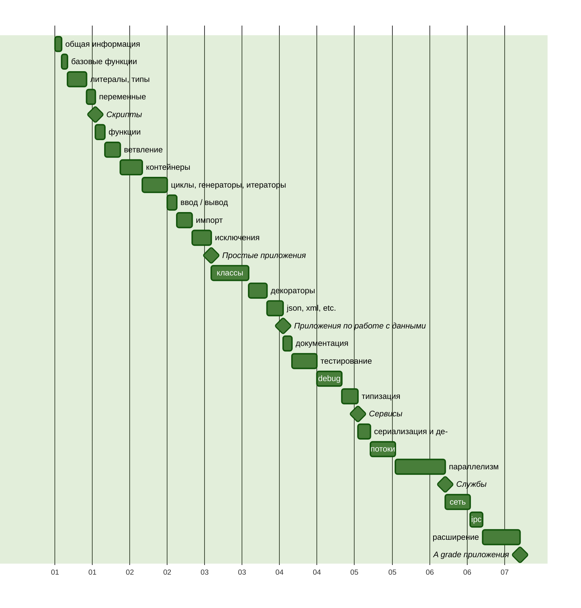

Python Песочница [→en](README.md)
===

В этом репозиторий я буду документировать путь изучения языка Python и
сопутствующим инструментам.

> [!NOTE]
>
> **Уточнение**
> У меня уже есть опыт написания приложений на Python, но я решил обновить
> и актуализировать свои знания.

## Обязательство

В качестве опорных материалов я буду использовать различные книги, документацию
и курсы. Буду предоставлять примеры кода и заметки на основе того, что я узнал
и понял. Текст буду сопровождать ссылками на материалы.

## План изучения

Для начала я составлю план изучения, не слишком подробный,
но позволяющий соблюдать определённую последовательность в освоении.

Каждый значимый этап будет завершать практическая работа,
на следующем графике эти работы можно опознать по символу ромба.



## Литературный список

1. «Основы Python. Научитесь думать как программист», 2-е издание. Аллен Б. Дауни[^1]
2. «Как устроен Python. Гид для разработчиков, программистов и интересующихся». Мэтт Харрисон[^2]

## О Языке

Python[^3] — высокоуровневый, универсальный, динамически типизированный,
интерпретируемый язык со сборщиком мусора[^4]. Язык разработан Гвидо ван Россумом
в 1991 году.

Он приобрёл популярность ко второй версии, а 3я версия актуальна
на сегодняшний день. Вторя версия уже не поддерживается.

### Синтаксис и семантика

Код на Python призван быть легко читаемым, так как он визуально форматируется
с использованием отступов, а выражения не оборачиваются в большое количество
вспомогательных символов, — нет привычной точки с запятой, отделяющей выражение,
и фигурных скобок, выделяющих смысловой блок программы.

### Развитие языка

Python, несмотря на свой возраст, это развивающийся язык, который развивается
сообществом и комитетами при фонде[^5].

Развитие языка происходит через систему оценки предложений PEP[^6], из которых
формируется описание языка.

У языка есть лозунг, который задаёт рамки его развития.

### Zen of Python

Существует краткий и лаконичный способ описать принципы которыми руководствуются
разработчики Python, они известны как Zen of Python, и у них есть свой PEP 20[^7].

> Красивое лучше, чем уродливое. <br />
> Явное лучше, чем неявное. <br />
> Простое лучше, чем сложное. <br />
> Сложное лучше, чем запутанное. <br />
> Плоское лучше, чем вложенное. <br />
> Разреженное лучше, чем плотное. <br />
> Читаемость имеет значение. <br />
> Особые случаи не настолько особые, чтобы нарушать правила. <br />
> При этом практичность важнее безупречности. <br />
> Ошибки никогда не должны замалчиваться. <br />
> Если они не замалчиваются явно. <br />
> Встретив двусмысленность, отбрось искушение угадать. <br />
> Должен существовать один и, желательно, только один очевидный способ сделать это. <br />
> Хотя он поначалу может быть и не очевиден, если вы не голландец. <br />
> Сейчас лучше, чем никогда. <br />
> Хотя никогда зачастую лучше, чем прямо сейчас. <br />
> Если реализацию сложно объяснить — идея плоха. <br />
> Если реализацию легко объяснить — идея, возможно, хороша. <br />
> Пространства имён — отличная штука! Будем делать их больше! <br />

## Запуск и режимы

Чтобы запустить Python приложение или отдельный скрипт нужен интерпретатор,
— приложение которое умеет читать инструкции на понятном человеку языке,
и переводить его в набор инструкций понятных вычислительной машине.

Преимущество интерпретируемых языков перед компилируемыми, что задачи компиляции
выполняются непосредственно при запуске программы, и не требуют дополнительного
подготовительного этапа — сборки (или компиляции и линковки), так как сборка
производится всегда под конкретную архитектуру процессора и операционную систему.

Это увеличивает переносимость кода и скорость разработки. Конечно, не бесплатно,
так как это же преимущество в некоторых случаях может быть недостатком.
Исполнение интерпретируемого кода никогда не будет на столько быстрым
чтобы сравниться с заранее компилированным приложением написанном на языке
системного уровня.

Выполнять Python инструкции можно как последовательно, так и в виде конечной
программы сохранённой в файл или серию файлов.

Для того, чтобы выполнять инструкции последовательно нужно активировать REPL
(<ins>R</ins>ead <ins>E</ins>valuate <ins>P</ins>rint <ins>L</ins>oop) режим.
Это такой вариант работы интерпретатора, когда тот после запуска ожидает ввода
пользователя, перевод на новую строку — определяет конец инструкции, и в этот
момент интерпретатор пытается выполнить написанное, после чего выдает
или результат выполнения, или ошибку, и возвращается с нова в ожидания ввода.

Запуск приложения — более распространенный вариант, когда интерпретатор при
вызове сразу получает точку входа в приложение, и пытается исполнить
все следующие за точкой входа инструкции.

Так-как приложение может быть представлено одним или более фалами,
то и запуск приложения может быть выражен как передача файла на исполнение,
или целой директории. В случае с директорией, по соглашению, интерпретатор будет
искать току входа — файл `__main__.py`.

Запускать Python можно с локальной машины, для этого нужно его установить[^8].

Если вам не хочется засорять локальную машину, то можно воспользоваться решением
на основе контейнеризации[^9].

Аллен Дауни, автор книги «Основы Python»[^1], предлагает для запуска простых
сценариев воспользоваться онлайн-сервисом [Python Anywhere](https://www.pythonanywhere.com/).
Существуют и другие, например [Replit](https://replit.com/), или в качестве REPL
можно воспользоваться [Google Colab](https://colab.google/).

> [!NOTE]
>
> Чтобы выйти из REPL интерпретатора, вызовите глобально доступный метод `exit()`.

> [!NOTE]
>
> В Python, есть этап компиляции заранее, когда интерпретатор преобразует файл-ы
> Python в байт-код, который будет выполнен. Такие файлы хранятся в каталоге
> `__pycache__`, **который** по-умолчанию **не должен добавляться в репозитории VCS**.

## Базовые функции

### print

Является одной из основных функций и находится в глобальном пространстве доступа.
На первый взгляд она «просто» выводит переданное значение «на экран».
На самом деле все чуть сложнее.

Метод `print` сначала проверяет тип переданного объекта, и если он не является
строкой, вызывает конвертацию. Кроме того, тезис о том, что `print` выводит
"на экран", тоже не верен, — функция печатает в поток вывода, который
по-умолчанию задан как стандартный поток вывода (`sys.stdout`), т.е. экран.
Поток вывода можно также указать, передав его в качестве аргумента вызова.

Аллен Дауни[^1], отмечает одно отличие между форматами вызова в Python2 и Python3,
— отсутствие скобок вокруг аргументов вызова для Python2.
На самом же деле скобки могут быть, но состав аргументов вызова отличается:

[Python2](https://docs.python.org/3/library/functions.html#print)
```python
>>> import sys
>>> print(>>sys.stdout, "Hello world\n")
```

[Python3](https://docs.python.org/3/library/functions.html#print)
```python
>>> import sys
>>> print("Hello world\n", file=sys.stdout)
```

### input

В противовес выводу в Python есть функция захвата ввода, `input`[^10], она так же
является глобально-доступной. Она позволяет перевести выполнение в режим ожидания
ввода и дождавшись вызова переноса строки, вернуть результат ввода в виде строки.

```python
>>> input("Say my name: ")
Say my name: Mr. White
'Mr. White'
```

### dir

Возвращает список имен, доступных в заданной области видимости[^11].
Без указания аргументов будет выбрана область видимости, доступная на уровне
исполнения. Если передать объект, то будут возвращены его методы и атрибуты.

#### help

Встроенная функция `help`[^12] особенно полезна в режиме REPL.
Без аргументов вызов функции инициализирует интерактивную консоль поиска
по индексу документации. При указании имени функции или класса интерпретатор
попытается найти соответствующий элемент среди зарегистрированных в текущем
окружении, и выведет справку.

> [!TIP]
>
> Я не стану подробно останавливаться на всех встроенных функциях. Уточню лишь,
> что они важны и поставляются разными модулями в глобальное пространство.
> О них можно прочесть на официальном сайте[^13], вызвав метод `help` со строкой
> `'builtins'`, или получить список зарегистрированных имён используя `dir`
> на объекте `__builtins__`.

```python
>>> help('builtins')
Help on built-in module builtins:

NAME
    builtins - Built-in functions, types, exceptions, and other objects.
...
```

```python
>>> dir(__builtins__)
['ArithmeticError', 'AssertionError', 'AttributeError', 'BaseException', ...
```

> [!NOTE]
>
> Не стоит переопределять зарезервированные имена встроенных объектов и функций!

## Литералы

Литералами являются значимые комбинации символов, которые могут быть строками[^14]
или числами[^15].

### Строки

Строковые литералы[^14] отличает наличие кавычек, одинарных, двойных, или серии
одинарных или двойных кавычек.

```python
'It\'s a string literal'

"This is also a string literal"

'''
It's is a multiline string
with single quote inside.
'''

"""
And this is a also so called
"multiline" string
"""
```

Кроме того, строковые литералы могут иметь префиксы управления состоящие из `frub`:

```python
>>> r'\Hello \People' # Raw string
'\\Hello \\People'

>>> u'Это строка в формате Unicode' # Backward capability from Python2
'Это строка в формате Unicode'

>>> f'x={1+1} y={{1,2,3,4,5}}' # Formatted string
'x=2 y={1,2,3,4,5}'

>>> b'\xcf\x84o\xcf\x81\xce\xbdo\xcf\x82'.decode('utf-8')
'τoρνoς'
```

### Числа

Числовые литералы[^11] представляют собой запись чисел в бинарной, восьмеричной, десятичной и шестнадцатеричной системах счисления. Используется префиксный оператор для отрицательных чисел или его отсутствие для положительных. Для десятичных чисел может применяться форма экспоненциальной записи, запись с плавающей точкой и указание мнимой части числа. С введением PEP 515[^12] появилась возможность визуального разделения разрядов символом нижнего подчеркивания `_`.

```python
# integers
0
41
0b101001
0o51
0x29
2_023
-41

# floats
0.
0.30684931506
.30684931506
0.2023e4
306_849.0e-6
```

> [!CAUTION]
>
> С цифры 0 не может начинаться целое десятичное число.

### Операторы

Для произведение операций над числами, строками булевыми значениями используются операторы.

+ - * / ** // %
^ & | << >> ~
++
--
=
+= -= *= /= **= //= %=
^= &= |=
and or not is
== != >= <= <=>


### Переменные

Для ссылки на исходные или промежуточные значения (состояния) используются переменные. Как отмечает Мэтт Харрисон в своей книге «Как устроен Python»[^13], это своего рода метки-указатели на значения, которые используются для дальнейшей ссылки на них.

```python
name = 'Maksim Kalenich'
age = 41
```

В языке есть ограничения для имен переменных, так переменная может состоять из букв латинского алфавита, цифр и символа нижнего подчёркивания, при этом переменная не может начинаться с цифры.

Кроме того, в языке есть список зарезервированных слов[^14], которые интерпретатор не даст использовать в качестве имён переменных.

> [!TIP]
>
> Зарезервированные слова можно найти не только на сайте, но и в самом языке. Разчехляйте известную вам функцию `help('keywords')`. Или можно импортировать модуль `keyword` и обратиться к его переменной `kwlist` (напишу про импорт отдельно).
>
> ```python
> import keyword
> keyword.kwlist
> ```

Кроме зарезервированных слов, Мэтт Харрисон в «Как устроен Python»[^13] не рекомендует использовать имена встроенных элементов языка, список которых доступен из переменной [`__builtins__`](#help).

Хорошим тоном вообще, и в Python в частности, считается давать переменным описательные имена, из которых можно заключить, на какое значение они указывают. Кроме того, стоит отметить, что документация языка предлагает конкретный формат переменных[^15]: `snake_case`, — когда имена даются строчными буквами, а если имя состоит из нескольких частей, то части соединяются символом нижнего подчёркивания.

Изначально синтаксис Python-а не предполагал декларации переменных без инициализации. Однако с версии 3.6 можно объявить переменную с указанием типа и не передавать инициализирующее значение.

```python
favorite_book = "The Hitchhiker's Guide to the Galaxy"

current_book: str
```

Для инициализации переменной используется оператор присвоения `=`, при этом создается представление переданного значения в виде объекта, в котором регистрируется ссылка на этот объект меткой, механизм так и называется счётчик ссылок, он необходим сборщику мусора для определения какие значения не используются и могут быть удалены.

> [!TIP]
>
> Для получения значения счётчика ссылок конкретного объекта, можно воспользоваться методом `getrefcount` из пакета `sys`:
>
> ```python
> uniq_string = 'And nine, nine rings were gifted to the race of Men — who above all else, desire power'
>
> import sys
> sys.getrefcount(uniq_string)
>> 2
>
> how_many_rings_was_gifted_to_the_race_of_men = uniq_string
> sys.getrefcount(uniq_string)
>> 3
> ```
>
> Ссылок на 1 больше чем можно было бы ожидать, потому, что вызов `getrefcount` сам ссылается на на этот же объект в момент вызова.

Поскольку Python язык с динамической типизацией, то переменную можно переприсвоить значению с другим типом, фактически метка указывавшая на один объект начинает указывать на другой.

Меняется не тип переменной, а сам объект на который указывает эта переменная.

> [!TIP]
>
> Для наглядной иллюстрации воспользуемся двумя встроенными функциями: `id` и `type`. А про типы поговорим в следующем блоке.

```python
days_since_last_incident = 100
max_days_without_issues = days_since_last_incident

print(id(days_since_last_incident))
print(type(days_since_last_incident))

print(id(max_days_without_issues))
print(type(max_days_without_issues))


days_since_last_incident = None

print(id(days_since_last_incident))
print(type(days_since_last_incident))

print(id(max_days_without_issues))
print(type(max_days_without_issues))
```

Из примера становится понятно, что переменным присваиваются значения а не другие переменные, по этому при смене объекта на который указывала базовая переменная, вторая переменная указывает на прежний объект. А объекты имеют разные идентификаторы, и принадлежат разным типам данных.

> [!WARNING]
>
> Не смотря на то, что язык позволяет переопределять переменную присваивая ей значения других типов, это крайне плохая идея, так, как в последствии сложно будет определить почему она могла поменять свой тип и при каких условиях.

### Типы

Существует несколько встроенных в язык типов для чисел, последовательностей, карт,

Может быть произведено преобразование типов явное через вызов метода с именем в который происходит преобразование или не явное, при использовании оператора, который вызовет преобразование на объекте перед своим исполнением.

Не явное преобразование происходит с укрупнением типа int -> float -> complex.

#### int

#### float

#### complex

#### Дополнительные числовые типы

##### Fraction

Доступен из пакета `fractions`.

##### Decimal

Доступен из пакета `decimals`.

#### Арифметические операции

##### abs

##### divmod

##### pow

##### round

##### math.trunc

##### math.floor

##### math.ceil

#### bool

True, False

bool(__)

#### Булевы операторы

and, or, not ( & | ^ )

#### Итерируемые типы

#### Последовательности

##### list

##### tuple

##### range

##### dict

##### set

##### frozenset

##### str

##### bytes, bytearray, memoryview

#### Операторы последовательностей

##### in

##### not in

##### +

##### *

##### [i:j:k]

##### len

##### min

##### max

##### index

##### count

##### hash

##### [i:j:k] =

##### del [i:j:k]

##### append

##### clear

##### copy

##### extend or +=

##### insert

##### pop

##### remove

##### reverse


---

[^1]: <https://www.livelib.ru/book/1005972301-osnovy-python-nauchites-dumat-kak-programmist-allen-b-dauni> "Основы Python. Научитесь думать как программист, 2-е издание. Автор: Аллен Б. Дауни"
[^2]: <https://www.livelib.ru/book/1002933611-kak-ustroen-python-gid-dlya-razrabotchikov-programmistov-i-interesuyuschihsya-mett-harrison> "Как устроен Python. Гид для разработчиков, программистов и интересующихся. Автор: Мэтт Харрисон"
[^3]: <https://www.python.org/> "Официальный сайт"
[^4]: <https://ru.wikipedia.org/wiki/Python> "Страница о языке Python на Wikipedia"
[^5]: <https://legacy.python.org/psf/committees/> "Раздел о комитетах фонда Python Software Foundation"
[^6]: <https://peps.python.org/pep-0000/> "Index of Python Enhancement Proposals"
[^7]: <https://peps.python.org/pep-0020/> "The Zen of Python"
[^8]: <https://www.python.org/downloads/> "Регистр доступных версий Python"
[^9]: <https://hub.docker.com/_/python> "Docker image for Python"
[^10]: <https://docs.python.org/3/library/functions.html?highlight=input#input> "input in Official documentation"
[^11]: <https://docs.python.org/3/library/functions.html?highlight=dir#dir> "dir in Official documentation"
[^12]: <https://docs.python.org/3/library/functions.html?highlight=help#help> "help in Official documentation"
[^13]: <https://docs.python.org/3/library/functions.html> "Built-in functions Official documentation"
[^14]: <https://docs.python.org/3/reference/lexical_analysis.html#literals> "Literals in Official documentation"
[^15]: <https://docs.python.org/3/reference/lexical_analysis.html#numeric-literals> "Numeric literals in Official documentation"
[^16]: <https://peps.python.org/pep-0515/> "PEP 515 – Underscores in Numeric Literals"
[^17]: <https://docs.python.org/3/reference/lexical_analysis.html#keywords> "Reserved keywords in Official documentation"
[^18]: <https://peps.python.org/pep-0008/> "PEP 8 Style Guide for Python Code"
[^19]: <https://docs.python.org/3/library/stdtypes.html#typebool>
