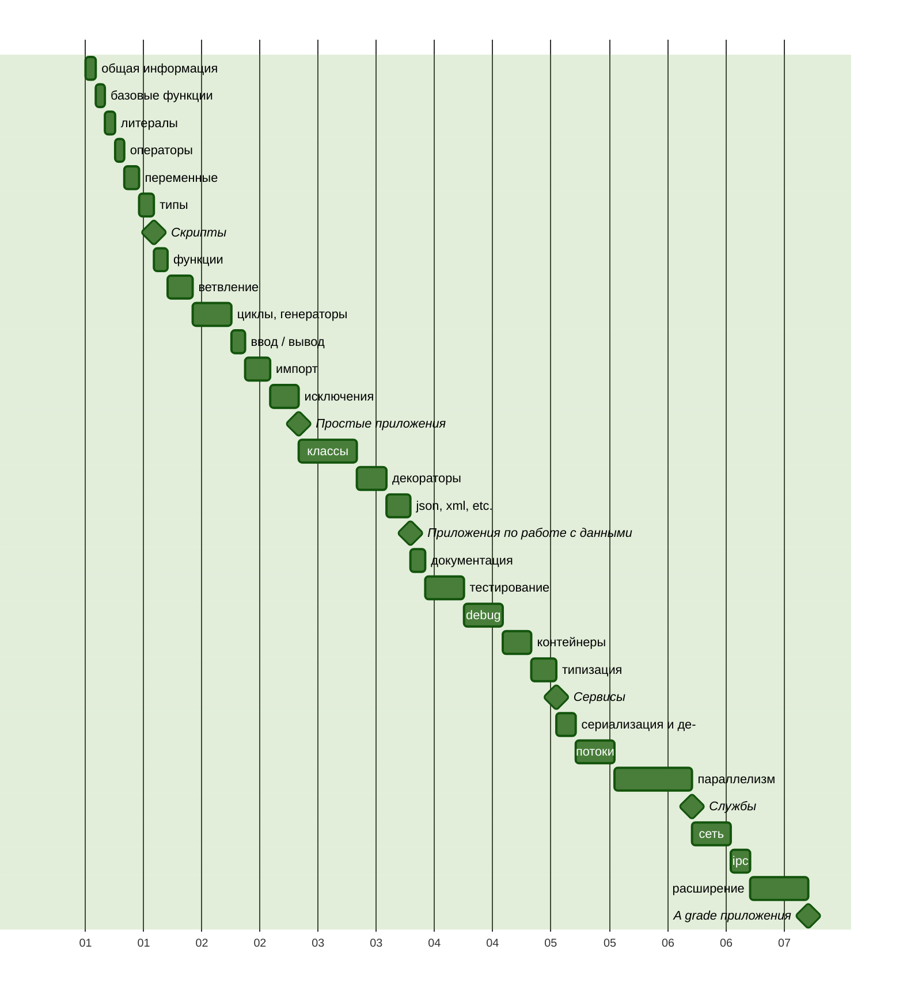

Путь Python [→en](README.md)
===

В данном репозитории я буду документировать свой путь изучения
языка Python и сопутствующих инструментов.

> [!NOTE]
>
> **Уточнение**: У меня уже есть опыт написания приложений на Python,
> но я решил актуализировать, пополнить и систематизировать свои знания.

## Обязательство

В качестве основных источников я буду использовать различные книги,
официальную документацию и курсы. Приведу примеры кода и заметки,
снабдив их ссылками на материалы.

## План изучения

Для начала я разработаю план обучения, не слишком детализированный,
но обеспечивающий определенную последовательность освоения материала.

Каждый значимый этап будет завершаться практической работой,
которую можно узнать по символу ромба на следующем графике.



## Литературный список

1. [«Основы Python. Научитесь думать как программист», 2-е издание. Аллен Б. Дауни](https://www.livelib.ru/book/1005972301-osnovy-python-nauchites-dumat-kak-programmist-allen-b-dauni "Описание книги «Основы Python» на LiveLib")
2. [«Как устроен Python. Гид для разработчиков, программистов и интересующихся». Мэтт Харрисон](https://www.livelib.ru/book/1002933611-kak-ustroen-python-gid-dlya-razrabotchikov-programmistov-i-interesuyuschihsya-mett-harrison "Описание книги «Как устроен Python» на LiveLib")

## О Языке

Python[^1] — высокоуровневый, переносимый, динамически типизируемый[^2],
интерпретируемый язык со сборкой мусора.

Язык был разработан Гвидо ван Россумом в 1991 году.

Язык приобрел популярность к моменту выхода второй версии. Текущая версия —
третья, и она считается актуальной.

### Синтаксис и семантика

Код на Python создавался с учетом легкости чтения, так как он визуально
форматируется с использованием отступов, а выражения обычно не снабжаются
вспомогательными символами. Привычный символ, точка с запятой, разделяющий
инструкции, часто пропускается, так как выражение завершается в конце строки.

Однако символ `;` может использоваться в отдельных случаях, когда необходимо
записать инструкции в одну строку.

В языке отсутствуют привычные фигурные скобки в качестве выделения блока
инструкций; эту роль выполняет визуальное форматирование с обязательным
одинаковым отступом для инструкций одного уровня.

В качестве символа отступа может использоваться как пробел, так и табуляция,
но они не должны смешиваться в рамках одного файла.

### Развитие языка

Python, несмотря на свой возраст, продолжает активно развиваться под
руководством сообщества и комитетов при фонде[^3].

Развитие языка осуществляется через систему оценки предложений PEP[^4],
из которых формируется описание языка.

Язык обладает лозунгом, который определяет направление его развития.

#### Zen of Python

Существует краткий и лаконичный способ описать принципы, которыми
руководствуются разработчики Python. Эти принципы известны как "Zen of Python"
и имеют свой собственный PEP 20[^5].

> Красивое лучше, чем уродливое. <br />
> Явное лучше, чем неявное. <br />
> Простое лучше, чем сложное. <br />
> Сложное лучше, чем запутанное. <br />
> Плоское лучше, чем вложенное. <br />
> Разреженное лучше, чем плотное. <br />
> Читаемость имеет значение. <br />
> Особые случаи не настолько особые, чтобы нарушать правила. <br />
> При этом практичность важнее безупречности. <br />
> Ошибки никогда не должны замалчиваться. <br />
> Если они не замалчиваются явно. <br />
> Встретив двусмысленность, отбрось искушение угадать. <br />
> Должен существовать один и, желательно, только один очевидный способ сделать это. <br />
> Хотя он поначалу может быть и не очевиден, если вы не голландец. <br />
> Сейчас лучше, чем никогда. <br />
> Хотя никогда зачастую лучше, чем прямо сейчас. <br />
> Если реализацию сложно объяснить — идея плоха. <br />
> Если реализацию легко объяснить — идея, возможно, хороша. <br />
> Пространства имён — отличная штука! Будем делать их больше! <br />

## Запуск и режимы

Для запуска Python-приложения или отдельного скрипта необходим интерпретатор
— приложение, способное читать инструкции на понятном человеку языке
и преобразовывать их в инструкции, понятные вычислительной машине.

Преимущество интерпретируемых языков перед компилируемыми заключается в том,
что задачи компиляции выполняются непосредственно при запуске программы,
без необходимости дополнительной сборки.
Это повышает переносимость кода и ускоряет процесс разработки.
Однако, выполнение интерпретируемого кода никогда не будет настолько быстрым,
чтобы сравниться с заранее скомпилированным приложением, написанным на языке
системного уровня.

Выполнение инструкций на Python можно осуществлять как последовательно,
так и в виде программы, сохраненной в файле или серии файлов.

Чтобы выполнить инструкции последовательно, активируется REPL
(<ins>R</ins>ead <ins>E</ins>valuate <ins>P</ins>rint <ins>L</ins>oop) режим.
В этом режиме интерпретатор ожидает ввода пользователя, определяя конец
инструкции при переходе на новую строку.
Затем интерпретатор пытается выполнить введенное и выводит результат
или ошибку, возвращаясь к ожиданию ввода.

Запуск приложения — более распространенный вариант, при котором интерпретатор
сразу получает точку входа и пытается выполнить все последующие инструкции.

Так как приложение может состоять из одного или нескольких файлов,
запуск приложения предполагает передачу пути к файлу или целевой директории
в качестве аргумента вызова Python.
При указании директории интерпретатор ищет точку входа в файле `__main__.py`.

Запуск Python возможен как на локальной машине после установки[^6], так и в
контейнеризированных средах[^7].

Для удобства запуска простых сценариев можно воспользоваться онлайн-сервисами,
такими как [Python Anywhere](https://www.pythonanywhere.com/),
[Replit](https://replit.com/)
или использовать [Google Colab](https://colab.google/) в качестве REPL.

> [!NOTE]
>
> Для выхода из REPL интерпретатора вызовите глобально доступный метод `exit()`

> [!NOTE]
>
> В Python, есть этап «компиляции заранее», когда интерпретатор преобразует
> текстовую версию кода Python в байт-код, который и будет выполнен.
> Такие файлы хранятся в каталоге `__pycache__`, который по умолчанию
> не должен добавляться в репозитории системы контроля версий.

## Базовые функции

### print

Одной из фундаментальных функций в любом языке программирования является
функция вывода.

Метод `print` автоматически проверяет тип переданного объекта. Если объект
не является строкой, то функция приводит его значение к строковому формату.
По умолчанию, `print` выводит результат в стандартный поток вывода
(`sys.stdout`), что обычно означает вывод на экран.
Однако, поток вывода можно явно указать, передав его в качестве аргумента
при вызове функции.

Аллен Дауни отмечает небольшое отличие в вызовах между Python 2 и Python 3,
а именно отсутствие скобок вокруг аргументов в Python 2.
Однако в Python 3 применяется формат с явным указанием потока вывода через
аргумент file:

[Python2](https://docs.python.org/3/library/functions.html#print)
```python
>>> import sys
>>> print(>>sys.stdout, "Hello world\n")
```

[Python3](https://docs.python.org/3/library/functions.html#print)
```python
>>> import sys
>>> print("Hello world\n", file=sys.stdout)
```

Эти примеры демонстрируют синтаксис для разных версий Python,
где в Python 2 используется `>>` для указания потока вывода,
а в Python 3 аргумент file для явного указания потока вывода.

### input

В контексте ввода данных в Python существует функция input[^8].
Подобно функции `print`, `input` является глобально доступной.

Функция `input` позволяет переключить выполнение программы
в режим ожидания ввода. Когда происходит ввод и пользователь нажимает клавишу
"Enter", `input` захватывает все введенные ранее символы.
Результат возвращается в виде строки.

```python
>>> input("Say my name: ")
Say my name: Mr. White
'Mr. White'
```

### dir

Функция `dir` возвращает список имен, доступных в заданной области
видимости[^9].
Если вызывается без аргументов, то будет выбрана текущая область видимости.
Если в функцию передается объект, то `dir` возвращает список его методов
и атрибутов.

### help

Встроенная функция `help`[^10] представляет собой мощный инструмент,
особенно в режиме REPL.
Без аргументов вызов функции инициирует интерактивную консоль поиска
по индексу документации.
Если указано имя функции или класса, интерпретатор попытается найти
соответствующий элемент среди зарегистрированных в текущем окружении
и выведет по нему справку.

> [!NOTE]
>
> Не буду подробно останавливаться на всех встроенных функциях.
> Однако, стоит отметить их важность и многообразие.
> Для подробного описания каждой функции можно обратиться к официальной
> документации[^11].

> [!TIP]
>
> Метод `help` может быть также использован с аргументом `builtins` для
> получения подробной справки.
> Или метод `dir` может быть вызван с аргументом `__builtins__`, чтобы вывести
> список зарегистрированных имен.

```python
>>> help('builtins')
Help on built-in module builtins:

NAME
    builtins - Built-in functions, types, exceptions, and other objects.
...
```

```python
>>> dir(__builtins__)
['ArithmeticError', 'AssertionError', 'AttributeError', 'BaseException', ...
```

> [!NOTE]
>
> Важно избегать переопределения зарезервированных имен встроенных объектов
> и функций. Это может привести к непредсказуемым результатам
> и сложноотлавливаемым ошибкам в коде.
> Вмешательство в зарезервированные имена может также вызвать конфликты имен,
> усложняя понимание кода другими разработчиками.
> При необходимости использовать подобные имена, лучше выбрать более
> специфичные или добавить префиксы, чтобы избежать конфликтов.

## Литералы, Булевы значения и None

Литералами[^12] являются значимые комбинации символов, которые могут быть
строками[^13] или числами[^14].

### Строки

Строковые литералы[^13] в Python выделяются наличием кавычек с обеих сторон.
Кавычки могут быть одинарными (`'`), двойными (`"`) и серией одинарных (`'''`)
или двойных (`"""`) кавычек.

```python
'It\'s a string literal'

"This is also a string literal"

'''
It's is a multiline string
with a single quote inside.
'''

"""
And this is a also so-called
"multiline" string
"""
```

Различия вида и количества кавычек определяются смыслом содержащихся
в литерале символов. Это позволяет в некоторых случаях избежать экранирования
символов.

Например: `'''My name is 'Max\''''`.

Как видно из примера, в строке, заключенной в три одинарные кавычки,
можно не экранировать одинарную кавычку внутри, но при этом необходимо
экранировать такую же одинарную кавычку в конце строки, чтобы отделить ее
от закрывающей последовательности.

Чтобы избежать подобных недоразумений, рекомендуется учитывать, какие символы
будут внутри строки, и использовать противоположный тип кавычек.

Например, так можно избежать проблемы: `"""My name is 'Max'"""`.

Кроме того, строковые литералы могут иметь префиксы управления `f`, `r`, `u` и
`b`. Где `f` определяет, что строка содержит форматирование переменных,
`r` — что литерал представляет "сырую" строку, то есть строку, в которой все
символы воспринимаются так, как написаны, `u` — указывает на то, что строка
использует unicode кодировку, и `b` — указывает на то, что строка представлена
последовательностью байтов.

```python
>>> r'\Hello \People' # Raw string
'\\Hello \\People'

>>> u'Это строка в формате Unicode' # Backward capability from Python2
'Это строка в формате Unicode'

>>> f'x={1+1} y={{1,2,3,4,5}}' # Formatted string
'x=2 y={1,2,3,4,5}'

>>> b'\xcf\x84o\xcf\x81\xce\xbdo\xcf\x82'.decode('utf-8')
'τoρνoς'
```

### Числа

Числовые литералы[^14] представляют собой набор символов, состоящих
из знака принадлежности числа к подмножеству положительных или отрицательных
вещественных чисел (`+`, `-`), указателя формата числа (`0b` — двоичный,
`0o` — восьмеричный, `0x` — шестнадцатеричный), цифр `0,1` для двоичных,
`0..7` — восьмеричных, `0..9` — десятичных, а в случае шестнадцатеричных чисел
также букв `A..F`. Точка (`.`) используется как символ разделителя между целой
и дробной частями числа.

Числа с плавающей точкой могут быть записаны в экспоненциальной форме
с использованием постфикса `e` и указанием степени.

```python
# integers
0
41
0b101001
0o51
0x29
2_023
-41
```

> [!CAUTION]
>
> Целое десятичное число не может начинаться с цифры 0.


```python
# floats
0.
0.30684931506
.30684931506
0.2023e4
306_849.0e-6
```
В дополнение к целым числам[^15] и числам с плавающей точкой[^16],
существует также запись литерала мнимого числа[^17].

```python
# imaginary
3.14j
1e100j
```

С введением PEP 515[^18] появилась возможность визуального разделения разрядов
символом нижнего подчеркивания `_`.

### Булевы значения<a name="boolean"></a>

Булевы значения, описывающие логическое состояние[^19], предопределены
и имеют фиксированную форму записи: `True` и `False`.

### None

`None` - это зарезервированное слово, которое выражает отсутствие
значения[^20] и имеет фиксированную форму записи.

## Операторы<a name="opertors"></a>

Для выполнения операций над числами, строками и булевыми значениями
используются различные операторы.

### Арифметические операции[^21]

| | Оператор |       Строки        |    Числа     |     Булев     |
|-|:---------|:--------------------|-------------:|--------------:|
|1|  L + R   |  'a' + 'b' = 'ab'   |  1 + 2 = 3   |   T + T = 2   |
| |  L - R   |            -        |  1 - 2 = -1  |   F - T = -1  |
|1|  L * R   |    'a' * 3 = 'aaa'  | -1 * 2 = -2  |   T * T = 1   |
| |  L / R   |            -        |  1 / 2 = 0.5 |   F / T = 0.0 |
| |  L ** R  |            -        |  5 ** 2 = 25 |  T ** T = 1   |
| |  L // R  |            -        |  5 // 2 = 2  |  T // T = 1   |
|1|  L % R   | '%s' % 100 = '100'  |   5 % 2 = 1  |   T % T = 0   |

### Побитовые операции[^22]

| | Оператор |       Строки        |    Числа     |     Булев     |
|-|:---------|:--------------------|-------------:|--------------:|
| |  L ^ R   |            -        |   5 ^ 2 = 7  |   F ^ T = T   |
| |  L & R   |            -        |   5 & 2 = 0  |   F & T = F   |
| |  L \| R  |            -        |   5 | 2 = 7  |   F | T = T   |
| |  L << R  |            -        |  5 << 2 = 20 |  T << T = 2   |
| |  L >> R  |            -        |  5 >> 2 = 1  |  T >> T = 0   |
| |    ~R    |            -        |      ~2 = -3 |      ~T = -2  |

### Операции сравнения[^23]

| | Оператор |       Строки        |    Числа     |     Булев     |
|-|:---------|:--------------------|-------------:|--------------:|
| |  L == R  | 'a' == 'b' = F      |  5 == 2 = F  |  F == T = F   |
| |  L != R  | 'a' != 'b' = T      |  5 != 2 = T  |  F != T = T   |
| |  L > R   |  'a' > 'b' = F      |   5 > 2 = T  |   F > T = F   |
| |  L >= R  | 'a' >= 'b' = F      |  5 >= 2 = T  |  F >= T = F   |
| |  L < R   |  'a' < 'b' = T      |   5 < 2 = F  |   F < T = T   |
| |  L <= R  | 'a' <= 'b' = T      |  5 <= 2 = F  |  F <= T = T   |

### Логические операции[^24]

| | Оператор |       Строки        |    Числа     |     Булев     |
|-|:---------|:--------------------|-------------:|--------------:|
| |  L and R |'a' and 'b' = 'b'    | 5 and 2 = 2  | F and T = F   |
| |  L or R  | 'a' or 'b' = 'a'    |  5 or 2 = 5  |  F or T = T   |
| |   not R  |    not 'b' = F      |   not 2 = F  |   not T = F   |
|*| L is R   | 'a' is 'b' = F      |  5 is 2 = F  |  F is T = F   |
|*|L is not R| 'a' is not 'b' = T  |5 is not 2 = T|F is not T = T |

`*` — Операторы `is` и `is not` нужны для проверки идентичности идентификаторов
объектов, они не сравнивают значения.

Все приведённые операции доступны для чисел и булевых значений.

В языке существует принцип не явного преобразования типов который позволяет
подобное поведение, и в некоторых случаях число приводится к булеву типу,
а в некоторых булев тип к числу.

Такие случаи можно идентифицировать по результату операции.

`1` — Строковые литералы имеют 3 специально переопределённых арифметических
оператора: `+`, который конкатенирует строки, `*`, который повторяет строку
заданное число раз, а `%` форматирует строку, в которой использован
форматирующий признак[^25]. Другие арифметические операции для строк
не определены.

> [!TIP]
>
> При сравнении булевых значений приоритет стоит отдавать логическим
> операторам, перед побитовыми.

> [!TIP]
>
> В языке существует возможность многократного сравнения:
> `1 < 3 > 2`. Такой вид сравнения называется диапазонной проверкой.

## Переменные

Для ссылки на исходные или промежуточные значения используются переменные.
Как отмечает Мэтт Харрисон, переменные можно воспринимать как метки
указывающие на значения, которые можно переиспользовать снова и снова.

```python
name = 'Maksim Kalenich'
year = 1982
```

### Имена переменных

В языке есть ограничения для имен переменных. Переменная может состоять
из букв латинского алфавита, цифр и символа нижнего подчёркивания.
При этом переменная не может начинаться с цифры.

Кроме того, в языке есть список зарезервированных слов[^26],
которые интерпретатор не даст использовать в качестве имён переменных.

> [!TIP]
>
> Вызвав `help('keywords')`, будет представлена короткая справка.
> Или можно импортировать модуль keyword и обратиться к его переменной kwlist
> модуля, которая содержит список зарезервированных слов.
>
> ```python
> >>> import keyword
> >>> keyword.kwlist
> ```

Кроме зарезервированных слов, Мэтт Харрисон не рекомендует использовать имена
встроенных элементов языка, список которых доступен из переменной
[`__builtins__`](#help).

Хорошим тоном вообще, и в Python в частности, считается давать переменным
описательные имена, из которых можно заключить, на какое значение они
указывают.

Кроме того, стоит отметить, что документация языка предлагает конкретный формат
переменных[^27]: `snake_case`, — когда имена даются строчными буквами,
а если имя состоит из нескольких частей, то части соединяются символом
нижнего подчёркивания.

### Декларация и инициализация переменных

Изначально синтаксис Python-а предполагал только декларацию переменных
c инициализацией. Однако с версии 3.6 можно объявить переменную с указанием
типа и не передавать инициализирующее значение.

```python
favorite_book = "The Hitchhiker's Guide to the Galaxy"
current_book: str
```

Для инициализации переменной используется оператор присвоения `=`,
при этом создается представление переданного значения в виде объекта.

Каждый объект получает идентификатор, описание типа значения и счётчик ссылок.

Счётчик ссылок необходим среде исполнения Python, поскольку именно она,
а не разработчик отвечает за время жизни значений и своевременную очистку
памяти от мусора.

> [!TIP]
>
> Для получения идентификатора объекта существует встроенный метод `id`.
>
> ```python
> >>> id(favorite_book)
> 4423523640 # yours would be different
> ```
>
> Для получения типа значения представляемого объектом существует встроенный
> метод `type`.
>
> ```python
> >>> type(favorite_book)
> <class 'str'>
> ```
>
> Для получения значения счётчика ссылок на конкретный объект,
> можно воспользоваться методом `getrefcount` из пакета `sys`.
>
> ```python
> >>> import sys
> >>> sys.getrefcount(favorite_book)
> 2
> ```
>
> При этом если завести ещё одну переменную и присвоить ей тот же объект,
> то число ссылок увеличится.
>
> ```python
> >>> favorite_guide = favorite_book
> >>> sys.getrefcount(favorite_book)
> 3
> ```
>
> При вызове `getrefcount` число ссылок возвращается на 1 больше,
> так как во время вызова `getrefcount` добавляется временная ссылка как на
> аргумент вызова.

### Переопределение переменной

Поскольку Python — язык с динамической типизацией, переменную можно
переопределить с значением типа, отличного от того, на который она ранее
указывала.

```python
>>> num = '1'
>>> id(num)
4423584600
>>> type(num)
<class 'str'>

>>> num = int(num)
>>> id(num)
4423523640
>>> type(num)
<class 'int'>
```

При этом одно значение может быть связано с несколькими переменными.

И если проверить `id` уже зарегистрированного значения, то он будет таким же,
как идентификатор, возвращаемый от переменной.

```python
>>> num2 = num
>>> id(num)
4423523640

>>> id(num)
4423523640

>>> id(1)
4423523640
```
> [!NOTE]
>
> Фактически идентификатор это представление адреса значения в памяти.
> Оно может и будет меняться от запуска к запуску приложения.

> [!WARNING]
>
> Несмотря на то, что язык позволяет переопределять переменную, присваивая
> значения других типов, это крайне плохая идея. Это усложняет определение
> того, почему переменная изменила тип и при каких обстоятельствах
> это произошло.

### Отложенный доступ к результату операции в REPL режиме

Результат выражения, которое не было вовремя присвоено переменной, будет
утерян. Но в Python предусмотрено промежуточное хранение вычисленного
значения.
Оно доступно в переменной с именем `_`.

```python
>>> 100 + 1
101
>>> _
101
```

Про эту возможность я узнал из книги Мэтта Харрисона.

### Присвоение с вычислением

Оператор присвоения может быть объединен с некоторыми
[операторами из списка](#opertors), что позволяет переопределять значение
для переменной слева.

#### Арифметические операции[^21]

| Оператор   |       Числа        |
|:-----------|-------------------:|
||                         x = 10 |
|   L += R   |  x += 2  # x = 12  |
|   L -= R   |  x -= 3  # x = 9   |
|   L *= R   |  x *= 3  # x = 27  |
|   L /= R   |  x /= 10 # x = 2.7 |
|  L **= R   | x **= 2  # x = 7.29|
|  L //= R   | x //= 2  # x = 3.0 |
|   L %= R   |  x %= 2  # x = 1.0 |

#### Побитовые операции[^22]

| Оператор   |       Числа        |
|:-----------|-------------------:|
||                          x = 5 |
|   L ^= R   |   x ^= 2 # x = 7   |
|   L &= R   |   x &= 2 # x = 2   |
|  L \|= R   |  x \|= 4 # x = 6   |
|  L <<= R   |  x <<= 2 # x = 24  |
|  L >>= R   |  x >>= 3 # x = 3   |

## Типы

В Python, типы значений указывают на класс, к которому принадлежит
данный объект.

От типа зависит поведение объекта этого класса, включая доступные
операции и методы, которые можно вызвать.

### Числовые типы

Язык Python поддерживает несколько встроенных числовых типов:

```python
>>> type(41)
<class 'int'>

>>> type(0.36)
<class 'float'>

>>> type(3.14j)
<class 'complex'>
```

#### Неизменяемость числовых типов

Числовой тип в Python является неизменяемым, что означает, что после
присвоения нельзя изменить значение объекта.

Это также означает, что любая математическая операция порождает
новый объект в качестве результата, включая операции с присвоением.

```python
>>> x = 100
>>> id(x)
4414086488

>>> x += 11
>>> id(x)
4414087523
```

#### Проблема чисел с плавающей точкой

Для всех реализаций арифметики чисел с плавающей точкой выполненных
по стандарту IEEE 754[^28] существует проблема точности.

Числа с плавающей точкой в Python реализуются с использованием стандарта
IEEE 754. Некоторые проблемы, характерные для этого стандарта, также могут
проявляться в Python[^29].

```python
>>> 0.1 + 0.1 + 0.1 == 0.3
False
```

Python предлагает различные методы для устранения проблем, связанных
с представлением чисел с плавающей точкой:

1. Использование функций из модуля math:
```python
>>> import math
>>> math.isclose(0.1 + 0.1 + 0.1, 0.3)
True
```

2. Применение функции округления с указанием точности при сравнении:
```python
>>> round(0.1 + 0.1 + 0.1, ndigits=1) == round(0.3, ndigits=1)
True
```

3. Использование специализированных типов данных с сохранением точности,
  таких как Decimal[^30] и Fraction[^31]:

```python
>>> import decimal
>>> decimal.Decimal('0.1') * 3 == decimal.Decimal('0.3')
True

>>> import fractions
>>> fractions.Fraction(1, 10) * 3 == fractions.Fraction(3, 10)
True
```

Выбор подходящего метода зависит от конкретной ситуации и требований
к точности.

#### Преобразование типов

Между числовыми типами существует неявное преобразование,
которое происходит с укрупнением числового пространства:
`int` → `float` → `complex`.

```python
>>> 1 + 0.1 + 1.1j
(1.1+1.1j)
```

Явное преобразование типов также возможно и, иногда, даже желательно:

```python
>>> int()
0

>>> float(1)
1.0

>>> complex(1.0)
(1.0+0j)
```

> [!CAUTION]
>
> В обратную сторону приведение типа лучше не использовать!

#### Вспомогательные числовые методы

Помимо [арифметических операций](#opertors) язык предлагает набор встроенных
методов[^11] и вспомогательных функций[^32] из модуля `math`.

Вот часть из них: `abs`, `divmod`, `pow`, `math.pow`, `round`, `math.trunc`,
`math.floor`, `math.ceil`, `math.sqrt`, `math.cbrt`, `math.exp`, `math.log`,
`math.log2`, `math.log10`.

```python
>>> abs(-0.345)
0.345

>>> divmod(5, 2) # same as (5 // 2, 5 % 2)
(2, 1)

>>> pow(5, 2) # same as 5 ** 2
25

>>> import math
>>> math.pow(5, 2)
25.0

>>> round(5.35, 1)
5.3

>>> math.trunc(5.35)
5

>>> math.floor(5.35)
5
>>> math.floor(-5.35)
6

>>> math.ceil(5.35)
6
>>> math.ceil(-5.35)
5

>>> math.sqrt(25) # same as 25 ** 1/2
5.0

>>> math.cbrt(27) # same as 27 ** 1/9
3.0

>>> math.exp(2) # close to math.e ** 2
7.38905609893065

>>> math.log(2)
0.6931471805599453

>>> math.log2(4) # same as math.log(4, 2)
2.0

>>> math.log10(100) # same as math.log(100, 10)
2.0
```

### Булев

Значениями типа булев могут быть `True` или `False`. Как упоминалось в секции
о литералах, [булевы значения](#boolean) имеют фиксированное написание.

К булевым значениям можно привести значения любых типов, явно,
используя встроенный метод `bool`, или не явно, когда интерпретатор сам
отдаст приоритет типу булев перед другим.

```python
>>> bool(1)
True

>>> bool(0)
False

>>> bool(-1)
True

>>> bool('')
False

>>> bool(None)
False

>>> not 0
True

>>> not ''
True

>>> not None
True

>>> not 1
False
```

> [!TIP]
>
> Явное приведение к булеву типу не приветствуется.

#### Ленивое вычисление

При выполнении логических операций с булевыми значениями происходит ленивое
вычисление[^33], при котором второй операнд не проверяется, если первый
удовлетворяет условию оператора.

```python
>>> True or False
True

>>> False and True
False
```

**Как это проверить?**
Использовать в качестве второго операнда метод, который бы был выполнен только
в случае, если до него дойдет выполнение.

```python
>>> True or print('Checked')
True

>>> False and print('Checked')
False

>>> True and print('Checked')
'Checked'
```

### Последовательности

Последовательности или серии — это объекты которые хранят несколько значений
следующих друг за другом.

| | Оператор      | Ожидаемый результат                                       |
|-|:--------------|:----------------------------------------------------------|
| |  x in s       | True если элемент или серия есть в последовательности     |
| |  x not in s   | True если элемент/серия отсутствует в последовательности  |
|1|  s + t        | Объединение                                               |
|1|  s * n        | Повторение серии n раз                                    |
|1|  s[i]         | Возвращение элемента последовательности по индексу        |
|*|  s[i:j]       | Возвращение среза из серии от индекса и до индекса        |
|*|  s[i:j:k]     | Возвращение среза из серии от индекса и до индекса с шагом|

`*` — в случае со срезами, все параметры опциональны, так запись
  `s[:]` — создаст новый срез с тем же содержимым, что и у оригинала.

`1` — операторы конкатенации, произведения, взятия элемента и слайса
  по индексам не определены для множеств, так как во множествах нет порядка
  следования.

```python
>>> word = 'peace'
>>> id(word)
4398765168

>>> not_war = word[:]
>>> id(not_war)
4398765168
```

> [!NOTE]
>
> Сама последовательность `i:j:k` — начальный индекс, конечный индекс, шаг,
> используется довольно часто. При это диапазон нужно читать так: `[i:j)`,
> т.е. когда левая граница включена, а правая исключена.

> [!TIP]
>
> Работа со слайсами также предусматривает отрицательные индексы и шаг.
> Так, например, развернуть последовательность можно при помощи `s[::-1]`.

> [!NOTE]
>
> Если вам не нравится формат записи взятия слайса: `[::]`, можно использовать
> встроенный метод `slice([start, ]stop[, step=None])` и передать его
> параметром `string[slice(10)]`.

| | Метод         | Ожидаемый результат                                       |
|-|:--------------|:----------------------------------------------------------|
| | len(s)        | Длинна серии                                              |
|*| min(s)        | Элемент с минимальным значением в серии                   |
|*| max(s)        | Элемент с максимальным значением в серии                  |
|*| sorted(s)     | Сортированная последовательность                          |
|1| reversed(s)   | Отраженная последовательность в виде итератора            |
| | iter(s)       | Итератор по элементам                                     |
| |enumerate(s, i)| Итератор по парам ключ: элемент                           |
| |filter(f, s)   | Итератор по отфильтрованной последовательности            |
| |map(f, s[, *s])| Итератор по модифицированной последовательности           |
|*|zip(*s)        | Итератор по транспонированным сериям                      |
|1|s.index(x,i,j) | Начальный индекс элем./серии из последовательности с окном|
|1|s.count(x)     | Количество вхождений элемента/серии в последовательность  |

`*` — для `min` и `max` дан упрощенный вариант дескриптора методов.

`1` — методы `reversed`, `.index` и `.count` не определёны для множеств, так
  как у множеств нет порядка следования элементов.

#### Строки

Как можно было догадаться из примера выше, строки — частный случай
последовательности.

Строки представляют собой последовательность символов[^34], каждый из которых
является представлением байта.

```python
>>> some_string = 'some not that long of a string'
>>> type(some_string)
<class 'str'>
```

Для просмотра строки в виде серии байтов, можно воспользоваться встроенными
методами `bytes`[^35] или `bytearray`[^36], вызвав метод `.hex` с указанием
символа разделителя в качестве аргумента.

```python
>>> bytes(some_string, 'latin-1').hex(',')
'73,6f,6d,65,20,6e,6f,74,20,74,68,61,74,20,6c,6f,6e,67,20,6f,...'
```

Строки являются неизменяемым типом, после присвоения нельзя изменить значение
хранящегося объекта.

Строки можно явно привести к числовым типам, при условии, что строка содержит
только разрешенные цифры и буквы числовой формы, к которой она приводится:

```python
>>> int('41') # same as int('41', 10)
41

>>> int('29', 16)
41

>>> int('51', 8)
41

>>> int('101001', 2)
41

>>> float('41.5')
41.5

>>> complex('10.1j')
10.1j
```

> [!TIP]
>
> Преобразование типов — востребованная задача, и лучше ее освоить заранее.
> Например, при получении значения из метода [`input`](#input),
> введенное пользователем значение возвращается как строка, вне зависимости
> от того, что было введено. Если предполагается числовой ответ, то логичным
> будет привести значение, чтобы выполнить арифметическое действие
> или провести сравнение с эталоном.

К строкам можно привести значения других типов, используя метод str[^37],
функцию форматирования format[^38], или форматированные[^25] строки[^39].

```python
>>> str(41) # str(0b101001) str(0o51) str(0x29)
'41'

>>> str(41.5)
'41.5'

>>> str(True)
'True'

>>> format(41, '>#05d')
'00041'

>>> format(41, '>#' '10b')
'  0b101001'

>>> format(77, 'c')
'M'

>>> '%x' % 41
'29'

>>> f'{41:#0x}'
'0x29'
```

> [!TIP]
>
> Приведение к строке, к числу или к любому иному типу ограничено классом,
> от которого наследован объект данного типа, и наличием у этого класса
> метода, который будет вызван при попытке интерпретатора привести тип.
>
> Подробнее об этом будет в разделе о классах и их наследниках.

Все операторы последовательностей работают со строками.

Так можно определить длину, найти индекс буквы или слова внутри строки,
подсчитать количество повторений, развернуть строку и так далее.

Класс строк расширяет функционал от работы с последовательностями следующими
методами[^40]:

| Метод класса строк            | Аргументы       | Результат                 |
|:------------------------------|:----------------|:--------------------------|
|||                                               s = 'schwarze Katze straße' |
| Модификация                                                               |||
| s.capitalize()                |                 | 'Schwarze katze straße'   |
| s.title()                     |                 | 'Schwarze Katze Straße'   |
| s.upper()                     |                 | 'SCHWARZE KATZE STRASSE'  |
| s.lower()                     |                 | 'schwarze katze straße'   |
| s.casefold()                  |                 | 'schwarze katze strasse'  |
| s.removeprefix(prf)           |'schwarze '      | 'Katze straße'            |
| s.removesuffix(sfx)           |' straße'        | 'Schwarze katze'          |
| s.strip([chs])                |'s'              | 'chwarze Katze straße'    |
| s.lstrip([chs])               |'s'              | 'chwarze Katze straße'    |
| s.rstrip([chs])               |'e'              | 'schwarze Katze straß'    |
| s.replace(old, new[, count]]) |'ß', 'ss'        | 'schwarze Katze strasse'  |
| Декодирование                                                             |||
| s.encode(enc, err)            |'ascii', 'ignore'| b'schwarze Katze strae'   |
| Поиск                                                                     |||
| s.find(ss[, s[, e]])          |'å'              | -1                        |
| s.rfind(ss[, s[, e]])         |'ra'             | 17                        |
| s.index(ss[, s[, e]])         |'å'              | ValueError                |
| s.rindex(ss[, s[, e]])        |'ra'             | 17                        |
| s.count(ss[, s[, e]])         |'a'              | 3                         |
| Валидация                                                                 |||
| s.startwith(sf[, s[, e]])     |'sch'            | True                      |
| s.endwith(sf[, s[, e]])       |'sch'            | False                     |
| s.isalnum()                   |                 | False                     |
| s.isalpha()                   |                 | False                     |
| s.isascii()                   |                 | False                     |
| s.isnumeric()                 |                 | False                     |
| s.isdecimal()                 |                 | False                     |
| s.isdigit()                   |                 | False                     |
| s.isidentifier()              |                 | False                     |
| s.islower()                   |                 | False                     |
| s.isupper()                   |                 | False                     |
| Декомпозиция                                                              |||
| s.partition(sep)              |' '        |('schwarze', ' ', 'Katze straße')|
| s.rpartition(sep)             |' '        |('schwarze Katze', ' ', 'straße')|
| s.split(sep, max)             |'a', 2     |['schw', 'rze K', 'tze straße']  |
| s.rsplit(sep, max)            |'a', 2     |['schwarze K', 'tze str', 'ße']  |
| Равнение                      ||                                  s = 'cat' |
| s.center(w[, f])              |10, '*'          | '\*\*\*cat\*\*\*\*'       |
| s.ljust(w[, f])               |10, '*'          | 'cat\*\*\*\*\*\*\*'       |
| s.rjust(w[, f])               |10, '*'          | '\*\*\*\*\*\*\*cat'       |
| Форматирование                ||                       s = '{} eats {food}' |
| s.format(*a, **kw)            |'cat', food='tuna'| 'cat eats tuna'          |
| Склейка строк                 ||                                    s = ';' |
| s.join(iter)                  | ['one', 'two']  | 'one;two'                 |

#### Кортежи

Кортеж[^41] представляет собой неизменяемую последовательность элементов.

```python
>>> t1 = (1, 'one', b'uno')
>>> t1
(1, 'one', b'uno')

>>> t2 = 1, 'one', b'uno'
>>> t2
(1, 'one', b'uno')


>>> t3 = tuple([1, 'one', b'uno'])
>>> t3
(1, 'one', b'uno')
```

Последний вариант с вызовом именного метода[^42] — это способ привести любой
перечисляемый тип к кортежу.

Кортежи используются для передачи данных между различными частями кода и могут
играть роль интерфейса-ожидания, поскольку их длина не меняется. Это позволяет
договориться, какая позиция в кортеже за что отвечает.

На кортежи распространяются операторы и методы перечислений. Их можно
склеивать, получая новый кортеж, повторять n раз, получать длину, проверять
наличие элемента, получать срез, а также проверять, указывает ли переменная на
тот же самый кортеж или нет.

Максимальный и минимальный элементы по значению можно получить только
в случае, если они могут быть приведены к одному типу.

```python
>>> max((1, 2, 3, 20, -2, 60, .5, 100.1))
100.1
```

Так как этот тип относится к неизменяемым, нельзя изменить длину кортежа
или переприсвоить новое значение его элементу.

```python
>>> t1[0] = 10
TypeError: 'tuple' object does not support item assignment
```

Однако, если элемент кортежа имеет изменяемый тип, то его можно мутировать.

```python
>>> t2 = ([1, 2, 3, 4],)
>>> t2[0][0] = 10
>>> t2
([10, 2, 3, 4],)
```

#### Списки

Список[^43] является наиболее распространенным типом для представления
перечислений. Похожий на кортеж, он также может хранить элементы различных
типов. Однако, в отличие от кортежа, список относится к изменяемым типам.
Это означает, что его элементы можно удалять, добавлять, заменять
и сортировать на месте.

```python
>>> l1 = [1, 'one', b'uno']
>>> l1
[1, 'one', b'uno']

>>> l2 = list([1, 'one', b'uno'])
>>> l2
[1, 'one', b'uno']
```

Последний вариант с вызовом именного метода[^44] представляет собой способ
привести любой перечисляемый тип к списку.

> [!TIP]
>
> Лучше избегать использования именных методов при инициализации из «чистых»
> наборов, так как это выглядит избыточно.

Как уже упоминалось, изменяемые типы последовательностей могут быть легко
изменены. Для этого существует ряд операторов и методов:

| | Оператор      | Ожидаемый результат                                       |
|-|:--------------|:----------------------------------------------------------|
| | s[i] = x      | Устанавливает элемент по индексу                          |
| | s[i:j] = t    | Заменяет часть серии значениями из итерируемого объекта   |
| | del s[i:j]    | Удаляет часть серии, s[i:j] = []                          |
|1| s[i:j:k] = t  | Заменяет указанные элементы значениями из итерир. объекта |
| | del s[i:j:k]  | Удаляет указанные элементы                                |

| | Метод         | Ожидаемый результат                                       |
|-|:--------------|:----------------------------------------------------------|
|2| s.append(x)   | Добавляет элемент в конец списка s[len(s):len(s)] = [x]   |
|3| s.extend(t)   | Добавляет серию в конец списка s[len(s):len(s)] = t       |
|4| s.insert(i, x)| Добавляет элемент в указанное место s[i:i] = [x]          |
| | s.pop([i])    | Забирает элемент из массива, без индекса, — с конца       |
| | s.copy()      | Создает копию списка s[:]                                 |
|5| s.reverse()   | Разворачивает последовательность                          |
|6| s.remove(x)   | Удаляет ближайший элемент от начала, по значению          |
| | s.clear()     | Очищает список del s[:]                                   |

> [!NOTE]
>
> 1. Количество элементов для замены в итерируемом объекте должно
>    соответствовать числу заменяемых;
> 2. Добавление элементов в конец списка — относительно недорогая
>    операция `O(1)`;
> 3. Расширение списка может быть произведено через присвоение с конкатенацией
>    `s += t`, но это более затратная операция.
>    Считаю `s[len(s):len(s)] = [x]|t` наиболее удачным и универсальным
>    вариантом, которому стоит отдавать предпочтение;
> 4. Самая затратная операция `O(n)` со списками, которую стоит избегать;
> 5. Метод разворачивания последовательности модифицирует саму
>    последовательность и не возвращает результата;
> 6. Удаление элемента по значению — затратная операция `O(n)`, поскольку
>    сначала нужно найти искомый элемент среди всех элементов
>    последовательности.

```python
>>> l1[0] = 10
>>> l1
[10, 'one', b'uno']
```

Для наследников класса Список существует ещё один метод:

| | Метод         | Ожидаемый результат                                       |
|-|:--------------|:----------------------------------------------------------|
|1| s.sort()      | Сортирует элементы внутри последовательности              |

`1` — так же как и метод `.reverse`, метод `.sort` модифицирует
  последовательность и ничего не возвращает. Оба этих метода экономят память,
  поскольку не создают копию, и это целесообразно для больших
  последовательностей. Если последовательность приемлемого размера, лучше
  использовать встроенные методы `reversed` и `sorted`.

#### Множества

Основное, что нужно знать о множествах[^45], заключается в том, что они хранят
уникальные элементы в неопределенном порядке!

```python
>>> s1 = {1, 'one', b'uno', 1}
>>> s1
{b'uno', 1, 'one'}

>>> s2 = set([1, 'one', b'uno', b'uno'])
>>> s2
{1, b'uno', 'one'}
```

Вторая важная особенность множеств заключается в том, что они позволяют решать
задачи теории множеств[^46]:

| Оператор      | Ожидаемый результат                                         |
|:--------------|:------------------------------------------------------------|
| s1 \| s2      | Объединение множеств                                        |
| s1 & s2       | Пересечение множеств                                        |
| s1 - s2       | Разность множеств s1 и s2                                   |
| s1 ^ s2       | Симметрическая разность множеств s1 и s2                    |
| s1 < s2       | True, если s1 является подмножеством s2                     |
| s1 <= s2      | True, если s1 является подмножеством или равен s2           |
| s1 == s2      | True, если множества равны                                  |
| s1 >= s2      | True, если s1 содержит s2 или равно ему                     |
| s1 > s2       | True, если s1 содержит s2                                   |

> [!NOTE]
>
> Элементом множества может быть любое неизменяемое хешируемое значение,
> например: число, строка, объект, кортеж, но не список или другое множество.

Операторы последовательностей применимы к множествам, так как они являются
частным случаем первых. Однако операторы, связанные с работой по индексам,
не определены.

Как и в случае с методами последовательностей, применимы за исключением тех,
что предполагают участие индексов. Например, сортировка невозможна, так как
элементы множеств хранятся вне порядка, или подсчет повторяющихся элементов,
поскольку элементы множеств всегда уникальны!

У множеств есть вспомогательные методы:

| Метод                    | Ожидаемый результат                              |
|:-------------------------|:-------------------------------------------------|
|s.isdisjoint(z)           |True, если s и z не имеют пересечений `not(s & z)`|
|s.issubset(z)             |True, если s является подмножеством z `s <= z`    |
|s.issuperset(z)           |True, если s содержит множество z `s >= z`        |
|s.union(*z)               |Объединение s и *z `s \| z \| ...`                |
|s.intersection(*z)        |Пересечение s и *z `s & z & ...`                  |
|s.difference(*z)          |Разность s и *z `s - z - ...`                     |
|s.symmetric_difference(z) |Симметрическая разность s и z `s ^ z`             |
|s.copy()                  |Копия множества                                   |
|s.add(e)                  |Добавляет элемент к множеству `s \|= {e}`         |
|s.pop()                   |Удаляет и возвращает произвольный элемент         |
|s.remove(e)               |Удаляет элемент, если он в множестве, или ошибка  |
|s.discard(e)              |Удаляет элемент из s, если он есть `s -= {e}`     |
|s.update(*z)              |Обновляет s, добавляя из *z `s \|= z \| ...`      |
|s.intersection_update(*z) |Оставляет общие элементы s с *z `s &= z & ...`    |
|s.difference_update(*z)   |Обновляет s, удаляя элементы *z `s -= z \| ...`   |
|s.symmetric_difference_update(z)|Обновляет s симметрической разностью c z    |
|s.clear()                 |Очищает множество                                 |

#### Словари

Их иногда называют хеш-картами или ассоциативными массивами. Реализации
в разных языках и платформах отличаются, но принцип представления у них
схожий: для каждого ключа существует связанное с ним значение.
Ключи — это список неизменяемых хешируемых значений.

Словари[^47] обеспечивают быстрый доступ по ключу `O(1)`. В противном случае поиск
значения происходит через перебор `O(n)`.

> [!NOTE]
>
> До версии 3.6 порядок ключей был произвольным, как значения в множествах.

```python
>>> d1 = {1: 'one', 'one': 1, b'one': 1, 1: 'uno'}
>>> d1
{1: 'uno', 'one': 1, b'one': 1}

>>> d2 = dict([(1, 'one'), ('one', 1), (b'one', 1), (1, 'uno')])
>>> d2
{1: 'uno', 'one': 1, b'one': 1}
```

Не все операторы и методы последовательностей доступны для словарей, но те,
что реализованы, — работают с ключами.

| Оператор        | Ожидаемый результат                                       |
|:----------------|:----------------------------------------------------------|
| x in d          | True, если ключ в словаре                                 |
| x not in d      | True, если ключ отсутствует в словаре                     |
| d[i]            | Элемент словаря по ключу или KeyError                     |
| d[i] = x        | Устанавливает элемент словаря по ключу                    |
| del d[i]        | Удаляет из словаря пару ключу-значение                    |
| d1 \| d2        | Комбинация словарей                                       |
| d1 \|= d2       | Обновление комбинации словарей                            |

| Метод           | Ожидаемый результат                                       |
|:----------------|:----------------------------------------------------------|
| len(d)          | Длинна словаря / количество пар ключ–значение             |
| reversed(d)     | Отраженная серия ключей, поскольку есть порядок           |
| enumerate(d, i) | Итератор по парам порядковый номер — ключ                 |
| filter(f, d)    | Итератор по отфильтрованной последовательности ключей     |
| map(f, d[, *d]) | Итератор по модифицированной последовательности ключей    |
| zip(*d)         | Итератор по сериям кортежей с ключём в качестве значения  |

У словарей, так же как и у других последовательностей, есть вспомогательные
методы:

| Метод                | Ожидаемый результат                                  |
|:---------------------|:-----------------------------------------------------|
| d.clear()            | Очищает словарь                                      |
| d.copy()             | Создает копию словаря                                |
| d.get(k [, v])       | Возвращает значение по ключу                         |
| d.items()            | Возвращает пары ключ-значение                        |
| d.keys()             | Возвращает ключи                                     |
| d.values()           | Возвращает знаяения                                  |
| d.pop(k [, v])       | Удаляет значение из словаря по ключу и возвращает его|
| d.popitem()          | Удаляет значение из начала словаря и возвращает его  |
| d.update(*dd)        | Обновляет словарь из словарей–донаров                |
| d.setdefault(k[, v]) | Устанавливает значение, если ключ не найден          |

> [!TIP]
>
> Кроме перечисленных методов на экземплярах словаря, существует метод
> на классе, который позволяет создать словарь с разными ключами
> и проинициализировать их единым значением:
>
> ```python
> >>> dict.fromkeys(('one', 'two', 'three'), 0)
> >>> {'one': 0, 'two': 0, 'three': 0}
> ```

#### Диапазоны

Это вспомогательная целочисленная последовательность.

```python
>>> r1 = range(1, 10, 2)
>>> list(r1)
[1, 3, 5, 7, 9]
```

Диапазон[^48] представляет собой последовательность целых чисел и становится
фактической последовательностью только в момент запроса на распаковку.

В сочетании с другими структурами и методом последовательностей `zip`,
он может быть использован для решения множества задач.

## Скрипты

На текущем этапе знаний языка достаточно для написания простой,
но функциональной программы. Эта программа будет выполнять последовательность
инструкций, шаг за шагом: приглашать пользователя ввести данные, обрабатывать
полученные значения и выполнять логические и арифметические операции.

Давайте, для примера, напишем утилиту, которая ожидает ввода строки от команды
`uname` с флагом `-a`. Затем она будет выводить базовую информацию о текущей
операционной среде в виде таблицы.

На данном этапе мы еще не изучили работу с потоками и файловыми дескрипторами,
не умеем запускать консольные команды из Python кода и перехватывать ответ
от них. Однако у нас уже есть все необходимые знания!

> [!TIP]
>
> При написании программы стоит провести оценку требований. Это позволяет
> понять, обладаем ли мы необходимым инструментарием, определить границы
> решения и наметить подход к решению.

**Оценим входные параметры.**

Во всех современных системах существует встроенная утилита, доступная
в терминальном режиме под именем `uname`. Она предоставляет информацию
о текущей операционной системе: название ядра, сетевое имя, версию ядра,
архитектуру, под которую операционная система собрана, и другие детали.

Для получения результата необходимо выполнить её в терминальной оболочке.
Существует множество оболочек, вот лишь некоторые: `sh`, `bash`, `zsh`,
`fish`. Для операционных систем Windows можно использовать PowerShell,
`pwsh` или `cmd`. В любой из них можно ввести `uname -a` и, нажав Enter,
получить желаемую строку описания.

Конечные строки будут отличаться от версии к версии операционной системы:

> Пример вывода команды `uname -a`:
>
> `Darwin maxbook.local 23.2.0 Darwin Kernel Version 23.2.0: Wed Nov 15 21:54:10 PST 2023; root:xnu-10002.61.3~2/RELEASE_X86_64 x86_64`
>
> `Linux mumenstallu 5.14.0-284.30.1.el9_2.aarch64 #1 SMP PREEMPT_DYNAMIC Fri Sep 15 19:19:23 UTC 2023 aarch64 aarch64 aarch64 GNU/Linux`
>
> `Windows_NT MaxWinITX 10.0 22621 x86_64 MS/Windows (Windows 11)`

Но принцип формирования строки остаётся неизменным[^49]:

> "\<sysname\> \<nodename\> \<release\> \<version\> \<machine\>\n"

**Теперь нам нужно понять требования к выходу из задачи.**

Допустим, что результатом решения должен быть вывод информации в виде таблицы:

```
|------------|--------------|---------|---------|
| Sysname    | Nodename     | Release | Machine |
|------------|--------------|---------|---------|
| Windows_NT | homepc.local |    10.0 | x86_64  |
|------------|--------------|---------|---------|
```

При этом ширина колонок должна адаптироваться под самое длинное слово
в колонке. Значения колонок Sysname, Nodename, Machine будут выровнены
по левому краю, а для Release — по правому.

**Выработка решения.**

Чтобы создать решение, необходимо сформулировать цепочку вопросов и ответить
на них. Ответ — это часть решения.

Нельзя сразу ответить на все вопросы, но в процессе уточнения и получения
ответов на некоторые из них появляются новые, уточняющие.

1. Как можно захватить результат выполнения `uname -a`?
2. Как извлечь части строки и присвоить их переменным?
3. Как очистить строку от лишних символов?
4. Как вычислить длину значения и название колонки?
5. Как определить, что из них длиннее?
6. Как вывести значение с выравниванием по указанной стороне
  и фиксированной шириной?
7. Как вывести многострочный текст на экран?

<details>
  <summary>Посмотреть ответы</summary>

1. Для захвата результата выполнения `uname -a` в Python можно воспользоваться
  символом `|` (pipe) для передачи вывода одной команды на вход другой.
  Полная команда выглядит так: `uname -a | python3 ./uname_table_view.py`.
  А для получения строки из ввода, вы можете использовать функцию
  [`input`](#input).
2. Опираясь на формат вывода `uname -a`, можно заключить,
  что пробел — разделитель элементов. В таком случае, метод строки `.split`
  с указанием пробела в качестве разделителя может быть использован для
  извлечения частей строки и их присвоения переменным.
  Однако, реальные результаты вызова команды `uname -a` показывают,
  что этот принцип не всегда соблюдается.
  Решение включает в себя взятие некоторого числа элементов слева и справа,
  а сегмент \<version\> оставить нетронутым.
  Кроме того, метод `.rstrip` может использоваться для удаления дополнительных
  символов после указания архитектуры в сегменте \<machine\>.
3. Для вычисления длины строки можно использовать метод последовательности
  `len`. Для определения самого длинного значения в колонке, можно
  воспользоваться методами последовательностей `max` и `map`.
  Используя переменные, хранящие sysname, nodename, release и machine, можно
  создать словарь с известными ключами и значениями.
  Далее, `map` можно использовать для создания списка кортежей, содержащих
  длины строк, а методы словаря `.keys` и `.values` вернут списки ключей
  и значений с сохранением порядка для анализа их длины.
4. Для выравнивания строк Python предоставляет методы экземпляра строки:
  `.center`, `.ljust` и `.rjust`. Метод `.format` может использоваться для
  форматирования внутри строки-шаблона, а также поддерживает указание
  выравнивания и ширины.
  Альтернативно, оператор `%` также позволяет определять выравнивание
  и поддерживает заданную ширину. Форматирование через оператор `%` можно
  совместить с форматируемыми строками (`f''`), что позволяет обращаться
  к переменным из строки и использовать синтаксис форматирования, аналогичный
  `.format`.
5. Многострочный текст можно вывести как многократным вызовом метода `print`,
  так и передав блок текста с переносами в качестве аргумента.
</details>

<details>
  <summary>Посмотреть решение</summary>

```python
sysname, nodename, release, rest = input()\
  .split(' ', 3)
# Используя `input`, забираем строку из ввода.
# Ввод считается завершенным после получения символа конца строки.
# С использованием `.split`, берем первые 3 значения, разделенные пробелом,
# и остаток.
# Обратный слэш `\` используется для продолжения выражения на следующей строке.
# В Python возможно множественное присвоение, где элементов в левой части
# может быть меньше, чем в правой.

_, machine = rest\
  .rstrip(' ()/1GLMNSUWdgiilmnnosuwx')\
  .rsplit(' ', 1)
# Очищаем правую часть строки от "мусора" справа используя метод `.rstrip`.
# В качестве словаря используем уникальный набор символов, следующих
# за архитектурой из примеров.
# Символ подчеркивания (_) используется для игнорирования значения
# в множественном присвоении.

uname_params = {
  'sysname': sysname,
  'nodename': nodename,
  'release': release,
  'machine': machine
}

columns_widths = tuple(
  map(
    max,
    zip(
      map(len, uname_params.keys()),
      map(len, uname_params.values())
    )
  )
)
# Для вычисления длин столбцов выбираем максимальную длину
# среди строк заголовка и значения.
# Используя `.keys` и `.values` на словаре uname_params, получаем 2 списка.
# Для каждого списка используем метод `map` с именем метода `len` без вызова.
# Тем самым, для каждого элемента будет вызван `len`, и результатом будет
# список длин строк.
# Метод `zip` объединяет эти два списка в список кортежей с двумя элементами.

separator_row = """|-{0:-<{1}}-|-{0:-<{2}}-|-{0:->{3}}-|-{0:-<{4}}-|""".format(
  '-',
  *columns_widths
)
# У строки-шаблона есть области подстановки, выглядящие как `{0:-<{1}}`.
# Здесь `{}` — это область подстановки, `0` — индекс аргумента из вызова
# `.format`, `-` — символ, используемый для заполнения пробелов,
# `<` указывает на выравнивание влево, `{1}` — место подстановки аргумента
# из `.format`.

head_row = """| {0: <{4}} | {1: <{5}} | {2: >{6}} | {3: <{7}} |""".format(
  *(tuple(
      map(str.capitalize, uname_params.keys())
      # Поскольку по задаче заголовки колонок должны быть словами с прописной
      # буквы, используем `map` для применения функции `str.capitalize`
      # ко всем ключам словаря.
  ) + columns_widths)
  # Формируем кортеж из строк и длин, затем склеиваем его с кортежем длин,
  # распаковываем результат в качестве аргументов вызова `.format`.
)

value_row = f"| %(sysname) -{columns_widths[0]}s \
| %(nodename) -{columns_widths[1]}s \
| %(release) +{columns_widths[2]}s \
| %(machine) -{columns_widths[3]}s |" % uname_params
# Используя перегруженный оператор `%`, форматируем вывод значений из словаря,
# обращаясь по именам `%(name)s`, где `s` указывает на тип данных — строку.
# Поскольку используется не обычная строка, а с префиксом `f`, она позволяет
# подставлять значения переменных из области видимости: `f'{variable}'`.
# Полностю формат подстановки можно прочесть так: `%()` — место подстановки,
# ` ` — символ заполнения пустоты, идущий за круглой скобкой,
# `-` — признак выравнивания по-левому краю, `{var}` — подстановка переменной,
# `s` — тип подставляемого значения.

print(
  '\n'.join([
    separator_row,
    head_row,
    separator_row,
    value_row,
    separator_row,
  ])
  # Имея разрозненные строки, их нужно объединить. Конкатенация строк
  # с использованием перегруженного оператора `+` — дорогая операция.
  # Лучше использовать метод наследника класса строк `.join`.
  # Строка, на которой вызывается этот метод, является строкой склейки,
  # то есть будет повторяться между элементами, которые нужно склеить.
  # Аргументами метода является перечисление.
)
# Метод `print` используется для вывода результата.
```
</details>

---

[^1]: <https://www.python.org/> "Python official site"
[^2]: <https://ru.wikipedia.org/wiki/Python> "Wiki cтраница о Python"
[^3]: <https://legacy.python.org/psf/committees/> "Python Software Foundation"
[^4]: <https://peps.python.org/pep-0000/> "Python Enhancement Proposals"
[^5]: <https://peps.python.org/pep-0020/> "The Zen of Python"
[^6]: <https://www.python.org/downloads/> "Python download page"
[^7]: <https://hub.docker.com/_/python> "Docker image for Python"
[^8]: <https://docs.python.org/3/library/functions.html?highlight=input#input> "Input function, Python documentation"
[^9]: <https://docs.python.org/3/library/functions.html?highlight=dir#dir> "Dir function, Python documentation"
[^10]: <https://docs.python.org/3/library/functions.html?highlight=help#help> "Help function, Python documentation"
[^11]: <https://docs.python.org/3/library/functions.html> "Built-in functions, Python documentation"
[^12]: <https://docs.python.org/3/reference/lexical_analysis.html#literals> "Literals, Python documentation"
[^13]: <https://docs.python.org/3/reference/lexical_analysis.html#string-and-bytes-literals> "String literals, Python documentation"
[^14]: <https://docs.python.org/3/reference/lexical_analysis.html#numeric-literals> "Numeric literals, Python documentation"
[^15]: <https://docs.python.org/3/reference/lexical_analysis.html#integer-literals> "Integer literals, Python documentation"
[^16]: <https://docs.python.org/3/reference/lexical_analysis.html#floating-point-literals> "Floating point number literals, Python documentation"
[^17]: <https://docs.python.org/3/reference/lexical_analysis.html#imaginary-literals> "Imaginary number literals, Python documentation"
[^18]: <https://peps.python.org/pep-0515/> "PEP 515 – Underscores in Numeric Literals, Python documentation"
[^19]: <https://docs.python.org/3/library/stdtypes.html#boolean-type-bool> "Boolean Type, Python documentation"
[^20]: <https://docs.python.org/3/reference/datamodel.html#none> "None, Python documentation"
[^21]: <https://docs.python.org/3/library/stdtypes.html#numeric-types-int-float-complex> "Arithmetic operators, Python documentation"
[^22]: <https://docs.python.org/3/library/stdtypes.html#bitwise-operations-on-integer-types> "Bitwise operators, Python documentation"
[^23]: <https://docs.python.org/3/library/stdtypes.html#comparisons> "Comparisons operators, Python documentation"
[^24]: <https://docs.python.org/3/library/stdtypes.html#boolean-operations-and-or-not> "Logical operators, Python documentation"
[^25]: <https://docs.python.org/3/library/stdtypes.html#printf-style-string-formatting> "String formatting, Python documentation"
[^26]: <https://docs.python.org/3/reference/lexical_analysis.html#keywords> "Reserved keywords, Python documentation"
[^27]: <https://peps.python.org/pep-0008/#naming-conventions> "PEP 008 — Naming Conventions, Python documentation"
[^28]: <https://ru.wikipedia.org/wiki/IEEE_754> "Wiki страница о формате представления чисел с плавающей точкой IEEE 754"
[^29]: <https://docs.python.org/3/tutorial/floatingpoint.html#floating-point-arithmetic-issues-and-limitations> "Floating Point Arithmetic: Issues and Limitations, Python documentation"
[^30]: <https://docs.python.org/3/library/decimal.html#module-decimal> "Decimal fixed point and floating point arithmetic, Python documentation"
[^31]: <https://docs.python.org/3/library/fractions.html#module-fractions> "Rational numbers, Python documentation"
[^32]: <https://docs.python.org/3/library/math.html#module-math> "Mathematical functions, Python documentation"
[^33]: <https://ru.wikipedia.org/wiki/Ленивые_вычисления> "Wiki страница о Ленивых вычислениях"
[^34]: <https://ru.wikipedia.org/wiki/Строковый_тип> "Wiki страница о Строковом типе"
[^35]: <https://docs.python.org/3/library/functions.html#func-bytes> "Bytes function, Python documentation"
[^36]: <https://docs.python.org/3/library/functions.html#func-bytearray> "Bytearray function, Python documentation"
[^37]: <https://docs.python.org/3/library/stdtypes.html#str> "Builtin str function, Python documentation"
[^38]: <https://docs.python.org/3/library/functions.html#format> "Format method of str type, Python documentation"
[^39]: <https://docs.python.org/3/reference/lexical_analysis.html#f-strings> "F-string literals, Python documentation"
[^40]: <https://docs.python.org/3/library/string.html> "Methods of str type, Python documentation"
[^41]: <https://docs.python.org/3/library/stdtypes.html#tuples> "Tuple type, Python documentation"
[^42]: <https://docs.python.org/3/library/stdtypes.html#tuple> "Builtin function tuple, Python documentation"
[^43]: <https://docs.python.org/3/library/stdtypes.html#lists> "List type, Python documentation"
[^44]: <https://docs.python.org/3/library/functions.html#func-list> "Builtin function list, Python documentation"
[^45]: <https://docs.python.org/3/library/stdtypes.html#set-types-set-frozenset> "Set type, Python documentation"
[^46]: <https://ru.wikipedia.org/wiki/Теория_множеств> "Wiki страница о Теории множеств"
[^47]: <https://docs.python.org/3/library/stdtypes.html#mapping-types-dict> "Dict type, Python documentation"
[^48]: <https://docs.python.org/3/library/stdtypes.html#ranges> "Ranges, Python documentation"
[^49]: <https://pubs.opengroup.org/onlinepubs/9699919799/utilities/uname.html> "Specification on uname command"
