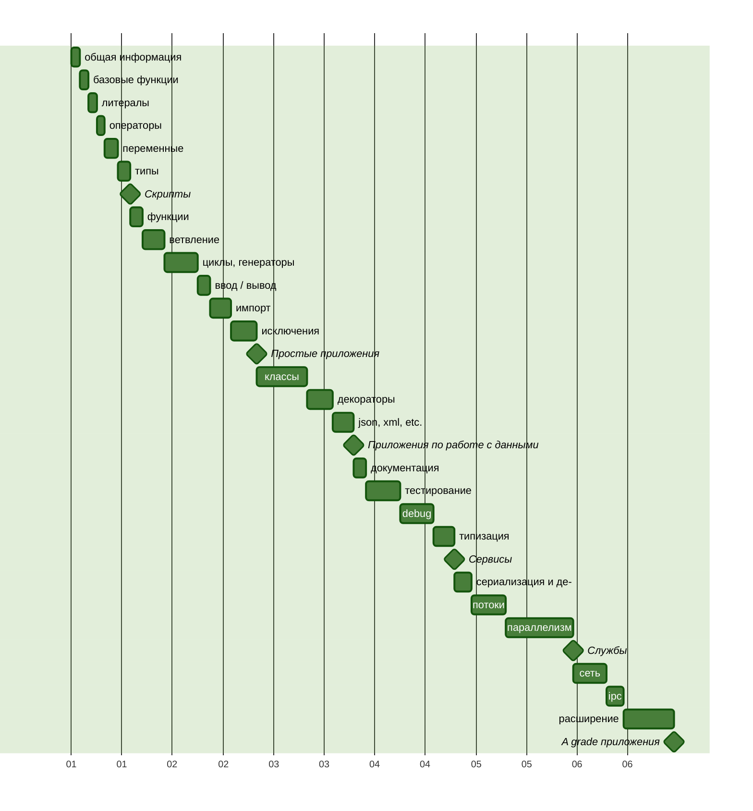

Путь изучения Python [→en](README.md)
===

В этом репозиторий я буду документировать путь изучения языка Python и
сопутствующих инструментов.

> [!NOTE]
>
> **Уточнение**
> У меня уже есть опыт написания приложений на Python, но я решил
> актуализировать, восполнить и систематизировать свои знания.

## Обязательство

В качестве опорных материалов я буду использовать различные книги,
официальную документацию и курсы.
Буду предоставлять примеры кода и заметки.
Текст буду сопровождать ссылками на материалы.

## План изучения

Для начала я составлю план изучения, не слишком подробный,
но позволяющий соблюдать определённую последовательность в освоении.

Каждый значимый этап будет завершать практическая работа,
на следующем графике эти работы можно опознать по символу ромба.



## Литературный список

1. «Основы Python. Научитесь думать как программист», 2-е издание. Аллен Б. Дауни[^1]
2. «Как устроен Python. Гид для разработчиков, программистов и интересующихся». Мэтт Харрисон[^2]

## О Языке

Python[^3] — высокоуровневый, универсальный, интерпретируемый язык со сборщиком мусора и динамической типизацией[^4].
Язык разработан Гвидо ван Россумом в 1991 году.

Язык приобрёл популярность ко второй версии. Текущая версия, — третья, считается актуальной.

### Синтаксис и семантика

Код на Python призван быть легко читаемым, так как он визуально форматируется
с использованием отступов, а выражения не принято сопровождать
вспомогательными символами. Привычный символ, точка с запятой, разделяющий
инструкции, часто пропускается, так как выражение заканчивается в конце строки.

Однако `;` может быть использована в отдельных случаях, когда нужно записать
инструкции в одну строку.

В языке нет привычных фигурных скобок, как обозначение блока набора инструкций,
эту роль выполняет визуальное форматирование и обязательно одинаковый отступ
для инструкций одного уровня.

В качестве символа отступа может выбран или пробел или табулятор,
но они не должны смешиваться в рамках одного файла.

### Развитие языка

Python, несмотря на свой возраст, это развивающийся язык, который развивается
сообществом и комитетами при фонде[^5].

Развитие языка происходит через систему оценки предложений PEP[^6], из которых
формируется описание языка.

У языка есть лозунг, который задаёт рамки его развития.

### Zen of Python

Существует краткий и лаконичный способ описать принципы которыми руководствуются
разработчики Python, они известны как Zen of Python, и у них есть свой PEP 20[^7].

> Красивое лучше, чем уродливое. <br />
> Явное лучше, чем неявное. <br />
> Простое лучше, чем сложное. <br />
> Сложное лучше, чем запутанное. <br />
> Плоское лучше, чем вложенное. <br />
> Разреженное лучше, чем плотное. <br />
> Читаемость имеет значение. <br />
> Особые случаи не настолько особые, чтобы нарушать правила. <br />
> При этом практичность важнее безупречности. <br />
> Ошибки никогда не должны замалчиваться. <br />
> Если они не замалчиваются явно. <br />
> Встретив двусмысленность, отбрось искушение угадать. <br />
> Должен существовать один и, желательно, только один очевидный способ сделать это. <br />
> Хотя он поначалу может быть и не очевиден, если вы не голландец. <br />
> Сейчас лучше, чем никогда. <br />
> Хотя никогда зачастую лучше, чем прямо сейчас. <br />
> Если реализацию сложно объяснить — идея плоха. <br />
> Если реализацию легко объяснить — идея, возможно, хороша. <br />
> Пространства имён — отличная штука! Будем делать их больше! <br />

## Запуск и режимы

Чтобы запустить Python приложение или отдельный скрипт нужен интерпретатор,
— приложение которое умеет читать инструкции на понятном человеку языке,
и переводить его в набор инструкций понятных вычислительной машине.

Преимущество интерпретируемых языков перед компилируемыми, что задачи компиляции
выполняются непосредственно при запуске программы, и не требуют дополнительного
подготовительного этапа — сборки (или компиляции и линковки), так как сборка
производится всегда под конкретную архитектуру процессора и операционную систему.

Это увеличивает переносимость кода и скорость разработки. Конечно, не бесплатно,
так как это же преимущество в некоторых случаях может быть недостатком.
Исполнение интерпретируемого кода никогда не будет на столько быстрым
чтобы сравниться с заранее компилированным приложением написанном на языке
системного уровня.

Выполнять Python инструкции можно как последовательно, так и в виде конечной
программы сохранённой в файл или серию файлов.

Для того, чтобы выполнять инструкции последовательно нужно активировать REPL
(<ins>R</ins>ead <ins>E</ins>valuate <ins>P</ins>rint <ins>L</ins>oop) режим.
Это такой вариант работы интерпретатора, когда тот после запуска ожидает ввода
пользователя, перевод на новую строку — определяет конец инструкции, и в этот
момент интерпретатор пытается выполнить написанное, после чего выдает
или результат выполнения, или ошибку, и возвращается с нова в ожидания ввода.

Запуск приложения — более распространенный вариант, когда интерпретатор при
вызове сразу получает точку входа в приложение, и пытается исполнить
все следующие за точкой входа инструкции.

Так-как приложение может быть представлено одним или более фалами,
то и запуск приложения может быть выражен как передача файла на исполнение,
или целой директории. В случае с директорией, по соглашению, интерпретатор будет
искать току входа — файл `__main__.py`.

Запускать Python можно с локальной машины, для этого нужно его установить[^8].

Если вам не хочется засорять локальную машину, то можно воспользоваться решением
на основе контейнеризации[^9].

Аллен Дауни, автор книги «Основы Python»[^1], предлагает для запуска простых
сценариев воспользоваться онлайн-сервисом [Python Anywhere](https://www.pythonanywhere.com/).
Существуют и другие, например [Replit](https://replit.com/), или в качестве REPL
можно воспользоваться [Google Colab](https://colab.google/).

> [!NOTE]
>
> Чтобы выйти из REPL интерпретатора, вызовите глобально доступный метод `exit()`.

> [!NOTE]
>
> В Python, есть этап компиляции заранее, когда интерпретатор преобразует файл-ы
> Python в байт-код, который будет выполнен. Такие файлы хранятся в каталоге
> `__pycache__`, **который** по-умолчанию **не должен добавляться в репозитории VCS**.

## Базовые функции

### print

Является одной из основных функций и находится в глобальном пространстве доступа.
На первый взгляд она «просто» выводит переданное значение «на экран».
На самом деле все чуть сложнее.

Метод `print` сначала проверяет тип переданного объекта, и если он не является
строкой, вызывает конвертацию. Кроме того, тезис о том, что `print` выводит
"на экран", тоже не верен, — функция печатает в поток вывода, который
по-умолчанию задан как стандартный поток вывода (`sys.stdout`), т.е. экран.
Поток вывода можно также указать, передав его в качестве аргумента вызова.

Аллен Дауни[^1], отмечает одно отличие между форматами вызова в Python2 и Python3,
— отсутствие скобок вокруг аргументов вызова для Python2.
На самом же деле скобки могут быть, но состав аргументов вызова отличается:

[Python2](https://docs.python.org/3/library/functions.html#print)
```python
>>> import sys
>>> print(>>sys.stdout, "Hello world\n")
```

[Python3](https://docs.python.org/3/library/functions.html#print)
```python
>>> import sys
>>> print("Hello world\n", file=sys.stdout)
```

### input

В противовес выводу в Python есть функция захвата ввода, `input`[^10], она так же
является глобально-доступной. Она позволяет перевести выполнение в режим ожидания
ввода и дождавшись вызова переноса строки, вернуть результат ввода в виде строки.

```python
>>> input("Say my name: ")
Say my name: Mr. White
'Mr. White'
```

### dir

Возвращает список имен, доступных в заданной области видимости[^11].
Без указания аргументов будет выбрана область видимости, доступная на уровне
исполнения. Если передать объект, то будут возвращены его методы и атрибуты.

#### help

Встроенная функция `help`[^12] особенно полезна в режиме REPL.
Без аргументов вызов функции инициализирует интерактивную консоль поиска
по индексу документации. При указании имени функции или класса интерпретатор
попытается найти соответствующий элемент среди зарегистрированных в текущем
окружении, и выведет справку.

> [!TIP]
>
> Я не стану подробно останавливаться на всех встроенных функциях. Уточню лишь,
> что они важны и поставляются разными модулями в глобальное пространство.
> О них можно прочесть на официальном сайте[^13], вызвав метод `help` со строкой
> `'builtins'`, или получить список зарегистрированных имён используя `dir`
> на объекте `__builtins__`.

```python
>>> help('builtins')
Help on built-in module builtins:

NAME
    builtins - Built-in functions, types, exceptions, and other objects.
...
```

```python
>>> dir(__builtins__)
['ArithmeticError', 'AssertionError', 'AttributeError', 'BaseException', ...
```

> [!NOTE]
>
> Не стоит переопределять зарезервированные имена встроенных объектов и функций!

## Литералы, Булевы значения и None

Литералами являются значимые комбинации символов, которые могут быть строками[^14]
или числами[^15].

### Строки

Строковые литералы[^14] отличает наличие кавычек, одинарных, двойных, или серии
одинарных или двойных кавычек.

```python
'It\'s a string literal'

"This is also a string literal"

'''
It's is a multiline string
with single quote inside.
'''

"""
And this is a also so called
"multiline" string
"""
```

Кроме того, строковые литералы могут иметь префиксы управления состоящие из `frub`:

```python
>>> r'\Hello \People' # Raw string
'\\Hello \\People'

>>> u'Это строка в формате Unicode' # Backward capability from Python2
'Это строка в формате Unicode'

>>> f'x={1+1} y={{1,2,3,4,5}}' # Formatted string
'x=2 y={1,2,3,4,5}'

>>> b'\xcf\x84o\xcf\x81\xce\xbdo\xcf\x82'.decode('utf-8')
'τoρνoς'
```

### Числа

Или числовые литералы[^15] это набор символов состоящих из знака принадлежности
числа к подмножеству положительных или отрицательных вещественных чисел (`+`, `-`),
указателя формата числа (`0b` — двоичный, `0o` — восьмеричный,
`0x` — шестнадцатеричный), цифр 0,1 для бинарной, 0..9 — десятичной и
шестнадцатеричной форм, 0..7 — восьмеричной, букв A..F в дополнение к цифрам
для шестнадцатеричной формы записи и `.` как символа разделителя целой и дробных
частей числа.

Числа с плавающей точкой, могут быть записаны в экспоненциальной форме, для
этого используется постфикс `e` c указанием размерности.

```python
# integers
0
41
0b101001
0o51
0x29
2_023
-41
```

> [!CAUTION]
>
> Целое десятичное число не может начинаться с цифры 0.


```python
# floats
0.
0.30684931506
.30684931506
0.2023e4
306_849.0e-6
```

В дополнение к целым числам[^16] и числам с плавающей точкой[^17], существует
запись литерала для мнимого числа[^18].

```python
# imaginary
3.14j
1e100j
```
С введением PEP 515[^19] появилась возможность визуального разделения разрядов
символом нижнего подчеркивания `_`.

### Булевы значения

Это литералы описывающие логическое состояние[^20], с предопределёнными значениями
и фиксированной формой записи: `True` и `False`.

### None

Зарезервированное слово-литерал, с фиксированной формой записи, выражает
отсутствие значения[^21].

## Операторы

Для произведение операций над числами, строками и булевыми значениями
используются различные операторы.

| Оператор |       Строки        |    Числа     |     Булев     |
|:---------|:--------------------|-------------:|--------------:|
| _Арифметические операции[^22]_                             ||||
|  L + R   |  'a' + 'b' = 'ab'   |  1 + 2 = 3   |   T + T = 2   |
|  L - R   |            -        |  1 - 2 = -1  |   F - T = -1  |
|  L * R   |    'a' * 3 = 'aaa'  | -1 * 2 = -2  |   T * T = 1   |
|  L / R   |            -        |  1 / 2 = 0.5 |   F / T = 0.0 |
|  L ** R  |            -        |  5 ** 2 = 25 |  T ** T = 1   |
|  L // R  |            -        |  5 // 2 = 2  |  T // T = 1   |
|  L % R   |            -        |   5 % 2 = 1  |   T % T = 0   |
| _Побитовые операции[^23]_                                  ||||
|  L ^ R   |            -        |   5 ^ 2 = 7  |   F ^ T = T   |
|  L & R   |            -        |   5 & 2 = 0  |   F & T = F   |
|  L \| R  |            -        |   5 | 2 = 7  |   F | T = T   |
|  L << R  |            -        |  5 << 2 = 20 |  T << T = 2   |
|  L >> R  |            -        |  5 >> 2 = 1  |  T >> T = 0   |
|    ~R    |            -        |      ~2 = -3 |      ~T = -2  |
| _Операции сравнения[^24]_                                  ||||
|  L == R  | 'a' == 'b' = F      |  5 == 2 = F  |  F == T = F   |
|  L != R  | 'a' != 'b' = T      |  5 != 2 = T  |  F != T = T   |
|  L > R   |  'a' > 'b' = F      |   5 > 2 = T  |   F > T = F   |
|  L >= R  | 'a' >= 'b' = F      |  5 >= 2 = T  |  F >= T = F   |
|  L < R   |  'a' < 'b' = T      |   5 < 2 = F  |   F < T = T   |
|  L <= R  | 'a' <= 'b' = T      |  5 <= 2 = F  |  F <= T = T   |
| _Логические операции[^25]_                                 ||||
|  L and R |'a' and 'b' = 'b'    | 5 and 2 = 2  | F and T = F   |
|  L or R  | 'a' or 'b' = 'a'    |  5 or 2 = 5  |  F or T = T   |
|   not R  |    not 'b' = F      |   not 2 = F  |   not T = F   |

Все приведённые операции доступны для чисел и булевых значений.
В языке существует принцип не явного преобразования типов, и в некоторых
случаях число приводится к булеву типу, а в некоторых булев тип к числу.
Такие случаи можно идентифицировать по результату операции.

Строковые литералы имеют два переопределённых арифметических оператора:
`+`, — который конкатенирует строки и `*`, — который повторяет строку заданное
правым операндом число раз. Другие арифметические операции для строк
не определены.

> [!TIP]
>
> При сравнении булевых значений приоритет стоит отдавать логическим операторам,
> против побитовых операторов.

> [!TIP]
>
> В языке существует возможность многократного сравнения: `1 <= 3 > 2 >= 0 = True`.

## Переменные

Для ссылки на исходные или промежуточные значения (состояния)
используются переменные. Как отмечает Мэтт Харрисон[^2], переменные можно
воспринимать как метки, ярлыки или указатели на значения,
которые можно переиспользовать снова и снова.

```python
name = 'Maksim Kalenich'
year = 1982
```

В языке есть ограничения для имен переменных, так переменная может состоять
из букв латинского алфавита, цифр и символа нижнего подчёркивания.
При этом переменная не может начинаться с цифры.

Кроме того, в языке есть список зарезервированных слов[^26], которые
интерпретатор не даст использовать в качестве имён переменных.

> [!TIP]
>
> Зарезервированные слова можно найти не только на сайте, но и в самом языке.
> Вызвав `help('keywords')` будет представлена короткая справка.
> Или можно импортировать модуль `keyword` и обратиться к его переменной `kwlist`
> модуля которая содержит список зарезервированных слов.
>
> ```python
> >>> import keyword
> >>> keyword.kwlist
> ```

Кроме зарезервированных слов, Мэтт Харрисон не рекомендует использовать имена
встроенных элементов языка, список которых доступен из переменной
[`__builtins__`](#help).

Хорошим тоном вообще, и в Python в частности, считается давать переменным
описательные имена, из которых можно заключить, на какое значение они указывают.
Кроме того, стоит отметить, что документация языка предлагает конкретный формат
переменных[^27]: `snake_case`, — когда имена даются строчными буквами,
а если имя состоит из нескольких частей, то части соединяются символом
нижнего подчёркивания.

Изначально синтаксис Python-а предполагал только декларацию переменных
c инициализацией. Однако с версии 3.6 можно объявить переменную с указанием типа
и не передавать инициализирующее значение. _О типах поговорим в следующем разделе._

```python
favorite_book = "The Hitchhiker's Guide to the Galaxy"

current_book: str
```

Для инициализации переменной используется оператор присвоения `=`,
при этом создается представление переданного значения в виде объекта.
Каждый объект получает идентификатор, описание типа значения и счётчик ссылок.

Счётчик ссылок необходим среде исполнения Python, поскольку именно она,
а не разработчик отвечает за время жизни значений и содержание памяти от мусора.

> [!TIP]
>
> Для получения идентификатора объекта существует встроенный метод `id`.
> ```python
> >>> id(favorite_book)
> 4423523640 # your's would be different
> ```
>
> Для получения типа значения представляемого объектом существует встроенный
> метод `type`.
> ```python
> >>> type(favorite_book)
> <class 'str'>
> ```
> Для получения значения счётчика ссылок на конкретный объект,
> можно воспользоваться методом `getrefcount` из пакета `sys`.
> ```python
> >>> import sys
> >>> sys.getrefcount(favorite_book)
> 2
> ```
> При этом если завести ещё одну переменную и присвоить ей тот же объект,
> то число ссылок увеличится.
> ```python
> >>> favorite_guide = favorite_book
> >>> sys.getrefcount(favorite_book)
> 3
> ```
>
> Ссылок возвращается на 1 больше так как во время вызова `getrefcount`
> добавляется ссылка от аргумента вызова.

Поскольку Python — язык с динамической типизацией, то переменную можно
переопределить со значением типа отличным от текущего.

```python
>>> num = '1'
>>> id(num)
4423584600
>>> type(num)
<class 'str'>

>>> num = int(num)
>>> id(num)
4423523640
>>> type(num)
<class 'int'>
```

> [!WARNING]
>
> Не смотря на то, что язык позволяет переопределять переменную присваивая
> значения других типов, это крайне плохая идея, так, как в последствии
> сложно определить почему она могла поменять свой тип и при каких
> обстоятельствах это может происходить.

## Типы

### Числовые

Язык поддерживает несколько встроенных типов чисел:

```python
>>> type(41)
<class 'int'>

>>> type(0.36)
<class 'float'>

>>> type(3.14j)
<class 'complex'>
```

Поскольку арифметика чисел с плавающей точкой почти у всех машин базируется
на стандарте IEEE 754[^28], то Python не исключение[^29], и наследуют проблемы
стандарта.

```python
>>> 0.1 + 0.1 + 0.1 == 0.3
False
```

Язык предлагает различные подходы по устранению подобных проблем:

1. При сравнении использовать функции из пакета math:
```python
>>> import math
>>> math.isclose(0.1 + 0.1 + 0.1, 0.3)
True
```

2. Или использовать функцию округления, с указанием точности, при сравнении:
```python
>>> round(0.1 + 0.1 + 0.1, ndigits=1) == round(0.3, ndigits=1)
True
```

3. Или использовать вспомогательные типы с сохранением точности: `Decimal`[^30] и `Fraction`[^31]:

```python
>>> import decimal
>>> decimal.Decimal('0.1') * 3 == decimal.Decimal('0.3')
True

>>> import fractions
>>> fractions.Fraction(1, 10) * 3 == fractions.Fraction(3, 10)
True
```

Между числовыми типами существует неявное преобразование которое происходит с укрупнением числового пространства: `int` → `float` → `complex`.

```python
>>> 1 + 0.1 + 1.1j
(1.1+1.1j)
```

Явное преобразование типов тоже возможно и даже желательно:

```python
>>> float(1)
1.0

>>> complex(1.0)
(1.0+0j)
```

> [!CAUTION]
>
> В обратную сторону приведение типа лучше не использовать!

Помимо [арифметических операций](#%D0%BE%D0%BF%D0%B5%D1%80%D0%B0%D1%82%D0%BE%D1%80%D1%8B)
язык предлагает набор встроенных методов[^13] и вспомогательных методов[^32]
модуля `math`, вот часть из них: abs[^33], divmod[^34], pow[^35], math.pow[^36], round[^37], math.trunc[^38], math.floor[^39], math.ceil[^40], math.sqrt[^41], math.cbrt[^42], math.exp[^43], math.log[^44], math.log2[^45], math.log10[^46].

```python
>>> abs(-0.345)
0.345

>>> divmod(5, 2) # same as (5 // 2, 5 % 2)
(2, 1)

>>> pow(5, 2) # same as 5 ** 2
25

>>> import math

>>> math.pow(5, 2)
25.0

>>> round(5.35, 1)
5.3

>>> math.trunc(5.35)
5

>>> math.floor(5.35)
5
>>> math.floor(-5.35)
6

>>> math.ceil(5.35)
6
>>> math.ceil(-5.35)
5

>>> math.sqrt(25) # same as 25 ** 1/2
5.0

>>> math.cbrt(27) # same as 27 ** 1/9
3.0

>>> math.exp(2) # close to math.e ** 2
7.38905609893065

>>> math.log(2)
0.6931471805599453

>>> math.log2(4) # same as math.log(4, 2)
2.0

>>> math.log10(100) # same as math.log(100, 10)
2.0
```

### Булев

Булевыми значениями могут быть `True` или `False`. Как упоминалось в секции о литералах, [булевы значения](#%D0%B1%D1%83%D0%BB%D0%B5%D0%B2%D1%8B-%D0%B7%D0%BD%D0%B0%D1%87%D0%B5%D0%BD%D0%B8%D1%8F) имеют фиксированное написание.

К булевым значениям можно привести значения любых иных типов, явно, используя встроенный метод `bool`, или не явно, когда интерпретатор сам отдаст приоритет
типу булев перед другим.

```python
>>> bool(1)
True

>>> bool(0)
False

>>> bool(-1)
True

>>> bool('')
False

>>> bool(None)
False

>>> not 0
True

>>> not ''
True

>>> not None
true

>>> not 1
False
```

#### Ленивое вычисление

При исполнении логических операций с булевыми значениями, происходит ленивое
вычисление[^47], — при котором второй операнд не проверяется, если первый удовлетворяет условиям оператора.

```python
>>> True or False
True

>>> False and True
False
```

Как проверить, что до второго оператора не дошло дело?
Использовать в качестве него метод, который в противном случае не будет вызван.

```python
>>> True or print('Checked')
True

>>> False and print('Checked')
False

>>> True and print('Checked')
'Checked'
```

### Последовательности

Последовательности или серии — это значения которые хранят несколько значений
следующих друг за другом, хотя не во всех случах это очевидно.

| Оператор      | Ожидаемый результат                                         |
|:--------------|:------------------------------------------------------------|
|  x in s       | Проверка на наличие элемента или серии в последовательности |
|  x not in s   | Проверка на отсутствие элемента или серии в последоват.     |
|  s + t        | Конкатенация (неизменяемых типов приводит к новому знач. )  |
|  s * n        | Повторение серии n раз                                      |
|  s[i]         | Обращение к элементу серии по индексу                       |
|  s[i:j]       | Обращение к срезу из серии по индексам начала и конца       |
|  s[i:j:k]     | Обращ. к подмножеству элементов указав начало, конец и шаг  |
|  len(s)       | Запрос на получение длинны серии                            |
|  min(s)       | Запрос на получение минимального элемента в серии           |
|  max(s)       | Запрос на получение максимального элемента в серии          |
|s.index(x,i,j) | Запрос индекса указанного элемента/серии внутри послед.     |
|  s.count(x)   | Запрос количества вхождений элемента/серии в послед.        |

#### Строки

Один из типов который принадлежит подмножеству последовательностей, так как строки это последовательность символов[^48], каждый из которых является представлением байтов.

```python
>>> some_string = 'some not that long of a string'
>>> type(some_string)
<class 'str'>
```

Чтобы увидеть строку как последовательность байтов, можно воспользоваться встроенным методом `bytes`[^49] или `bytearray`[^50].

```python
>>> bytes(some_string, 'latin-1').hex(',')
'73,6f,6d,65,20,6e,6f,74,20,74,68,61,74,20,6c,6f,6e,67,20,6f,...'

>>> memoryview(bytes(some_string, 'latin-1')).tolist()
[115, 111, 109, 101, 32, 110, 111, 116, 32, 116, 104, 97, 116, 32, ...]
```

Строки это не изменяемый тип, — после присвоения нельзя изменить значение,
можно лишь переприсвоить новое целиком.

Строки можно явно привести к числовым типам, при условии, что строка содержит
только разрешенные цифры и буквы формы в которую она приводится:

```python
>>> int('41') # same as int('41', 10)
41

>>> int('29', 16)
41

>>> int('51', 8)
41

>>> int('101001', 2)
41

>>> float('41.5')
41.5

>>> complex('10.1j')
10.1j
```

> [!TIP]
>
> Преобразование типов часто требуемая задача, и лучше её освоить заранее.
> Например при получении значения из метода [`input`](#input),
> введённое пользователем значение возвращается как строка, вне зависимости
> от того, что имело ввиду. И если предполагался числовой ответ, то логичным
> будет привести его к числу, чтобы в последствии провести проверку или
> выполнить арифметическое действие.

К строкам можно привести значения иных типов используя метод `str`[^51], функцию форматирования `format`[^52], или форматированные строки[^53].

```python
>>> str(41) # str(0b101001) str(0o51) str(0x29)
'41'

>>> str(41.5)
'41.5'

>>> str(True)
'True'

>>> format(41, '>#05d')
'00041'

>>> format(41, '>#' '10b')
'  0b101001'

>>> format(77, 'c')
'M'

>>> f'{41:#0x}'
'0x29'
```

Строки, как и любые другие типы из семейства последовательностей, имеют длину, которую можно измерить вызвав встроенный метод `len`[^54].

Объекты типа строка наследуют широкий набор методов, как от родительского
класса последовательностей, так и класса строк:

| Метод |
|:------|
sdsds


---

, последовательностей, карт,

#### Итерируемые типы

#### Последовательности

##### list

##### tuple

##### range

##### dict

##### set

##### frozenset

##### memoryview

#### Операторы последовательностей

##### in

##### not in

##### +

##### *

##### [i:j:k]

##### len

##### min

##### max

##### index

##### count

##### hash

##### [i:j:k] =

##### del [i:j:k]

##### append

##### clear

##### copy

##### extend or +=

##### insert

##### pop

##### remove

##### reverse


---

[^1]: <https://www.livelib.ru/book/1005972301-osnovy-python-nauchites-dumat-kak-programmist-allen-b-dauni> "Основы Python. Научитесь думать как программист, 2-е издание. Автор: Аллен Б. Дауни"
[^2]: <https://www.livelib.ru/book/1002933611-kak-ustroen-python-gid-dlya-razrabotchikov-programmistov-i-interesuyuschihsya-mett-harrison> "Как устроен Python. Гид для разработчиков, программистов и интересующихся. Автор: Мэтт Харрисон"
[^3]: <https://www.python.org/> "Официальный сайт"
[^4]: <https://ru.wikipedia.org/wiki/Python> "Страница о языке Python на Wikipedia"
[^5]: <https://legacy.python.org/psf/committees/> "Раздел о комитетах фонда Python Software Foundation"
[^6]: <https://peps.python.org/pep-0000/> "Index of Python Enhancement Proposals"
[^7]: <https://peps.python.org/pep-0020/> "The Zen of Python"
[^8]: <https://www.python.org/downloads/> "Регистр доступных версий Python"
[^9]: <https://hub.docker.com/_/python> "Docker image for Python"
[^10]: <https://docs.python.org/3/library/functions.html?highlight=input#input> "input in the official documentation"
[^11]: <https://docs.python.org/3/library/functions.html?highlight=dir#dir> "dir in the official documentation"
[^12]: <https://docs.python.org/3/library/functions.html?highlight=help#help> "help in the official documentation"
[^13]: <https://docs.python.org/3/library/functions.html> "Built-in functions in the official documentation"
[^14]: <https://docs.python.org/3/reference/lexical_analysis.html#literals> "Literals in the official documentation"
[^15]: <https://docs.python.org/3/reference/lexical_analysis.html#numeric-literals> "Numeric literals in the official documentation"
[^16]: <https://docs.python.org/3/reference/lexical_analysis.html#integer-literals> "Integer literals in the official documentation"
[^17]: <https://docs.python.org/3/reference/lexical_analysis.html#floating-point-literals> "Floating point literals in the official documentation"
[^18]: <https://docs.python.org/3/reference/lexical_analysis.html#imaginary-literals> "Imaginary literals in the official documentation"
[^19]: <https://peps.python.org/pep-0515/> "PEP 515 – Underscores in Numeric Literals"
[^20]: <https://docs.python.org/3/library/stdtypes.html#boolean-type-bool> "Boolean Type in the official documentation"
[^21]: <https://docs.python.org/3/reference/datamodel.html#none> "None in the official documentation"
[^22]: <https://docs.python.org/3/library/stdtypes.html#numeric-types-int-float-complex> "Arithmetic operators in the official documentation"
[^23]: <https://docs.python.org/3/library/stdtypes.html#bitwise-operations-on-integer-types> "Bitwise operators in the official documentation"
[^24]: <https://docs.python.org/3/library/stdtypes.html#comparisons> "Comparisons operators in the official documentation"
[^25]: <https://docs.python.org/3/library/stdtypes.html#boolean-operations-and-or-not> "Logical operators in the official documentation"
[^26]: <https://docs.python.org/3/reference/lexical_analysis.html#keywords> "Reserved keywords in the official documentation"
[^27]: <https://github.com/maxja/pythonic/blob/main/README.ru.md#help> "Конвенция именования в PEP 8 Style Guide for Python Code"
[^28]: <https://en.wikipedia.org/wiki/IEEE_754> "The IEEE Standard for Floating-Point Arithmetic (IEEE 754)"
[^29]: <https://docs.python.org/3/tutorial/floatingpoint.html#floating-point-arithmetic-issues-and-limitations> "Floating Point Arithmetic: Issues and Limitations in the official documentation"
[^30]: <https://docs.python.org/3/library/decimal.html#module-decimal> "Decimal fixed point and floating point arithmetic in the official documentation"
[^31]: <https://docs.python.org/3/library/fractions.html#module-fractions> "Rational numbers in the official documentation"
[^32]: <https://docs.python.org/3/library/math.html#module-math> "Mathematical functions in the official documentation"
[^33]: <https://docs.python.org/3/library/functions.html#abs> "Take an absolute value from a given number in the official documentation"
[^34]: <https://docs.python.org/3/library/functions.html#divmod> "Take a quotient and a remainder by given the dividend and the divisor in the official documentation"
[^35]: <https://docs.python.org/3/library/functions.html#pow> "Take a power of a base in the official documentation"
[^36]: <https://docs.python.org/3/library/math.html#math.pow> "Take a power of a base from math module in the official documentation"
[^37]: <https://docs.python.org/3/library/functions.html#round> "Round a number with the given precision in the official documentation"
[^38]: <https://docs.python.org/3/library/math.html#math.trunc> "Truncate a float to an integer in the official documentation"
[^39]: <https://docs.python.org/3/library/math.html#math.floor> "Floor a float to an integer in the official documentation"
[^40]: <https://docs.python.org/3/library/math.html#math.ceil> "Ceil a float to an integer in the official documentation"
[^41]: <https://docs.python.org/3/library/math.html#math.sqrt> "Take a square root of a number in the official documentation"
[^42]: <https://docs.python.org/3/library/math.html#math.cbrt> "Take a cube root of a number in the official documentation"
[^43]: <https://docs.python.org/3/library/math.html#math.exp> "Take an e raised to the power of given number in the official documentation"
[^44]: <https://docs.python.org/3/library/math.html#math.log> "Take the natural logarithm of given number to a given base or base of e if second argument not given"
[^45]: <https://docs.python.org/3/library/math.html#math.log2> "Take logarithm of x base 2 in the official documentation"
[^46]: <https://docs.python.org/3/library/math.html#math.log10> "Take logarithm of x base 10 in the official documentation"
[^47]: <https://ru.wikipedia.org/wiki/%D0%9B%D0%B5%D0%BD%D0%B8%D0%B2%D1%8B%D0%B5_%D0%B2%D1%8B%D1%87%D0%B8%D1%81%D0%BB%D0%B5%D0%BD%D0%B8%D1%8F> "Ленивые вычисления на Wikipedia"
[^48]: <https://ru.wikipedia.org/wiki/%D0%A1%D1%82%D1%80%D0%BE%D0%BA%D0%BE%D0%B2%D1%8B%D0%B9_%D1%82%D0%B8%D0%BF> "Строковый тип на Wikipedia"
[^49]: <https://docs.python.org/3/library/functions.html#func-bytes> "bytes function in the official documentation"
[^50]: <https://docs.python.org/3/library/functions.html#func-bytearray> "bytearray function in the official documentation"
[^51]: <https://docs.python.org/3/library/stdtypes.html#str> "Builtin str cast method in the official documentation"
[^52]: <https://docs.python.org/3/library/functions.html#format> "Builtin format method in the official documentation"
[^53]: <https://docs.python.org/3/reference/lexical_analysis.html#f-strings> "F-string literals in the official documentation"
[^54]: <https://docs.python.org/3/library/functions.html#len> "Builtin len method in the official documentation"

