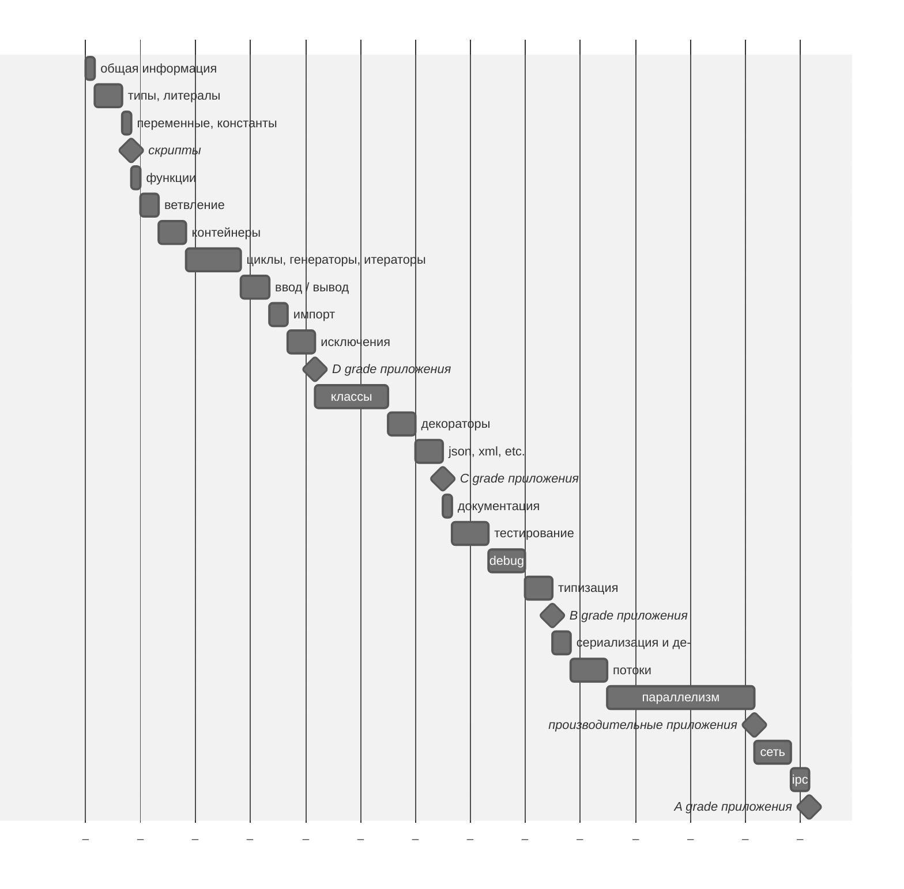

Python Песочница [→en](README.md)
===

Этот репозиторий будет документировать мой путь обучения языку Python и сопутствующим инструментам.

> [!NOTE]
>
> **Уточнение**
> У меня уже есть опыт написания приложений на Python, но я решил обновить и актуализировать свои знания.

## Обязательство

Я буду использовать различные книги в качестве опорных материалов, буду предоставлять примеры кода и заметки на основе того, что я узнал и понял. Все ссылки на источники будут сопровождаться соответствующими ссылками.

## План изучения
Для начала я составлю план обучения, не слишком подробный, но позволяющий соблюдать определённую последовательность в освоении.



## Литературный список

1. [«Основы Python. Научитесь думать как программист», 2-е издание. Аллен Б. Дауни][1]
2. [«Как устроен Python. Гид для разработчиков, программистов и интересующихся». Мэтт Харрисон][2]

## О Языке

Python[^1] - это высокоуровневый, универсальный, динамически типизированный, интерпретируемый язык с сборкой мусора[^2]. Это многопарадигменный язык программирования, изначально разработанный Гвидо ван Россумом в 1991 году.

Самой популярной стала вторая версия. На текущий момент актуальна третья версия, и вторая больше не поддерживается.

### Синтаксис и семантика

Код на Python должен быть легко читаемым, так как рабочий код визуально форматируется с использованием отступов и отсутствия фигурных скобок вокруг блоков.

### Предложения по расширению языка

Python - это развивающийся язык программирования, несмотря на свой возраст, и новые функции появляются довольно часто.

Полный индекс[^3] предложений, которые уже приняты, и тех, которые только что были предложены.

### Zen of Python

Краткий и лаконичный способ описать принципы руководства Python, известные как Zen of Python, и да, у него есть свой собственный PEP 20[^4], (перевод):

> Красивое лучше, чем уродливое. <br />
> Явное лучше, чем неявное.  <br />
> Простое лучше, чем сложное.  <br />
> Сложное лучше, чем запутанное.  <br />
> Плоское лучше, чем вложенное.  <br />
> Разреженное лучше, чем плотное.  <br />
> Читаемость имеет значение.  <br />
> Особые случаи не настолько особые, чтобы нарушать правила.  <br />
> При этом практичность важнее безупречности.  <br />
> Ошибки никогда не должны замалчиваться.  <br />
> Если они не замалчиваются явно.  <br />
> Встретив двусмысленность, отбрось искушение угадать.  <br />
> Должен существовать один и, желательно, только один очевидный способ сделать это.  <br />
> Хотя он поначалу может быть и не очевиден, если вы не голландец.  <br />
> Сейчас лучше, чем никогда.  <br />
> Хотя никогда зачастую лучше, чем прямо сейчас.  <br />
> Если реализацию сложно объяснить — идея плоха.  <br />
> Если реализацию легко объяснить — идея, возможно, хороша.  <br />
> Пространства имён — отличная штука! Будем делать их больше!  <br />

## Установка

Python 3 (далее Python) — целевая версия языка, которая интересует меня в процессе изучения.

Python может быть установлен как отдельный пакет, существует множество способов, отличающихся от операционной системы
к операционной системе.

Аллен Дауни, автор книги «Основы Python»[^5], предлагает воспользоваться онлайн-сервисом
[Python Anywhere](https://www.pythonanywhere.com/), хотя существует множество других доступных площадок,
таких как [Google Colab](https://colab.google/).

## Запуск

### REPL — <ins>R</ins>ead <ins>E</ins>valuate <ins>P</ins>rint <ins>L</ins>oop

Некоторые языки, в основном интерпретируемые, имеют так называемый REPL, или интерактивную консоль, которая считывает предоставленный ввод, пытается оценить то, что у нее есть на входе, выводит результат или описание ошибки и снова ожидает новый ввод.

Она позволяет тестировать алгоритмические гипотезы пошагово.

Чтобы запустить Python REPL, просто выполните `$ python` или `$ python3`, это запустит подпрограмму и выведет приглашение к вводу, начинающееся с `>>>`.

Чтобы выйти из него, просто вызовите глобально доступный метод `exit()`.

## Исполнение

Python приложение можно выполнить как отдельный файл; в этом случае файл должен иметь расширение `.py` или его предварительно скомпилированную версию, `.pyc`. Оно также может быть выполнено как каталог, но в этом случае каталог должен иметь файл входа с определенным именем `__main.py__` (вариант .pyc также подойдет).

```sh
$ python3 application.py
```

```sh
$ ls app/
__main__.py

$ python3 app
```

> [!NOTE]
>
> Да, есть этап компиляции заранее, когда интерпретатор преобразует файл Python в байт-код, который будет выполнен. Такие файлы хранятся в `__pycache__`, который по умолчанию не должен добавляться в репозитории VCS.

## Погружаемся

### Основы

#### print

Функция print является одной из основных функций и находится в глобальном пространстве доступа.
На первый взгляд она «просто» выводит переданное значение «на экран». Однако на самом деле все чуть сложнее.

Метод `print` сначала проверяет тип переданного объекта, и если он не является строкой, вызывает конвертацию. Кроме того, тезис о том, что print выводит "на экран", тоже не верен. По умолчанию print выводит в заданный поток вывода, который указывает на `sys.stdout`, но поток вывода можно также указать, передав его в качестве аргумента вызова.

Аллен Дауни, автор книги «Основы Python»[^5], отмечает лишь одно отличие между форматами вызова в Python2 и Python3 - отсутствие скобок вокруг аргументов вызова во второй версии. На самом же деле скобки могут быть, но состав аргументов вызова разительно отличается:

[Python2](https://docs.python.org/3/library/functions.html#print)
```python
import sys
print(>>sys.stdout, "Hello world\n")
```

[Python3](https://docs.python.org/3/library/functions.html#print)
```python
import sys
print("Hello world\n", file=sys.stdout)
```

#### input

Функция `input`[^6], так же как и `print`, является одной из базовых, глобально доступных функций. Она позволяет перевести консоль в режим ожидания ввода, и новая строка (`EOL`) служит подтверждением введенных данных.

#### dir

Функция `dir`[^7] возвращает список имен, доступных в заданной области видимости. Без указания аргументов будет выбрана область видимости, доступная на уровне исполнения. Если передать объект, то будут возвращены его методы и атрибуты.

#### help

Встроенная функция `help`[^8] особенно полезна в режиме REPL. Без аргументов вызов функции инициализирует интерактивную консоль поиска по документации. При указании имени функции или класса интерпретатор попытается найти соответствующий элемент среди зарегистрированных и выведет справку, описанную в блоке документации.

> [!TIP]
>
> Сейчас я не буду подробно останавливаться на всех встроенных функциях. Уточню лишь, что они важны и поставляются разными модулями в глобальное пространство. О них можно прочесть на официальном сайте[^9], вызвав метод `help` со строкой `'builtins'`: `help('builtins')`, или выполнив метод `dir` на объекте `__builtins__`: `dir(__builtins__)`.

### Литералы и Типы

Литералами являются значимые комбинации символов, которые могут быть строковыми[^10] или числовыми[^11].

Характерной особенностью строковых литералов[^10] является последовательность символов, заключенная в парные кавычки. С кавычек с каждой стороны может быть одна одинарная `'` или двойная `"`, а также три `'''`, `"""` в случае необходимости создания строк с сохранением переносов. Кроме того, строки могут иметь префиксы управления.

```python
'It\'s a string literal'

"This is also a string literal"

'''
It's is a multi
line string
'''

"""
And this is a also multi
line string
"""
```

Числовые литералы[^11] представляют собой запись чисел в бинарной, восьмеричной, десятичной и шестнадцатеричной системах счисления. Используется префиксный оператор для отрицательных чисел или его отсутствие для положительных. Для десятичных чисел может применяться форма экспоненциальной записи, запись с плавающей точкой и указание мнимой части числа. С введением PEP 515[^12] появилась возможность визуального разделения разрядов символом нижнего подчеркивания `_`.

```python
# integers
0
41
0b101001
0o51
0x29
2_023
-41

# floats
0.
0.30684931506
.30684931506
0.2023e4
306_849.0e-6
```

> [!CAUTION]
>
> С цифры 0 не может начинаться целое число.


[1]: <https://www.livelib.ru/book/1005972301-osnovy-python-nauchites-dumat-kak-programmist-allen-b-dauni> "Основы Python. Научитесь думать как программист, 2-е издание. Автор: Аллен Б. Дауни"
[2]: <https://www.livelib.ru/book/1002933611-kak-ustroen-python-gid-dlya-razrabotchikov-programmistov-i-interesuyuschihsya-mett-harrison> "Как устроен Python. Гид для разработчиков, программистов и интересующихся. Автор: Мэтт Харрисон"
[^1]: <https://www.python.org/> "Официальный сайт"
[^2]: <https://ru.wikipedia.org/wiki/Python> "Страница о языке Python на Wikipedia"
[^3]: <https://peps.python.org/pep-0000/> "Index of Python Enhancement Proposals"
[^4]: <https://peps.python.org/pep-0020/> "The Zen of Python"
[^5]: <https://www.livelib.ru/book/1005972301-osnovy-python-nauchites-dumat-kak-programmist-allen-b-dauni> "Основы Python. Научитесь думать как программист, 2-е издание. Автор: Аллен Б. Дауни"
[^6]: <https://docs.python.org/3/library/functions.html?highlight=input#input> "input in Official documentation"
[^7]: <https://docs.python.org/3/library/functions.html?highlight=dir#dir> "dir in Official documentation"
[^8]: <https://docs.python.org/3/library/functions.html?highlight=help#help> "help in Official documentation"
[^9]: <https://docs.python.org/3/library/functions.html> "Built-in functions Official documentation"
[^10]: <https://docs.python.org/3/reference/lexical_analysis.html#literals> "Literals in Official documentation"
[^11]: <https://docs.python.org/3/reference/lexical_analysis.html#numeric-literals> "Numeric literals in Official documentation"
[^12]: <https://peps.python.org/pep-0515/> "PEP 515 – Underscores in Numeric Literals"
